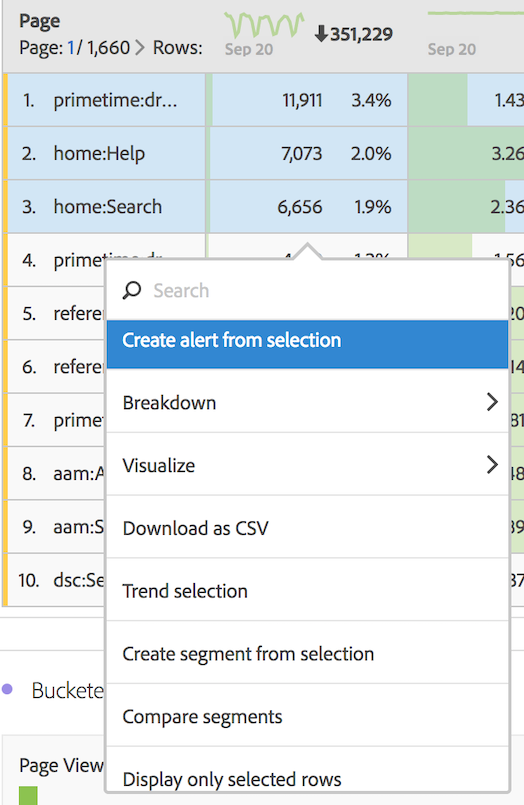
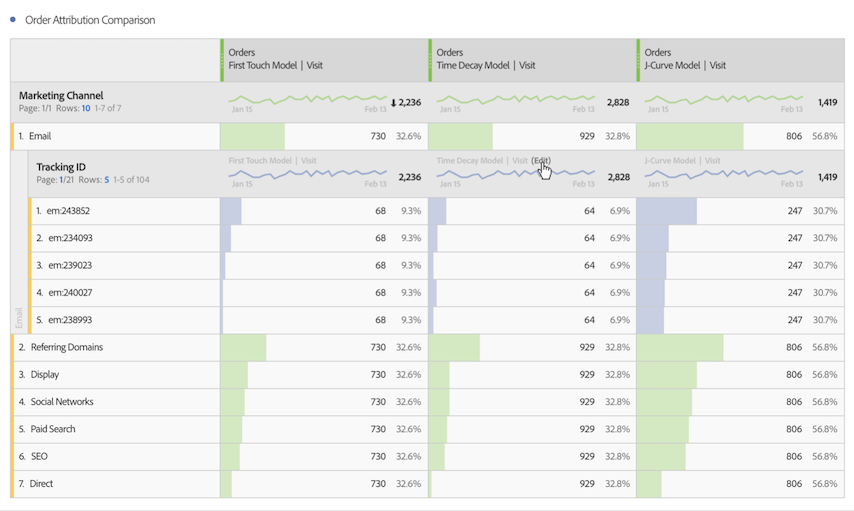

# Break down dimensions

Break down dimensions and dimension items in Analysis Workspace.

Break down your data in unlimited ways for your specific needs; build queries using relevant metrics, dimensions, segments, time lines, and other analysis breakdown values.

1. [Create a project](/help/analyze/analysis-workspace/home.md) with a data table.
1. In the data table, right-click a line item and select **[!UICONTROL Breakdown]** > *`<item>`*.

   

   You can break down metrics by dimension items or audience segments across selected time periods. You can also drill down further to a more granular level.

   >[!NOTE]
   >
   >The number of breakdowns to show in the table is limited to 200. This limit will increase for exporting breakdowns.

## Apply attribution models to breakdowns

Any breakdown within a table can also have any attribution model applied to it. This attribution model can be the same or different from the parent column. For example, you can analyze linear Orders on your Marketing Channels dimension but apply U-Shaped Orders to the specific tracking codes within a Channel. To edit the attribution model applied to a breakdown, hover over the breakdown model and click **[!UICONTROL Edit]**:

## Videos

Adding dimensions and metrics to your project in Analysis Workspace:

>[!VIDEO](https://video.tv.adobe.com/v/30606/?quality=12)

Working with dimensions in a Freeform Table:

>[!VIDEO](https://video.tv.adobe.com/v/40179/?quality=12)

Here is a video on dimension breakdowns by position:

>[!VIDEO](https://video.tv.adobe.com/v/24033/?quality=12)
