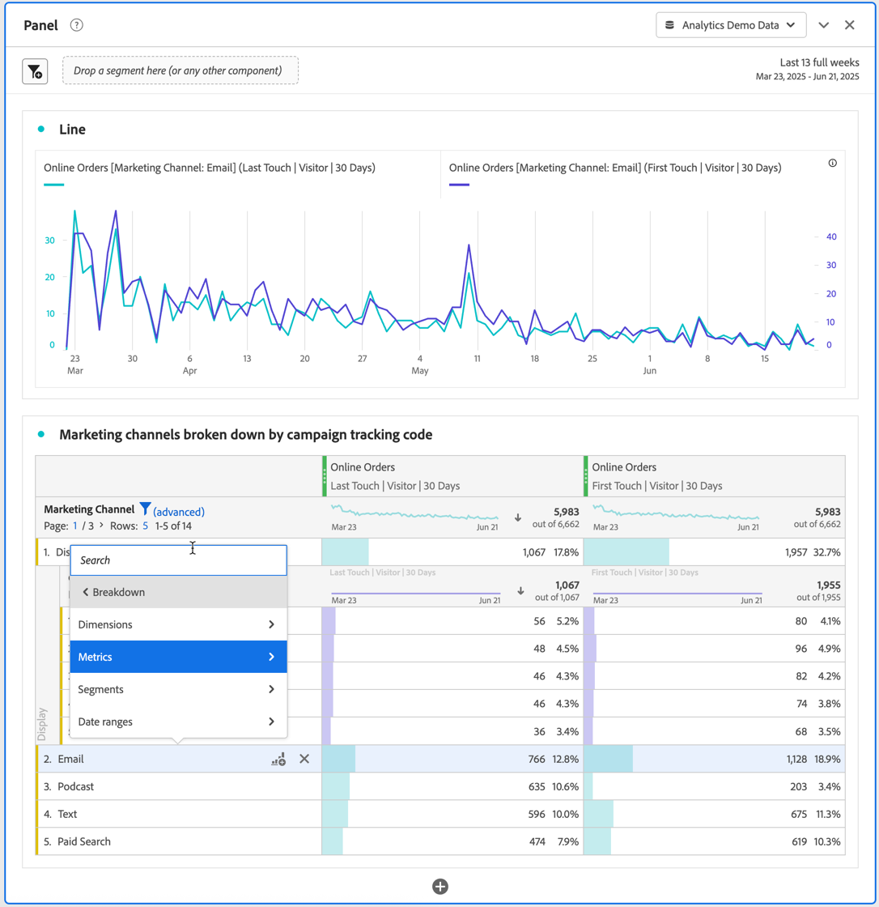
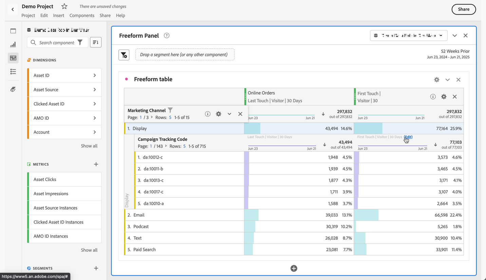

# Break down dimensions

You can break down your data in Analysis Workspace in unlimited ways for your specific needs; build queries using relevant metrics, dimensions, segments, time lines, and other analysis breakdown values.

1. In a [Freeform table](/help/analyze/analysis-workspace/visualizations/freeform-table/freeform-table.md), from the context menu of one or more selected rows, select **[!UICONTROL Breakdown]** .

   

1. From the submenu select **[!UICONTROL Dimensions]**, **[!UICONTROL Metrics]**, **[!UICONTROL Segments]** or **[!UICONTROL Date ranges]** and then select an item. Or simply search for a component in the **[!UICONTROL *Search*]** field.

You can break down metrics by dimension items or audience segments across selected time periods. You can also drill down further to a more granular level.

   >[!NOTE]
   >
   >The number of breakdowns to show in the table is limited to 200. This limit increases for exporting breakdowns.

## Breakdown by position

By default, breakdowns are fixed to static row items. For example, imagine you breakdown the top 3 Page dimension items (Homepage, Search Results, Checkout) by Marketing Channel. Then, you leave the project and return two weeks later. Upon opening the project again, the top 3 pages have changed, and now Homepage, Search Results and Checkout are the top 4-6 pages instead. By default, your Marketing Channel breakdowns still appear under Homepage, Search Results and Checkout, even though they are now in rows 4-6.

In contrast, **Breakdown by position**,  always breaks down the top 3 items, regardless of what thse items are. Referring back to the example, when you re-open your project, the Marketing Channel breakdowns are tied to the top 3 pages in the table. And not to Homepage, Search Results and Checkout, which are now in rows 4-6. See [Row settings](/help/analyze/analysis-workspace/visualizations/freeform-table/column-row-settings/table-settings.md) how to configure this setting.

## Apply attribution models to breakdowns

Any breakdown within a table can also have any attribution model applied to it. This attribution model can be the same or different from the parent column. For example, you can analyze linear Orders on your Marketing Channels dimension but apply U-Shaped Orders to the specific tracking codes within a Channel. To edit the attribution model applied to a breakdown, hover over the breakdown model and select **[!UICONTROL Edit]**.

This is the expected behavior when applying attribution models to breakdowns or editing them:

* If you apply an attribution when no other attributions exist, then the attribution applies to the entire column tree.

* If you add a breakdown after an attribution has been applied, it will use the default for the given breakdown that was added (if that dimension has a default). Otherwise it will use the breakdown from the parent column. Some dimensions have a default allocation. For example, Time dimensions and Referrer use Same Touch. The Product dimension uses Last Touch. Other dimensions don't have a default, and will use the parent column allocation.

* If there are already attributions in the column tree, changing the attribution only impacts the one you are editing.

>[!BEGINSHADEBOX]

See  [Dimension in Analysis Workspace](https://video.tv.adobe.com/v/23971?quality=12&learn=on){target="_blank"} for a demo video.

>[!ENDSHADEBOX]

>[!BEGINSHADEBOX]

See  [Dimension breakdowns](https://video.tv.adobe.com/v/23969?quality=12&learn=on){target="_blank"} for a demo video.

>[!ENDSHADEBOX]

>[!BEGINSHADEBOX]

See  [Adding dimensions and metrics](https://video.tv.adobe.com/v/30606?quality=12&learn=on){target="_blank"} for a demo video.

>[!ENDSHADEBOX]

>[!BEGINSHADEBOX]

See  [Working with dimensions in a Freeform Table](https://video.tv.adobe.com/v/40179?quality=12&learn=on){target="_blank"} for a demo video.

>[!ENDSHADEBOX]

>[!BEGINSHADEBOX]

See  [Dimension breakdown by position](https://video.tv.adobe.com/v/24033){target="_blank"} for a demo video.

>[!ENDSHADEBOX]

<!--
# Break down dimensions

Break down dimensions and dimension items in Analysis Workspace.

Break down your data in unlimited ways for your specific needs; build queries using relevant metrics, dimensions, segments, time lines, and other analysis breakdown values.

1. [Create a project](/help/analyze/analysis-workspace/home.md) with a data table.
1. In the data table, right-click a line item and select **[!UICONTROL Breakdown]** > *`<item>`*.

   

   You can break down metrics by dimension items or audience segments across selected time periods. You can also drill down further to a more granular level.

   >[!NOTE]
   >
   >The number of breakdowns to show in the table is limited to 200. This limit will increase for exporting breakdowns.

## Apply attribution models to breakdowns

Any breakdown within a table can also have any attribution model applied to it. This attribution model can be the same or different from the parent column. For example, you can analyze linear Orders on your Marketing Channels dimension but apply U-Shaped Orders to the specific tracking codes within a Channel. To edit the attribution model applied to a breakdown, hover over the breakdown model and click **[!UICONTROL Edit]**:

This is the expected behavior when applying attribution models to breakdowns or editing them:

* If you apply an attribution when no other attributions exist, then the attribution applies to the entire column tree.

* If you add a breakdown after an attribution has been applied, it will use the default for the given breakdown that was added, if that dimension has a default. Otherwise it will use the breakdown from the parent column. Some dimensions have a default allocation.  For example, [!UICONTROL Time] dimensions and [!UICONTROL Referrer] use [!UICONTROL Same Touch]. The [!UICONTROL Product] dimension uses [!UICONTROL Last Touch]. Other dimensions don't have a default, and will use the parent column allocation.

* If there are already attributions in the column tree, changing the attribution only impacts the one you are editing.

## Videos

>[!BEGINSHADEBOX]

See  [Adding dimensions and metrics to your project in Analysis Workspace](https://video.tv.adobe.com/v/30606?quality=12&learn=on){target="_blank"} for a demo video.

>[!ENDSHADEBOX]

>[!BEGINSHADEBOX]

See  [Working with dimensions in a Freeform Table](https://video.tv.adobe.com/v/40179?quality=12&learn=on){target="_blank"} for a demo video.

>[!ENDSHADEBOX]

>[!BEGINSHADEBOX]

See  [dimension breakdowns by position](https://video.tv.adobe.com/v/24033?quality=12&learn=on){target="_blank"} for a demo video.

>[!ENDSHADEBOX]

-->