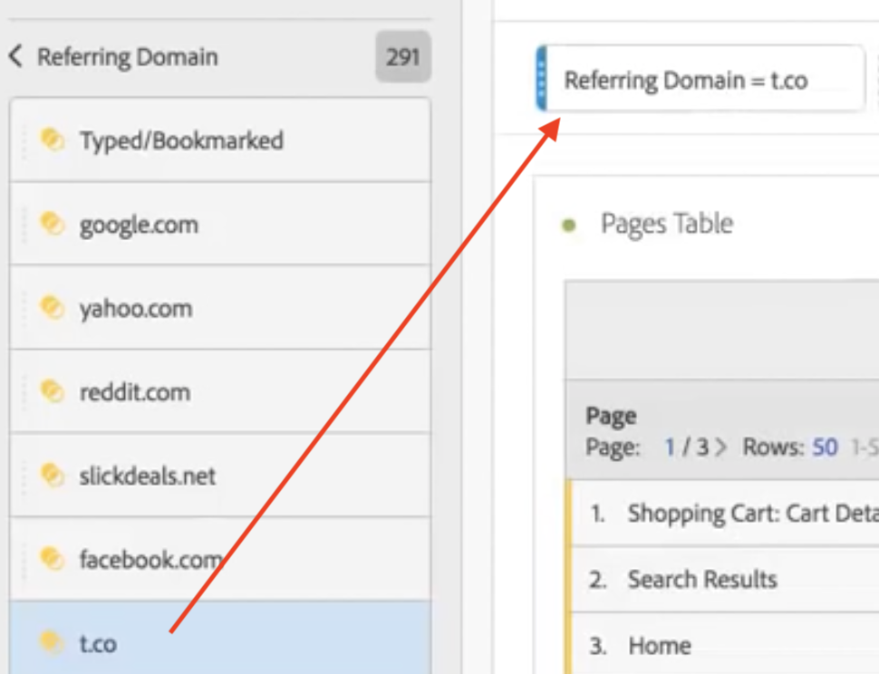
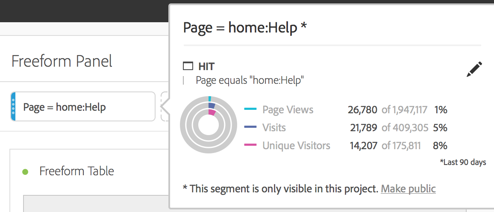

# Ad-hoc segments

Here is a video on creating ad-hoc segments:

>[!VIDEO](https://video.tv.adobe.com/v/23978/?quality=12)

You can create ad-hoc segments if you want to quickly explore how a segment might affect your project, without going to the Segment Builder. Think of these segments as temporary, project-level segments. They will typically not be part of your segment "library" like component segments in the left rail. However, you can save them, as shown below.

For a comparison of what ad-hoc segments can do vs. full-fledged component-level segments, go [here](/help/analyze/analysis-workspace/components/segments/t-freeform-project-segment.md).

1. Drop any component type (dimension, dimension item, event, metric, segment, segment template, date range) into the segment drop zone at the top of a panel. Component types are auto-converted into segments. 
   Here is an example of how to create a segment for the Twitter referring domain:

   

   Your panel automatically gets this segment applied and you can instantly see the results. 

1. You can add an unlimited number of components to a panel.
1. If you decide that you want to save this segment, refer to the section below.

Keep in mind:

* You **cannot** drop the following component types into the segment zone: calculated metrics and dimensions/metrics from which you cannot build segments.
* For full dimensions and events, Analysis Workspace creates "exists" hit segments. Examples: `Hit where eVar1 exists` or `Hit where event1 exists`.
* If "unspecified" or "none" is dropped in the segment drop zone, it is automatically converted to a "does not exist" segment so that it is treated correctly in segmentation.

>[!NOTE]
>
>Segments created this way are internal to the project.

## Save ad-hoc segments {#ad-hoc-save}

You can choose to save these segments by following these steps:

1. Hover over the segment in the drop zone and click the "i" icon.
1. In the information panel that displays, click **[!UICONTROL Save]**.

   
   