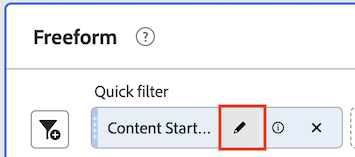
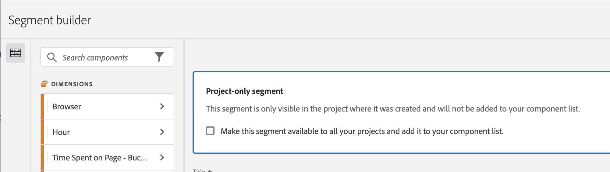

# Quick segments

Quick segments allow you to easily explore data within a given project, without the need of creating a more complex component-list segment in the [segment builder](/help/components/segmentation/segmentation-workflow/seg-build.md). 

Consider the following when creating quick segments:

* Quick segments apply only to the project where they were created. They are not available in other projects and cannot be shared to other users. 
* A maximum of 3 rules are allowed.
* Nested containers or sequential rules are not supported.

The following video demonstrates how to use quick segments:

>[!VIDEO](https://video.tv.adobe.com/v/341466/?quality=12&learn=on)

## Create a quick segment

Any user in Anlysis Workspace can create a quick segment.

To create a quick segment:

1. Choose one of the following methods to begin creating the quick segment:

   * **Ad hoc (drag-and-drop):** From the left rail, drag a component to the drop zone next to the **Segment** icon in the panel header, then select the **Edit** icon to adjust the segment.

     

      >[!NOTE]
      >
      > Consider the following when creating a quick segment ad hoc (drag-and-drop):
      > * The following component types are not supported: calculated metrics and dimensions, as well as metrics from which you cannot build segments.
      > * For full dimensions and events, Analysis Workspace creates "exists" hit segments. Examples: `Hit where eVar1 exists` or `Hit where event1 exists`.
      > * If "unspecified" or "none" is dropped in the segment drop zone, it is automatically converted to a "does not exist" segment so that it is treated correctly in segments.

   * **Using the segment icon:** In a Freeform table, select the **Segment** icon in the panel header.

     

1. Adjust any of the following settings:

   | Setting | Description |
   | --- | --- |
   | [!UICONTROL Name] | The default name of a segment is a combination of the rule names in the segment. You can rename the segment to a more friendly name. |
   | [!UICONTROL Include/exclude] | You can either include or exclude components in your segment definition, but not both. |
   | [!UICONTROL Hit/Visit/Visitor] container | Quick segments include one [segment container](https://experienceleague.adobe.com/docs/analytics/components/segmentation/seg-overview.html#section_AF2A28BE92474DB386AE85743C71B2D6) only that lets you include a dimension/metric/date range in (or exclude it from) the segment. [!UICONTROL Visitor] contains overarching data specific for the visitor across visits and page views. A [!UICONTROL Visit] container lets you set rules to break down the visitor's data based on visits, and a [!UICONTROL Hit] container lets you break down visitor information based on individual page views. The default container is [!UICONTROL Hit]. |
   | [!UICONTROL Components] (Dimension/metric/date range) | Define up to 3 rules by adding components (dimensions, metrics, date ranges, or dimension values). There are 3 ways to find the right component:<ul><li>Start typing and the quick segment builder automatically finds the appropriate component.</li><li>Use the drop-down list to find the component.</li><li>Drag and drop components from the left rail.</li></ul>  |
   | [!UICONTROL Operator] | Use the drop-down menu to find standard operators and [!UICONTROL Distinct Count] operators. See [segment operators](operators.md). |
   | Plus (+) sign | Add another rule |
   | AND/OR qualifiers | You can add "AND" or "OR" qualifiers to the rules, but you cannot mix "AND" and "OR" in a single segment definition. |
   | [!UICONTROL Apply] | Apply this segment to the panel. If the segment contains no data, you are asked if you want to continue. |
   | [!UICONTROL Open builder] | Opens the Segment Builder. After you save or apply the segment in the Segment Builder, it is no longer considered a "quick segment". It becomes part of the component-list segment library. 
To make the component available across all of your projects and in the left rail, select the option [!UICONTROL **Make this segment available to all your projects and add it to your component list**].

For more information, see the section [Save a quick segment as a component-list segment](#save-a-quick-segment-as-a-component-list-segment) in this article.

**Note:** Only users with the Segment Creation permission in the [Adobe Admin Console](https://experienceleague.adobe.com/docs/analytics/admin/admin-console/permissions/summary-tables.html#analytics-tools) can open the Segment Builder.
 |
   | [!UICONTROL Cancel] | Cancel this quick segment (don't apply it). |
   | [!UICONTROL Date range] | The validator uses the panel date range for its data lookup. But any date range applied in a quick segment overrides the panel date range at the top of the panel.  |
   | Preview (top right) | Lets you see whether you have a valid segment and how broad the segment is. Represents the breakdown of the data set you can expect to see when you apply this segment. You might get a notice that indicates that this segment has no data. In this case, you can proceed or change the segment definition. |

1. Select [!UICONTROL **Apply**] to save your changes.

## Edit quick segments

1. Hover over the quick segment and select the **Edit** icon.

   

1. Edit the segment definition and/or the segment name.

1. Select [!UICONTROL **Apply**].

## Save a quick segments as a component-list segment

>[!IMPORTANT]
>
> Consider the following when saving a quick segment:
> 
> * To save a quick segment, you need the Segment Creation permission in the [Adobe Admin Console](https://experienceleague.adobe.com/docs/analytics/admin/admin-console/permissions/summary-tables.html#analytics-tools).
> 
> * After you save or apply the segment, it can no longer be edited it in the quick segment builder. Instead, you must use the regular Segment Builder.

You can choose to save quick segments as component-list segments. Advantages of component-list segments include:

* Availablility across all your Workspace projects
* Support more complex segments as well as sequential segments

You can save segments either from the quick segment Builder or from the [!UICONTROL Filter Builder].

### Save in the quick segment builder {#save2}

1. After you apply the quick segment, hover over it and select the info ("i") icon.
1. Select **[!UICONTROL Make available to all projects and add to your component list]**.
1. (Optional) Rename the segment.
1. Select **[!UICONTROL Save]**.

   The segment now appears in your component list in the left rail. Also, note that the segment's side bar changes from light blue to a darker blue, indicating that it can no longer be edited or opened in the quick segment builder.

### Save in the Segment Builder {#save3}

1. After you apply the quick segment, hover over it and select the info ("i") icon.
1. Select **[!UICONTROL Save segment]**
1. (Optional) Rename the segment, then select [!UICONTROL **Apply**].

   Go back to Workspace and note that the segment's side bar changes from light blue to a darker blue, indicating that it can no longer be edited or opened in the quick segment builder. And by saving it, it becomes part of the component list.

After you apply the segment, you can choose to add it to your segment component list and make it available to all your projects.

1. Hover over the saved segment and select the pencil icon.

1. Select [!UICONTROL **Open builder**].

1. At the top of the Segment Builder, notice the [!UICONTROL **Project-only segment**] dialog:

   

1. Select the checkbox next to **[!UICONTROL Make available to all your projects and add to your component list.]**

1. Select **[!UICONTROL Save]**.

   The segment now appears in your segment component list for all your projects.
   You can also [share the segment](https://experienceleague.adobe.com/docs/analytics/analyze/analysis-workspace/curate-share/curate.html#concept_4A9726927E7C44AFA260E2BB2721AFC6) with other people in your organization.

## Quick segment example

The following example of a segment combines dimensions and metrics:

## Known issue

1. Create a quick segment with 2 entries and **[!UICONTROL Save]** it as Test1.
1. Click **[!UICONTROL Save as]** and save this quick segment as Test2. 
1. Edit the Test2 quick segment and save it again as Test2. 
   Notice that the Test1 quick segment gets modified by Test2.
