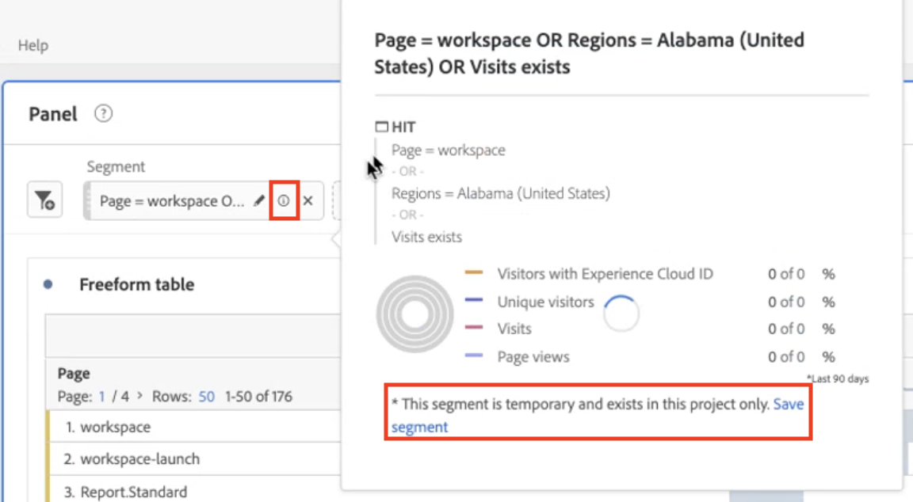
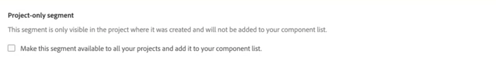

# Quick segments

You can create quick segments within a project to bypass the complexity of the full [segment builder](/help/components/segmentation/segmentation-workflow/seg-build.md). For a comparison of what quick segments can do vs. full-fledged component-list segments, go [here](/help/analyze/analysis-workspace/components/segments/t-freeform-project-segment.md). Quick segments allow for up to 3 rules and do not accommodate nested containers, or sequential segments.

>[!IMPORTANT]
> Quick segments are currently in limited testing and are not generally available yet.

## Create quick segments

In a Freeform table, click the filter+ icon in the panel header: 

| Setting | Description |
| --- | --- |
| Name | The default name of a segment is a combination of the rules in the segment. You can rename the segment. |
| Include/exclude | You can include or exclude components in your segment definition, but not both. |
| Hit/Visit/Visitor container | Quick segments include one [segment container](https://experienceleague.adobe.com/docs/analytics/components/segmentation/seg-overview.html?lang=en#section_AF2A28BE92474DB386AE85743C71B2D6) only that lets you include a dimension/metric/date range in (or exclude it from) the segment. [!UICONTROL Visitor] contains overarching data specific for the visitor across visits and page views. A [!UICONTROL Visit] container lets you set rules to break down the visitor’s data based on visits, and a [!UICONTROL Hit] container lets you break down visitor information based on individual page views. The default container is [!UICONTROL Hit]. |
| Components (Dimension/metric/date range) | Define up to 3 rules by adding components dimensions and/or metrics and/or date ranges. There are 3 ways to find the right component:<ul><li>Start typing and the [!UICONTROL Quick Segment] builder automatically finds the appropriate component.</li><li>Use the drop-down list to find the component.</li><li>Drag and drop components from the left rail.</li></ul>  |
| Operator | Use the drop-down menu to find standard operators like `contains`, and [!UICONTROL Distinct Count] operators. |
| Plus (+) sign | Add another rule |
| And/Or qualifiers | You can add "AND" or "OR" qualifiers to the rules, but you cannot mix "AND" and "OR" in a single segment definition. |
| Apply | Apply this segment to the panel. |
| Open builder | Opens the Segment Builder. |
| Cancel | Cancel this quick segment - don't apply it. |
| Date range | The validator uses the panel date range for its data lookup. But any date range applied in a quick segment overrides the panel date range at the top of the panel.  |
| Preview (top right) | Lets you see whether you have a valid segment and how broad the segment is. Represents the breakdown of the data set you can expect to see when you apply this segment.  |

Here is an example of a segment that combines dimensions and metrics:

The segment appears at the top. Notice its grey sidebar, as opposed to the blue sidebar for component-level segments in the segment library on the left.

## Edit quick segments

1. Hover over the quick segment and select the pencil icon.
1. Edit the segment definition or the segment name.

## Save quick segments

You can choose to save quick segments either in the Quick Segments builder or by following these steps.

>[!IMPORTANT]
>Once you save or apply the segment, you can no longer edit it in the Quick Segment Builder, only in the regular Segment Builder.

1. Hover over the quick segment and select the info ("i") icon.
1. Select **[!UICONTROL Save segment]**

   

1. Leave the name as is or rename the segment.

   Go back to Workspace and notice how the segment now has a blue sidebar. This indicates it can no longer be edited/opened in the Quick Segment Builder. And by saving it, it becomes part of the component list.

   

After you have applied the segment, you can choose to add it to your segment component list and make it available to all your projects. 

1. Hover over the saved segment and select the pencil icon.

1. At the top of the Segment Builder, notice this dialog:

   

1. Select the checkbox next to **[!UICONTROL Make this segment available to all your projects and add it to your component list.]**
1. Click **[!UICONTROL Save]**.
1. The segment now appears in your segment component list for all your projects.
1. You can also [share the segment](/help/components/segmentation/segmentation-workflow/t-seg-share.md) with other people in your organization.

## What are project-only segments?

Project-only segments are either quick segments or ad-hoc Workspace project segments. When editing/opening them in the segment builder then the project-only box will show up. If they APPLY a quick segment in the builder but don’t check the make available box, then it is still a project-only segment but it can no longer be opened in the QS builder. If they check the box and SAVE it is now a component-list segment. 