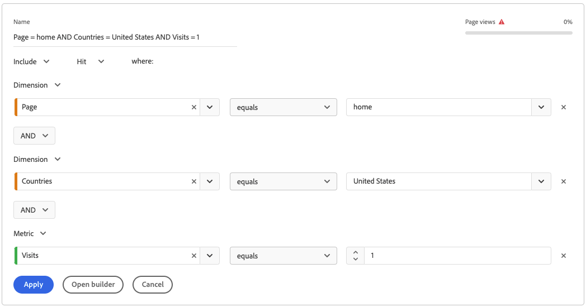

# Quick segments

You can create quick segments within a project to bypass the complexity of the full [segment builder](/help/components/segmentation/segmentation-workflow/seg-build.md). For a comparison of what quick segments can do vs. full-fledged component-level segments, go [here](/help/analyze/analysis-workspace/components/segments/t-freeform-project-segment.md).

>[!IMPORTANT]
> Quick segments are currently in limited testing and are not generally available yet.

## Create quick segments

1. In a Freeform table, click the filter+ icon in the panel header: 

   

   Note that:

   - There is one segment container only that lets you include a dimension/metric/date range in (or exclude it from) the segment.
   - You can set the container to Hit, Visit, or Visitor level. Default is Hit.

1. Add a dimension/metric/date range in one of 3 ways:

   - Start typing and the Quick Segment builder automatically finds the appropriate component.
   - Use the drop-down list to find the component.
   - Drag and drop components from the left rail.

1. Specify the first rule, such as `Page equals workspace`. You can have up to three rules in the segment definitions. Just click the "+" sign to add another rule. You can add "AND" or "OR" qualifiers to the rules, but you cannot mix "AND" and "OR" in a single segment definition. 

   Here is an example of a segment that combines dimensions and metrics:

   

1. Click **[!UICONTROL Apply]** to apply this segment to the panel. 
   The segment appears at the top. Notice its grey sidebar, as opposed to the blue bar for component-level segments at the left.

   

## Make quick segments public

You can choose to make these segments public (global) by following these steps:

1. Hover over the quick segment and click the "i" icon.
1. Click **[!UICONTROL Open builder]**.
   This opens the segment in the Segment Builder. 
   >[!NOTE]
   >Once you apply or save the segment in the Segment Builder, you can no longer edit it in the Quick Segment Builder.
1. Click **[!UICONTROL OK]**.
1. In the Segment Builder, click **[!UICONTROL Apply]**.
1. Go back to Workspace and notice how the segment now has a blue sidebar, signaling that it is part of the component library.

   

