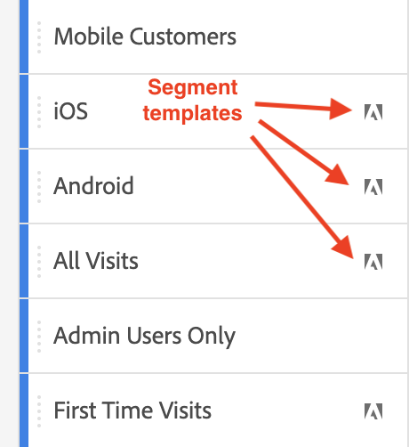

# Segments {#topic_DC2917A2E8FD4B62816572F3F6EDA58A}

You can create different types of segments in Workspace, depending on how complex they need to be, whether they should apply to this project only, etc. Here is a summary of segment types:

| Segment type | Created where? | Applicable where? | When to use |
| --- | --- | --- | --- |
| Component list segment | [Segment Builder](/help/components/segmentation/segmentation-workflow/seg-build.md) | Global/public | For complex segments, sequential segments |
| Quick segment | [Quick segment builder](/help/analyze/analysis-workspace/components/segments/quick-segments.md) | Project level, but can make public | Flexibility and control to add/edit rules, names and multiple rules |
| Ad hoc segments: |  |  |  | 
|  - Ad hoc Workspace project segment | [Drag and drop into segment drop zone in a project](/help/analyze/analysis-workspace/components/segments/ad-hoc-segments.md) | Project level, but can make public | For default, single-rule segments |  
|  - Calculated metrics-based segment | [Calculated metric builder](https://experienceleague.adobe.com/docs/analytics/components/calculated-metrics/calcmetric-workflow/metrics-with-segments.html) | To individual calculated metric | Apply segment/s within your metric definition |
|  - VRS-based segment | [Virtual report suite builder](https://experienceleague.adobe.com/docs/analytics/components/virtual-report-suites/vrs-workflow/vrs-create.html) | To individual virtual report suite | Apply segment/s within your VRS definition |

For an in-depth discussion of segmentation in Adobe Analytics, go [here](/help/components/segmentation/seg-overview.md).

## Create segments {#section_693CFADA668B4542B982446C2B4CF0F5}

You can create different types of segments in Analysis Workspace:

* [Quick segments](/help/analyze/analysis-workspace/components/segments/quick-segments.md)
* [Ad-hoc segments](/help/analyze/analysis-workspace/components/segments/ad-hoc-segments.md)
* Regular component list segments that end up in the segment library (see below)

### Create Component list segments {#section_3B07D458C43E42FDAF242BB3ACAF3E90}

The segment rail under the Components menu shows segments as well as segment templates, as signified by these icons:

[Using Segments in Analysis Workspace](https://experienceleague.adobe.com/docs/analytics-learn/tutorials/analysis-workspace/applying-segments/using-segments-in-analysis-workspace.html)(6:46)

### Other methods for applying segments {#section_10FF2E309BA84618990EA5B473015894}

>[!VIDEO](https://video.tv.adobe.com/v/30994/?quality=12)

Several other methods exist for applying segments to a freeform project.

| Action | Description |
|--- |--- |
| Create segment from selection | Create an inline segment. This segment applies only to the open project and is not saved as an Analytics segment. 1. Select rows.  2. Right-click the selection.  3. Click *Create segment from selection*. |
| Components > New Segment | Displays the Segment Builder. See [Segment Builder](https://experienceleague.adobe.com/docs/analytics/components/segmentation/segmentation-workflow/seg-build.html) for more information about segmentation. |
| Share > Share Project or Share > Curate Project Data | In [Curate and Share](https://experienceleague.adobe.com/docs/analytics/analyze/analysis-workspace/curate-share/curate.html#concept_4A9726927E7C44AFA260E2BB2721AFC6), learn how segments that you apply to the project are available in shared analysis for the recipient. |
| Use Segments as Dimensions | Video: [Using Segments as Dimensions in Analysis Workspace](https://experienceleague.adobe.com/docs/analytics-learn/tutorials/analysis-workspace/applying-segments/using-segments-as-dimensions-in-analysis-workspace.html?lang=en) |

