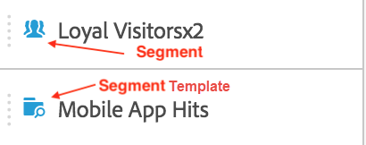
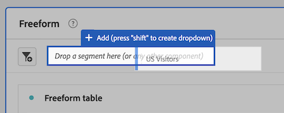

# Segments {#topic_DC2917A2E8FD4B62816572F3F6EDA58A}

## Segment rail {#section_3B07D458C43E42FDAF242BB3ACAF3E90}

The segment rail under the Components menu shows segments as well as segment templates, as signified by these icons:

[Using Segments in Analysis Workspace](https://experienceleague.adobe.com/docs/analytics-learn/tutorials/analysis-workspace/applying-segments/using-segments-in-analysis-workspace.html)(6:46)

## Create segments {#section_693CFADA668B4542B982446C2B4CF0F5}

You can create instant segments by dropping any component type (dimension, dimension item, event, metric, segment, segment template, date range) into the segment drop zone at the top of a panel.

Component types are auto-converted into segments. Alternatively, you can click the "+" sign in the Add Segment drop box.

Keep in mind that:

* You **cannot** drop the following component types into the segment zone: calculated metrics and dimensions/metrics from which you cannot build segments.
* For full dimensions and events, Analysis Workspace creates "exists" hit segments. Examples: "Hit where eVar1 exists" or "hit where event1 exists".
* If "unspecified" or "none" is dropped in the segment drop zone, it is automatically converted to a "does not exist" segment so that it is treated correctly in segmentation.

>[!NOTE]
>
>Segments created this way are internal to the project.

You can choose to make these segments public (global) by following these steps:

1. Hover over the segment in the drop zone and click the "i" icon.
1. In the information panel that displays, click **[!UICONTROL Make public]**.

   

## Other methods for applying segments {#section_10FF2E309BA84618990EA5B473015894}

Several other methods exist for applying segments to a freeform project.

| Action | Description |
|--- |--- |
|Create segment from selection | Create an inline segment. Select rows, right-click the selection, then create an inline segment. This segment applies only to the open project and is not saved as an Analytics segment. 1. Select rows.  2. Right-click the selection.  3. Click *Create segment from selection*.|
|Components > New Segment | Displays the Segment Builder. See [Segment Builder](https://experienceleague.adobe.com/docs/analytics/components/segmentation/segmentation-workflow/seg-build.html) for more information about segmentation.|
|Share > Share Project or Share > Curate Project Data|In [Curate and Share](https://experienceleague.adobe.com/docs/analytics/analyze/analysis-workspace/curate-share/curate.html#concept_4A9726927E7C44AFA260E2BB2721AFC6), learn how segments that you apply to the project are available in shared analysis for the recipient.|
|Use Segments as Dimensions|Video: [Using Segments as Dimensions in Analysis Workspace](https://experienceleague.adobe.com/docs/analytics-learn/tutorials/analysis-workspace/applying-segments/using-segments-as-dimensions-in-analysis-workspace.html?lang=en)|

## Ad hoc (temporary) segments in Analysis Workspace

Here is a video on ad hoc segments:

>[!VIDEO](https://video.tv.adobe.com/v/23978/?quality=12)
