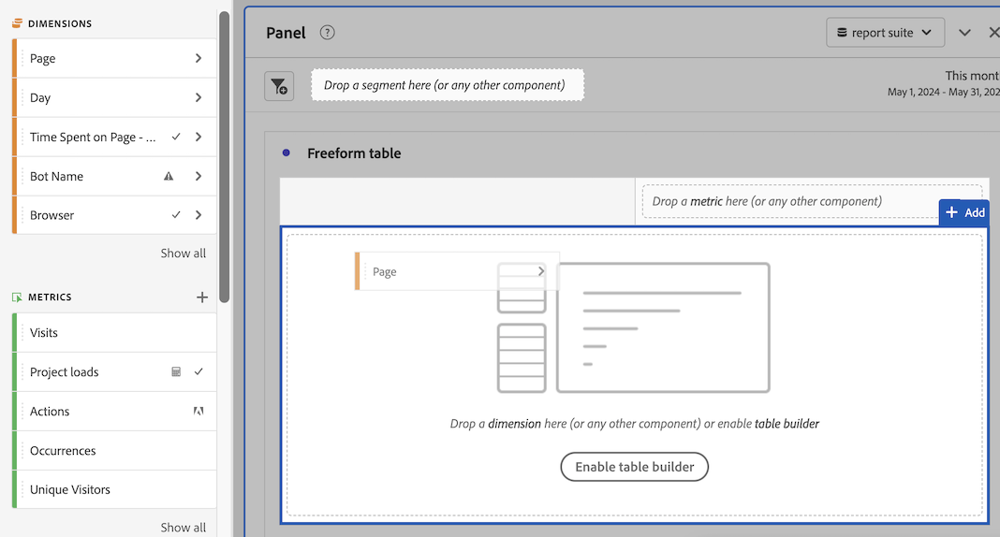

# Use components in Analysis Workspace

Components make up the actual data of any project in Analysis Workspace. Components consist of dimensions, metrics, segments, and date ranges. You can add components to a project by dragging them into visualizations or panels.

For overview information about the types of components you can add, see [Components overview](/help/analyze/analysis-workspace/components/analysis-workspace-components.md).

>[!TIP]
>
>For information about each component, select the Info icon next to a component's name in the left rail of Analysis Workspace, or see the [Analytics Components Guide](/help/components/home.md).

## Begin adding components to a project

1. [Create a project in Analysis Workspace](/help/analyze/analysis-workspace/build-workspace-project/create-projects.md) if you haven't already.

1. [Add a panel](/help/analyze/analysis-workspace/c-panels/panels.md) or [add a visualization](/help/analyze/analysis-workspace/visualizations/freeform-analysis-visualizations.md#add-visualizations-to-a-panel) to the project in Analysis Workspace. 

   If you add a component to a blank project, a freeform table visualization is automatically created.

1. Select the **[!UICONTROL Components]** icon in the left rail.

   

1. Scroll to or search for the component you want to add, then drag it to a panel or visualization within your project. 

1. (Optional) Drag a component to the segment drop zone in a panel header. 

   Segments apply to all content within the panel.

   For information about how you can use the segment drop zone on a panel to filter your panel, see [Drop zone](/help/analyze/analysis-workspace/c-panels/panels.md#drop-zone) in [Panels overview](/help/analyze/analysis-workspace/c-panels/panels.md).

   

1. For more detailed information, continue with one of the following sections, depending on the component type you are adding:

   * [Add dimensions to a project](#add-dimensions-to-a-project)

   * [Add metrics to a project](#add-metrics-to-a-project)

   * [Add segments to a project](#add-segments-to-a-project)

   * [Add date ranges to a project](#add-date-ranges-to-a-project)

## Add dimensions to a project

[Dimensions](/help/components/dimensions/overview.md) are variables in Adobe Analytics that typically contain string values. Common dimensions include [Page](/help/components/dimensions/page.md), [Referring domain](/help/components/dimensions/referring-domain.md), or an [eVar](/help/components/dimensions/evar.md). In contrast, [metrics](/help/components/metrics/overview.md) contain numeric values that tie to a dimension. A basic report shows rows of string values (dimension), against a column of numeric values (metric).

1. Start adding a dimension to your project in Analysis Workspace, as described in [Begin adding components to a project](#begin-adding-components-to-a-project).

1. Choose one of the following methods to add dimensions and determine the type of data you want to analyze:

   * Drag a dimension to a visualization (such as a freeform table) in Analysis Workspace.

     
   
   * Drag one or more dimensions from the left rail onto the segment drop zone to create an ad hoc segment, as described in [Add segments to a project](#add-segments-to-a-project).

     

1. (Optional) You can break down dimensions and dimension items in Analysis Workspace with other components. 

   For more information, see [Break down dimensions](/help/analyze/analysis-workspace/components/dimensions/t-breakdown-fa.md).

For more information about how to use dimensions in Analysis Workspace, see [Preview dimensions](/help/analyze/analysis-workspace/components/dimensions/view-dimensions.md), [Break down dimensions](/help/analyze/analysis-workspace/components/dimensions/t-breakdown-fa.md), and [Time-parting dimensions](/help/analyze/analysis-workspace/components/dimensions/time-parting-dimensions.md).

## Add metrics to a project

[Metrics](/help/analyze/analysis-workspace/components/apply-create-metrics.md) allow you to quantify data points in Analysis Workspace. They are most commonly used as columns in a visualization and tied to dimensions.

To add a metric to a project in Analysis Workspace:

1. Start adding a metric to your project in Analysis Workspace, as described in [Begin adding components to a project](#begin-adding-components-to-a-project).

1. Choose one of the following methods to add a metric in Analysis Workspace:

   * Drag a metric to the metric drop zone in an empty Freeform table to see that metric trended over the project's date period. 

     

   * Drag a metric when a dimension is present to see that metric compared to each dimension item. 

   * Drag a metric on top of an existing metric header to replace it.

   * Drag a metric next to a header to see both metrics side-by-side.

For more information about how to use metrics in Analysis Workspace, see [Metrics](/help/analyze/analysis-workspace/components/apply-create-metrics.md).

## Add segments to a project

[Segments](/help/components/segmentation/seg-overview.md) allow you to identify subsets of visitors based on characteristics or specific interactions.

You can use segments in Analysis Workspace in any of the following ways:

### Add segments to a panel

When you add segments to a panel, the segments apply to all content within the panel.

For information about how you can use the segment drop zone on a panel to filter your panel, see [Drop zone](/help/analyze/analysis-workspace/c-panels/panels.md#drop-zone) in [Panels overview](/help/analyze/analysis-workspace/c-panels/panels.md).

### Add segments to a column in a freeform table

When you add segments to a column in a freeform table, the segments apply to all content within the table column.

### Use segments when creating calculated metrics

In the Calculated metric builder, you can apply segments within your metric definition. 

For more information, see [Segmented metrics](/help/components/c-calcmetrics/c-workflow/cm-workflow/c-build-metrics/metrics-with-segments.md).

## Add date ranges to a project

[Date ranges](/help/analyze/analysis-workspace/components/calendar-date-ranges/custom-date-ranges.md) determine the reporting time frame in Analysis Workspace, and can be applied to one or more panels within a project.

Each panel includes a date range by default. There are multiple ways to update a date range for a panel. One way to update a date range for a panel in Analysis Workspace is to drag a date range component from the left rail:

1. Start adding a date range to your project in Analysis Workspace, as described in [Begin adding components to a project](#begin-adding-components-to-a-project).

1. Drag a date range from the left rail onto the current date range in the upper-right portion of the panel.

     

For more information about how to use calendars and date ranges in Analysis Workspace, see [Calendar and date ranges overview](/help/analyze/analysis-workspace/components/calendar-date-ranges/calendar.md).
