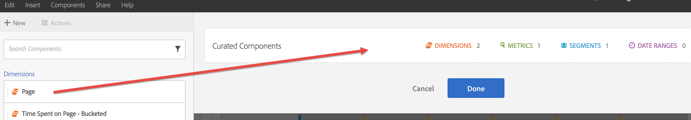

# Curation/Sharing overview

Curation lets you limit the components before sharing a project. You can share a project and its components with marketers and other non-analysts in your business. Annotate and apply tags to projects.

**Video overview** 
>[!VIDEO](https://www.youtube.com/watch?v=LJJRskdmlOg&index=79&t=0s&list=PL2tCx83mn7GuNnQdYGOtlyCu0V5mEZ8sS)  **[!UICONTROL Workspace]** > **[!UICONTROL Share]**> **[!UICONTROL Curate Project Data]**

## Curate project data

1. Specify permission to create and curate projects.

   Before creating or curating an Analysis Workspace project, administrators must add you to a [group](https://marketing.adobe.com/resources/help/en_US/reference/?f=groups) with the **[!UICONTROL Create / Curate Projects in Analysis Workspace]** permission enabled, or to the **[!UICONTROL All Report Access]** user group. ( **[!UICONTROL Admin]** > **[!UICONTROL User Management]** > **[!UICONTROL Groups]**). 

1. [Create and save](../../../analyze/analysis-workspace/build-workspace-project/t-freeform-project.md#task_C2C698ACC7954062A28E4784911E6CF2) a project, then click **[!UICONTROL Share]** > **[!UICONTROL Curate Project Data]**. 
1. Drag components you want to share from the draggable component stack on the left to the **[!UICONTROL Curated Components]** field.

   

   >[!IMPORTANT]
   >
   >Curating components is not required for sharing a project. You can share a project with all available, default components, or with the selected components. To preserve all of the default components in a project, a best practice is to create a copy of a project for yourself (using **[!UICONTROL Save As]**) prior to curating components. Once you curate the components in a project, the other components are no longer available to you for that project.

1. Click **[!UICONTROL Done]**.

The resulting project behaves like a typical project in Analysis Workspace, but only with the specified components to choose from.

## Share a curated project

Sharing makes this project available to other Analysis Workspace users in your organization. Any curation you have done is reflected when others use the project.

1. After you curate the components of a report, click **[!UICONTROL Share]** > **[!UICONTROL Share Project]**.

   

1. Add recipients. 
1. (Optional) You can share embedded project components (segments, calculated metrics, and date ranges) with all recipients. After being shared, these components will appear in the components drop-down of the recipient’s Workspace. 

   >[!IMPORTANT]
   >
   >This setting does not persist - it is a singular action at the time of sharing.

1. Optionally, you can set this page as the landing page for recipients. 

   >[!IMPORTANT]
   >
   >This setting does not persist - it is a singular action at the time of sharing.

1. Click **[!UICONTROL Share]**.

<!-- 

 <b>Annotate and tag a project</b> 
 

An alternative way to collaborate on a project is to use the Information panel. This panel will be re-introduced in an upcoming release. 
 

 
 
<ul id="ul_EFD045FD9F3B4BF8A70637B00EE0BC9C"> 
 <li id="li_EC6C5EAF9C234E76BDA7FF0226B82083">Tag reports for sharing. </li> 
 <li id="li_CF6A438C55F847F8890F8CB674CAA4F7">Specify the recipient (filter by permission group or user name), the storage folder. In-product notifications let users know that they have a shared report waiting. </li> 
 <li id="li_C8E088DA43024277908705CB0F3A142A">Write messages or report descriptions for recipients. </li> 
 <li id="li_342EB4758C344B859757E23691068FA3"> Select the dimensions, metrics, and segments to recommend to a non-analyst colleague, who can view the report you are curating and sharing. Curating the component gives the recipient access to those components, based on their permission settings. </li> 
 <li id="li_6487500F9315481599B7F3897998879F"> Add suggested items to a previously configured report. These new items exist as recommended selectable options. </li> 
</ul>

 -->

