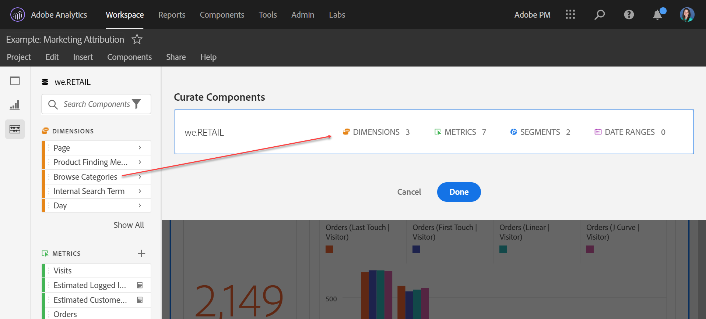
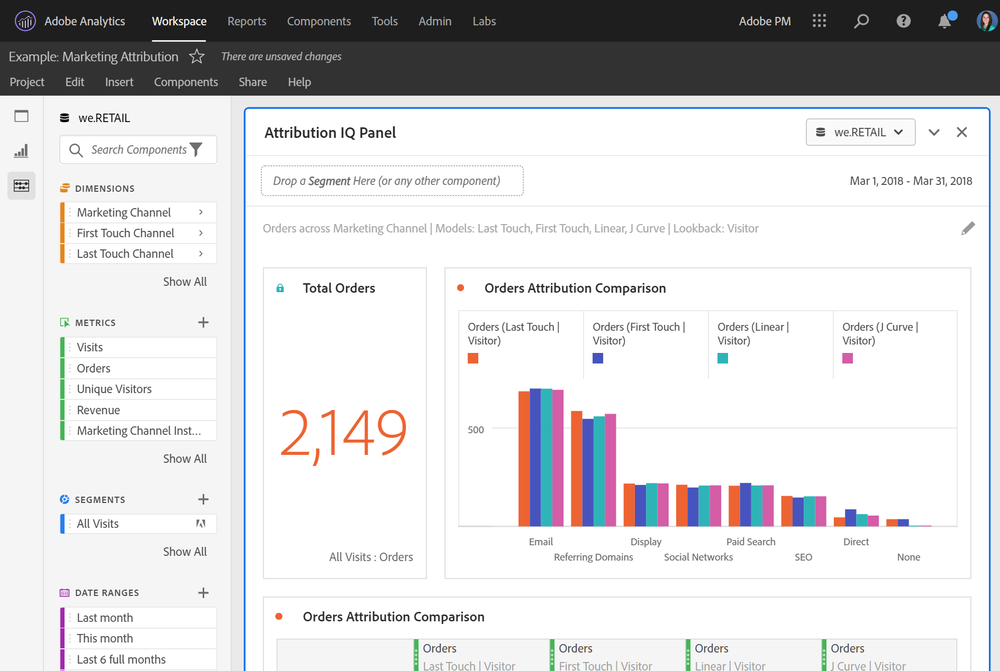

# Curate projects

Curation lets you limit the components (dimensions, metrics, segments, date ranges) before sharing a project. When a recipient opens the project, they will see a limited set of components that you have curated for them. Curation is an optional but recommended step before sharing a project. 

>[!NOTE]
> Product profiles are the primary mechanism governing which components a user can see. They are managed through the Adobe Experience Cloud Admin Console. Curation is a secondary filter. 

## Apply project curation

1. Click **[!UICONTROL Share]** > **[!UICONTROL Curate Project Data]**. 
   The components that are used in the project will automatically be added. 
   **Note**: If a project has multiple report suites, you will see a curate field for each report suite in the project. 
1. (Optional) To add more components, drag components you want to share from the left rail to the [!UICONTROL Curate Components] field.  
1. Click **[!UICONTROL Done]**.

Curation can also be applied from the [!UICONTROL Share] menu by clicking **[!UICONTROL Curate and Share]**. This option automatically curates the project to the components in use in the project. You can add additional components following the steps above.

## Curated project view

When a recipient opens a curated project, they will only see the curated set of components you have defined:

## Remove project curation

To remove project curation and restore the full set of components in the left rail:

1. Click **[!UICONTROL Share]** > **[!UICONTROL Curate Project Data]**. 
1. Click **[!UICONTROL Remove Curation]**. 
1. Click **[!UICONTROL Done]**.

## Virtual Report Suite (VRS) curation

To apply curation at a report-suite level, so that it applies to many projects at once, you can [curate components in a Virtual Report suite (VRS)](https://experienceleague.adobe.com/docs/analytics/components/virtual-report-suites/vrs-components.html). 

>[!NOTE]
> VRS curation is always applied before project curation. This means that even if your curated project includes certain components, they will be filtered out if the curated VRS does not include them.

## Show All components option

In a curated project or VRS, the recipient will be presented with the option to **[!UICONTROL Show All]** components in the left rail. [!UICONTROL Show All] reveals different sets of components, depending on:

* The user’s permission level (admin or non-admin)
* Project role (owner/editor or not)
* Type of curation applied (VRS or project)
* Components owned by or shared to the user. Owned/shared components include segments, calculated metrics, and date ranges. They do not include implemented components such as eVars, props, and custom events. 

Note: Non-admin view roles do not have access to the left rail in a project, so they have been omitted from the table below.

|Curation Type|Admins|Non-Admin project owner or edit role|Non-Admin duplicate role|
|---|---|---|---|
|Curated VRS|All non-curated VRS components|Non-curated VRS components that this role owns or that have been shared with them|Non-curated VRS components that this role owns or that have been shared with them|
|Curated Project|All non-curated project components|All non-curated project components|Non-curated project components that this role owns or that have been shared with them|
|Curated Project in a Curated VRS| All non-curated components, shown under **[!UICONTROL Non-Curated Project Components]** and **[!UICONTROL Non-Curated VRS Components]**| All non-curated project components AND non-curated VRS components that this role owns or that have been shared with them|Non-curated VRS and project components that this role owns or that have been shared with them|
