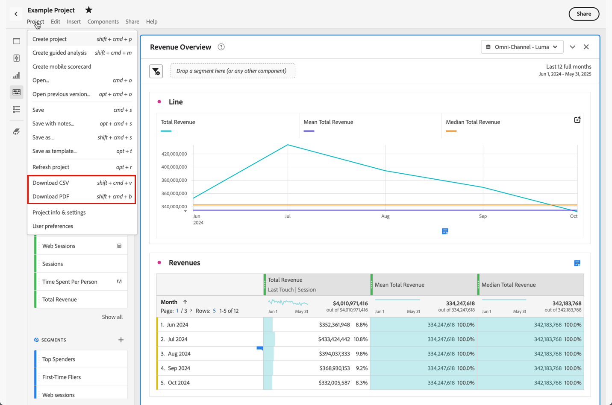
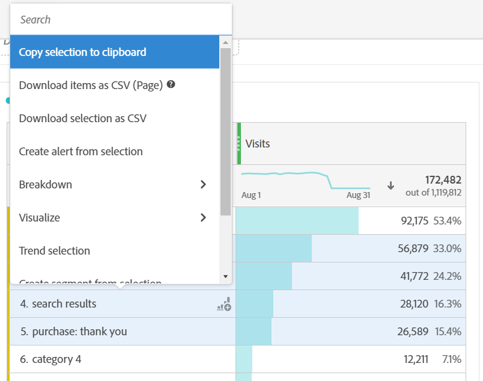
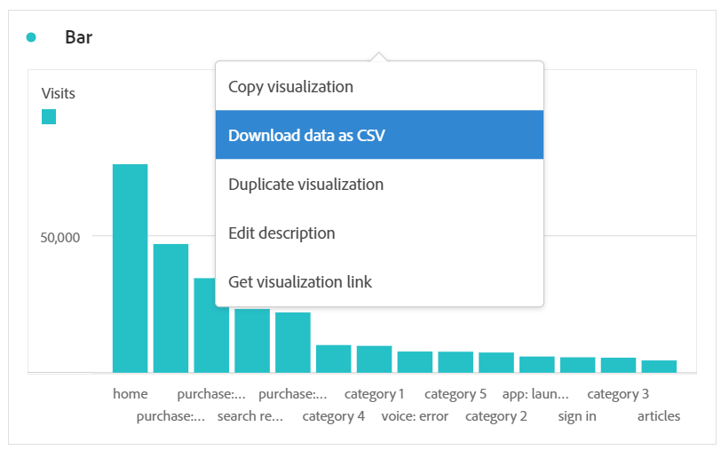
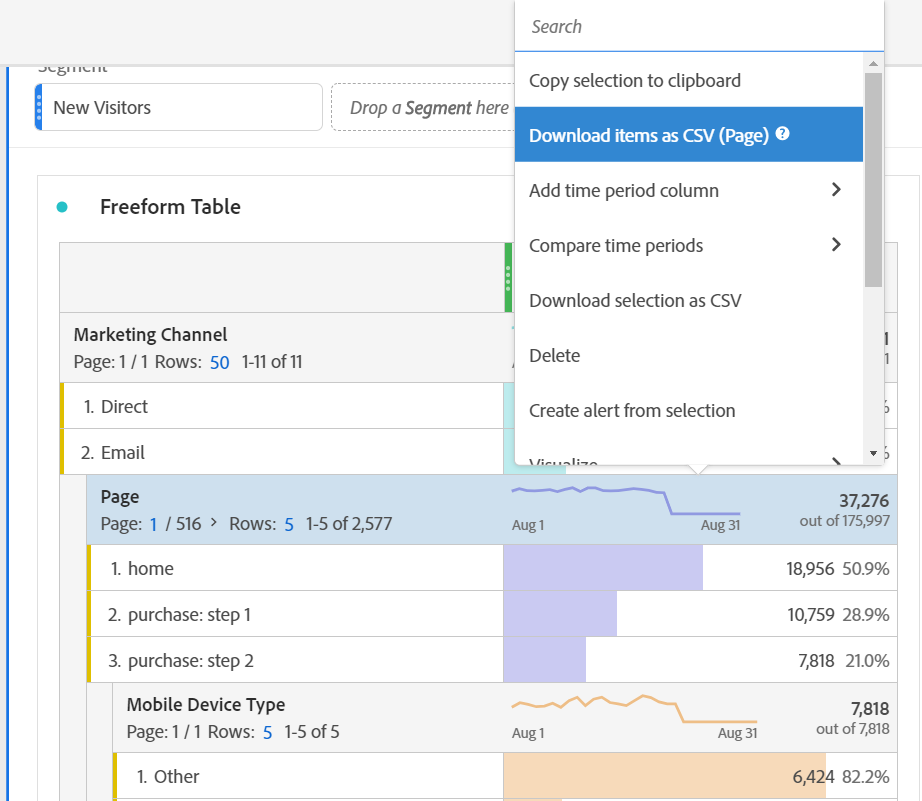
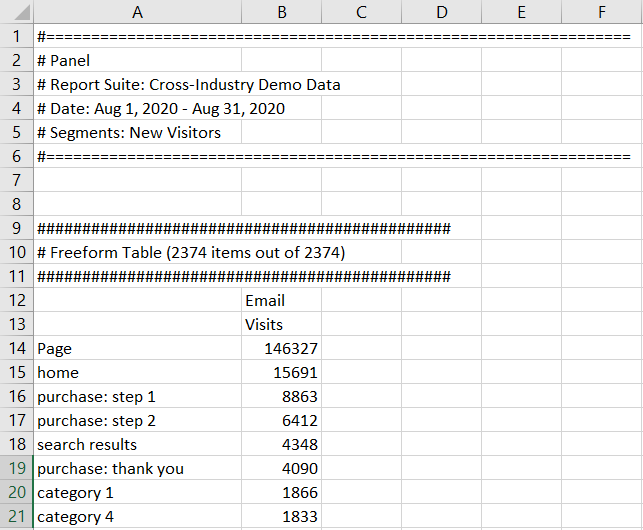

# Download PDF or CSV files

There are several different ways you can export data from Analysis Workspace, depending on what set of data you want to analyze outside of the tool and who needs to receive the information. Exported data can be in the form of copied data, CSV or PDF files. A PDF is typically preferred if you want visualizations included in the file, while a CSV (or copied data) is preferred if you simply want plain-text data.

## Download project as CSV or PDF {#download-project}

You can download a full project by going to **[!UICONTROL Project > Download as PDF (or as CSV)]**. The downloaded file contains all of the displayed (visible) tables and visualizations in the project. A PDF is typically preferred if you want visualizations included in the file, while a CSV is preferred if you simply want plain-text data.

For project downloads, keep in mind:

* The project can be saved or unsaved when you request a project download. However, only saved projects can be [scheduled](https://experienceleague.adobe.com/docs/analytics/analyze/analysis-workspace/curate-share/t-schedule-report.html). 
* PDFs downloaded in the browser can take several minutes to export because the project is re-run on Adobe servers before rendering in PDF format. We recommend not leaving the project until the PDF downloads in your browser. However, you can continue to make changes to the project while you wait. If a PDF takes longer than 5 minutes to render, you will be prompted to email it instead.
* PDF downloads are rendered as a single page with no pagination applied.
* When a project is rendered to PDF, we render what is on the page. If a project has custom-sized visualizations and panels, you need to change them to be auto-sized (button in top-right corner) so that there will be no truncated content.

## Copy data to clipboard (hotkey: Ctrl+C) {#copy-data}

The right-click option **[!UICONTROL Copy to clipboard]** lets you quickly copy data from Workspace and paste it elsewhere. 

* If you want the displayed table copied, right-click on the table header and choose **Copy data to clipboard**. 
* If you want a subset of data copied, make a selection in the table and then right-click > **Copy selection to clipboard**.

Additionally, the hotkey `Ctrl+C` copies your selection to the clipboard. Once copied, you can go into another tool and paste the information (or hit `Ctrl+V`).

## Download data as CSV {#download-data}

The right-click option **[!UICONTROL Download data as CSV]** allows you to download a table of data or the data source of any visualization as a CSV.

* From the header of any table or visualization, right-click **[!UICONTROL Download data as CSV]**. This downloads the displayed data in the table or the underlying data source for a visualization as a CSV. Note: the Map visualization does not support this option.
* If a selection is made in the table, the option will say **[!UICONTROL Download selection as CSV]**. Only the selection is downloaded with this option, as opposed to the full, displayed table.

## Download items as CSV {#download-items}

If you want to analyze more than the visible 400 rows of data in a table, right-click the table header or any row and select **Download items as CSV (Dimension name)**. This option will export up to 50,000 dimension items (based on the table sort) for the selected dimension, with filters and segments applied. If you chose this option from the top of the table, the first dimension in the table will be exported. While no limits are enforced in the freeform table, it is recommended that the Download items option be used in tables with less than 20 columns to ensure optimal performance.

>[!TIP]
>
> If your dimension exceeds 50,000 items, download the file with different sort metrics applied or apply a filter. For example, sort descending by Visits in one download and then ascending by Visits in a second download. This tip can help you retrieve longer-tail items.

You can multi-task within the project and even navigate to a new Workspace project in the same tab while the download is in progress. The download will pause if you open a new browser tab. The download will cancel if you leave Workspace completely or close the browser tab.

### Downloaded items file 

Features of the table will be applied to the downloaded file as follows:

* All panel segments are applied as filters.
* Breakdowns **above** the selected dimension in the table are applied as filters above each column. 
* Breakdowns **below** the selected dimension in the table are removed.

In the example above, Page items are downloaded with the panel segment (New Visitors Customers) and components above (Marketing Channel = Email) applied as filters, and the components below (Mobile Device Type) removed from the downloaded CSV.

### Download notifications

As the file downloads, you will see an informational notification with the progress. At any time, you can cancel the download by clicking **[!UICONTROL Cancel download]**. Closing the toast **will not** cancel the download. 

Once the file completes, you will see a completion notification and the file will download to your browser.

If you request more than one download at a time, you will receive a notification that each additional download will be queued until the prior download completes.

## FAQ {#faq}

| Question | Answer |
| --- | --- |
| Why is my downloaded PDF one page? | Workspace does not paginate downloaded PDFs at this time. |
| Can I export more than 50,000 items with the “Download items as CSV” option? | While each download can contain up to 50,000 dimension items, you can change the sort of your table to retrieve longer tail items, or apply a filter to download more specific items. |
| What does **[!UICONTROL Copy visualization]** do? | **[!UICONTROL Copy visualization]** is not an export option. It allows you to copy a visualization or panel from one place in Workspace to another. For example, from one panel to another in the same project, or from one project to another project. [Intra-linking video](https://experienceleague.adobe.com/docs/analytics-learn/tutorials/analysis-workspace/visualizations/intra-linking-in-analysis-workspace.html) |
