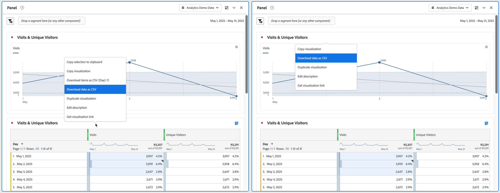
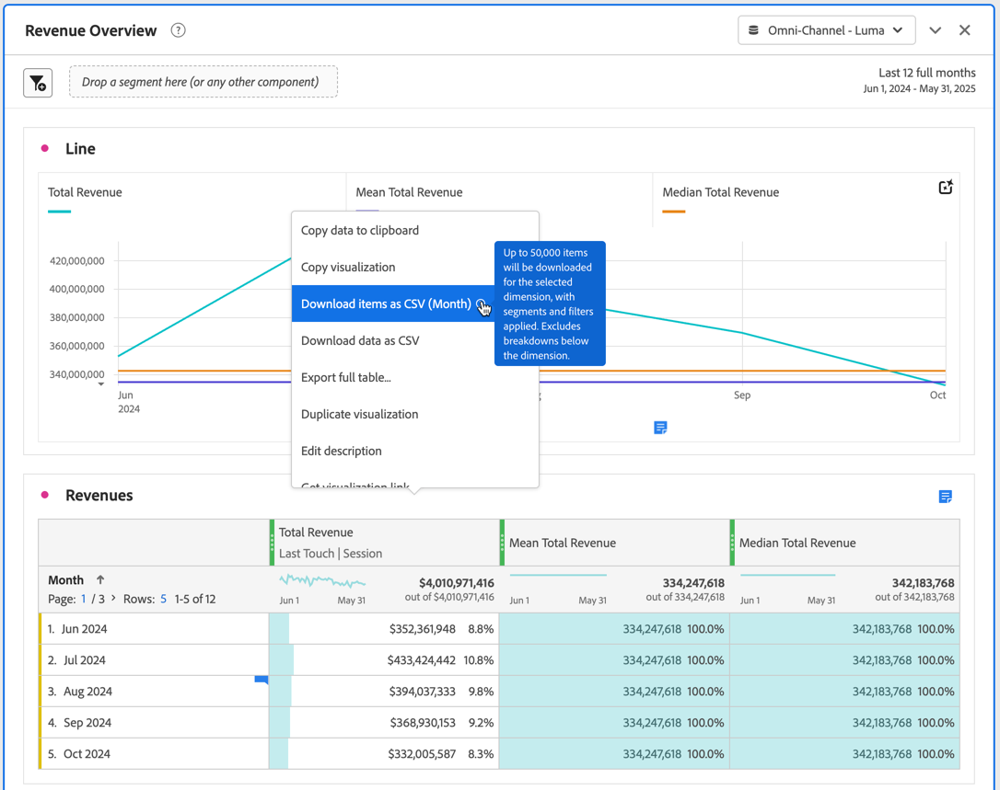
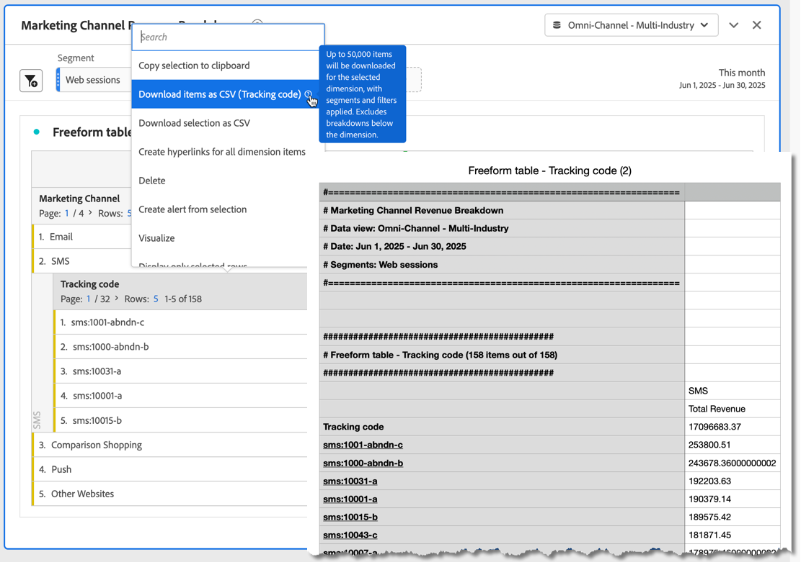

# Download projects and data

You can download Analysis Workspace projects and data to your local device. This download can be copied data, a CSV (comma separated value data) file, or a PDF (portable document format) document. 

* Select the PDF option if you want visualizations included in the downloaded file. 
* Select the CSV and copied data options if you simply need plain-text data.

Additional methods to export Adobe Analytics data are described in the [Export guide](/help/export/home.md).

## Download a project as a PDF or CSV file {#download-project}

### Download a project as a PDF file

Consider the following when you download a project as a PDF:

* Do not leave the project until the project downloads to your workstation. The download can take several minutes as the project is rerun on Adobe servers in order for the PDF to render. You can continue to make changes to the project while the download is rendering. If a PDF takes longer than 5 minutes to render, you are prompted to [email the PDF](../curate-share/send-schedule-files.md) instead.
* Downloads are rendered as a single page with no pagination applied.
* The PDF contains what is visible in the browser page in Analysis Workspace. To avoid truncated content, select  to auto-size any custom-sized visualizations or panels.
* [Hyperlinks](/help/analyze/analysis-workspace/visualizations/freeform-table/freeform-table-hyperlinks.md) within freeform tables are clickable in the downloaded PDF. 

To download a project as a PDF file:

1. Select **[!UICONTROL Project]** > **[!UICONTROL Download PDF]**. 
   
   A green bar is displayed with the following message:  **[!UICONTROL Your download has been requested. Please wait.]** 
   
1. As soon your download is ready, a green bar appears with the following message:  **[!UICONTROL *Name of the project* PDF is ready.]** 

1. Select **[!UICONTROL Download]** on the green bar.

   Depending on your browser settings, the PDF automatically downloads to the folder that you previously configured, or you are prompted to choose a folder where the PDF will be downloaded. 
   
   The file name is composed of *project name* - *report suite name* - *date*. For example, `Example Project - Omni-Channel - Luma - Jun 30, 2025.pdf`.

### Download a project as a CSV file

1. Select **[!UICONTROL Project]** > **[!UICONTROL Download CSV]**. 

   Depending on your browser settings, the CSV file automatically downloads to a folder that you previously configured, or you are prompted to choose a folder where the CSV file will be downloaded. 
   
   The file name is composed of *project name* - *report suite name* - *date*. For example, `Example Project - Omni-Channel - Luma - Jun 30, 2025.csv`.

## Copy data within a visualization to the clipboard {#copy-data}

The **[!UICONTROL Copy to clipboard]** option from the context menu lets you quickly copy data from Analysis Workspace and paste the data in a third-party tool. 

* If you want the displayed table data copied, select the table header and select **Copy data to clipboard** from the context menu.
* If you want a subset of the data copied, make a selection in the table and select **Copy selection to clipboard** from the context menu.

>[!TIP]
>
>You can use the hotkey **_cmd + c_** (macOS) or **_ctrl + c_** (Windows) to copy your selection to the clipboard. Then use **_cmd + v_** (macOS) or **_ctrl + v_** (Windows) to paste the data.

{zoomable="yes"}

## Download data within a visualization as a CSV file {#download-data}

The download as CSV options from the context menu allow you to download a table of data or the data source of any visualization as a CSV.

To do so:

* From the header of any table or visualization, select **[!UICONTROL Download data as CSV]** from the context menu. This downloads the displayed data in the table or the underlying data source for a visualization as a CSV. 

<!-- Only relevant as soon as CJA supports Map visualization 
  >[!NOTE]
  >
  >  Note: the Map visualization does not support this option.
-->

* Within a table, select **[!UICONTROL Download selection as CSV]** from the context menu. Only the selection is downloaded with this option, as opposed to the full, displayed table.

## Download items as a CSV file {#download-items}

If you want to analyze more than the visible 400 rows of data in a table, select  **Download items as CSV (_Dimension name_)** from the context menu of the table header or any row. This option exports up to 50,000 dimension items (based on the table sort) for the selected dimension, with sort options and filters applied. If you select this option from the top of the table, the first dimension in the table is exported. 

No limits are enforced in the freeform table. To ensure optimal performance, the recommendation is to use this option in tables with fewer than 20 columns.

>[!TIP]
>
> If your dimension exceeds 50,000 items, download the file with different sort metrics applied or apply a segment. For example, sort descending by Visits in one download and then ascending by Visits in a second download. This tip can help you retrieve longer-tail items.

You can multi-task within the project and even navigate to a new Workspace project in the same tab while the download is in progress. The download pauses if you open a new browser tab. The download is canceled if you leave Workspace completely or close the browser tab.

### Downloaded items file {#items-file}

The following features of a freeform table are applied to the downloaded file:

* All panel segments are applied as filters.
* Breakdowns **above** the selected dimension in the table are applied as filters above each column. 
* Breakdowns **below** the selected dimension in the table are removed.

### Download notifications {#notifications}

As the file downloads, you see the following notifications:

* A blue **[!UICONTROL _Table name_ - _Dimension_.csv has been requested. _x_% complete]** indicating the progress. To cancel the download at any time, select **[!UICONTROL Cancel download]**. Select  if you want to close the message, which does not cancel the download.
* A green **[!UICONTROL _Table name_ - _Dimension_.csv has been downloaded]** completion notification once the file download is completed. The file is downloaded to the downloads folder configured for your browser.

If you request more than one download at a time, you receive a notification that each additional download is queued until the prior download completes.

## FAQ {#faq}

| Question | Answer |
| --- | --- |
| Why does my downloaded PDF consist of of only one page? | The [Download PDF](#download-as-csv-or-pdf) functionality does not paginate downloaded PDFs. |
| Can I export more than 50,000 items with the **[!UICONTROL Download items as CSV]** option? | While each download can contain up to 50,000 dimension items, you can change the sort of your table to retrieve longer tail items, or apply a filter to download more specific items. |
| What does **[!UICONTROL Copy visualization]** do? | Unlike [!UICONTROL **Copy data to clipboard**] or [!UICONTROL **Copy selection to clipboard**], the **[!UICONTROL Copy visualization]** context menu option is not an export option. This option allows you to [copy a visualization](/help/analyze/analysis-workspace/visualizations/freeform-analysis-visualizations.md#context-menu) or [copy a panel](/help/analyze/analysis-workspace/c-panels/panels.md#context-menu) from one place in Workspace to another. For example, from one panel to another in the same project, or from one project to another project. |

<!--

# Download 

There are several ways to export data from Analysis Workspace. The method you choose depends on what set of data you want to analyze and who needs to access it.

Exported data can be in the form of copied data, CSV, or PDF. A PDF is typically preferred if you want visualizations included in the file. CSV and copied data is preferred if you simply want plain-text data.

## Download a project as CSV or PDF {#download-project}

Consider the following when downloading projects:

* When downloading projects as a CSV or PDF, the project can be saved or unsaved when you request a project download. However, only saved projects can be [scheduled](/help/analyze/analysis-workspace/curate-share/t-schedule-report.md). 

* When downloading projects as a PDF:
  * Downloads can take several minutes to export because the project is re-run on Adobe servers before rendering in PDF format. We recommend not leaving the project until the PDF downloads in your browser. However, you can continue to make changes to the project while you wait. If a PDF takes longer than 5 minutes to render, you will be prompted to email it instead.
  * Downloads are rendered as a single page with no pagination applied.
  * PDF renderings contain what is on the page in Workspace. If a project has custom-sized visualizations and panels, you need to change them to be auto-sized (button in top-right corner) so that there will be no truncated content.
  * Any [hyperlinks](/help/analyze/analysis-workspace/visualizations/freeform-table/freeform-table-hyperlinks.md) that exist within freeform tables are not functional in the downloaded PDF. 

To download a project as a CSV or PDF file:

1. Do either of the following, depending on what format you want to download the project in:

   * **PDF:** Select **[!UICONTROL Project]** > **[!UICONTROL Download PDF]**.

     Choose this option if you want the downloaded file to contain all the displayed (visible) tables and visualizations in the project.

   * **CSV:** Select **[!UICONTROL Project]** > **[!UICONTROL Download CSV]**. 

     Choose this option if you want plain-text data.

   

1. (Conditional) If you chose to download a PDF, a message is shown after the project is ready to be downloaded. Click [!UICONTROL **Download**].
1. Click the **[!UICONTROL Download this file]** icon and save the file to a folder of your choice.

## Copy data to clipboard (hotkey: cmd + c) {#copy-data}

The right-click option **[!UICONTROL Copy to clipboard]** lets you quickly copy data from Workspace and paste it in a third-party tool. 

* If you want the displayed table copied, right-click the table header and choose **Copy data to clipboard**. 
* If you want a subset of data copied, make a selection in the table and then right-click > **Copy selection to clipboard**.

>[!TIP]
>
>You can use the hotkey `Ctrl+C` to copy your selection to the clipboard, then use `Ctrl+V` to paste it into a third-party tool.

## Download data as CSV {#download-data}

The right-click option **[!UICONTROL Download data as CSV]** allows you to download a table of data or the data source of any visualization as a CSV.

* From the header of any table or visualization, right-click and choose **[!UICONTROL Download data as CSV]**. This downloads the displayed data in the table or the underlying data source for a visualization as a CSV. 

  >[!NOTE]
  >
  >  Note: the Map visualization does not support this option.

* Within a table, right-click and choose **[!UICONTROL Download selection as CSV]**. Only the selection is downloaded with this option, as opposed to the full, displayed table.

## Download items as CSV {#download-items}

If you want to analyze more than the visible 400 rows of data in a table, right-click the table header or any row and select **Download items as CSV (_Dimension name_)**. This option exports up to 50,000 dimension items (based on the table sort) for the selected dimension, with filters and segments applied. If you chose this option from the top of the table, the first dimension in the table will be exported. While no limits are enforced in the freeform table, it is recommended that the Download items option be used in tables with less than 20 columns to ensure optimal performance.

>[!TIP]
>
> If your dimension exceeds 50,000 items, download the file with different sort metrics applied or apply a filter. For example, sort descending by Visits in one download and then ascending by Visits in a second download. This tip can help you retrieve longer-tail items.

You can multi-task within the project and even navigate to a new Workspace project in the same tab while the download is in progress. The download pauses if you open a new browser tab. The download is canceled if you leave Workspace completely or close the browser tab.

### Downloaded items file 

Features of the table will be applied to the downloaded file as follows:

* All panel segments are applied as filters.
* Breakdowns **above** the selected dimension in the table are applied as filters above each column. 
* Breakdowns **below** the selected dimension in the table are removed.

In the example above, Page items are downloaded with the panel segment (New Visitors Customers) and components above (Marketing Channel = Email) applied as filters, and the components below (Mobile Device Type) removed from the downloaded CSV.

### Download notifications

As the file downloads, you will see an informational notification with the progress. At any time, you can cancel the download by clicking **[!UICONTROL Cancel download]**. Closing the toast **will not** cancel the download. 

Once the file completes, you will see a completion notification and the file will download to your browser.

If you request more than one download at a time, you will receive a notification that each additional download will be queued until the prior download completes.

## FAQ {#faq}

| Question | Answer |
| --- | --- |
| Why is my downloaded PDF one page? | Workspace does not paginate downloaded PDFs at this time. |
| Can I export more than 50,000 items with the "Download items as CSV" option? | While each download can contain up to 50,000 dimension items, you can change the sort of your table to retrieve longer tail items, or apply a filter to download more specific items. |
| What does **[!UICONTROL Copy visualization]** do? | Unlike [!UICONTROL **Copy data to clipboard**] or [!UICONTROL **Copy selection to clipboard**], the **[!UICONTROL Copy visualization]** right-click option is not an export option. It allows you to copy a visualization or panel from one place in Workspace to another. For example, from one panel to another in the same project, or from one project to another project. [Intra-linking video](https://experienceleague.adobe.com/docs/analytics-learn/tutorials/analysis-workspace/visualizations/intra-linking-in-analysis-workspace.html) |

-->