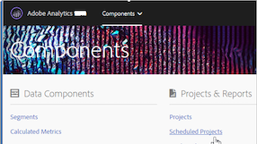

# Scheduled projects manager

Manage scheduled Analysis Workspace projects.

 **[!UICONTROL Analytics]** > **[!UICONTROL Components]** > **[!UICONTROL Scheduled Projects]**.

In the Scheduled Projects Manager, you can edit and delete recurring project deliveries. You can create delivery schedules that send your reports via email to a specified address. You can configure these schedules to automatically send the reports at specified intervals for a duration of time or indefinitely, or stop the delivery of a recurring project.

The Scheduled Projects Manager shows the items that a specific user has created. If the user account is disabled in the application, all scheduled deliveries stop.

* Edit scheduled projects. 
* View a project's Schedule ID (used mainly for debugging purposes). 
* Search for scheduled projects. 
* Tag scheduled projects. 
* Specify/change the owner of a scheduled projects. 
* Add other filters, such as Approved, Failed, Favorites, Mine, Show All, and Expired Projects.

* Define a scheduled projects expiration date.

