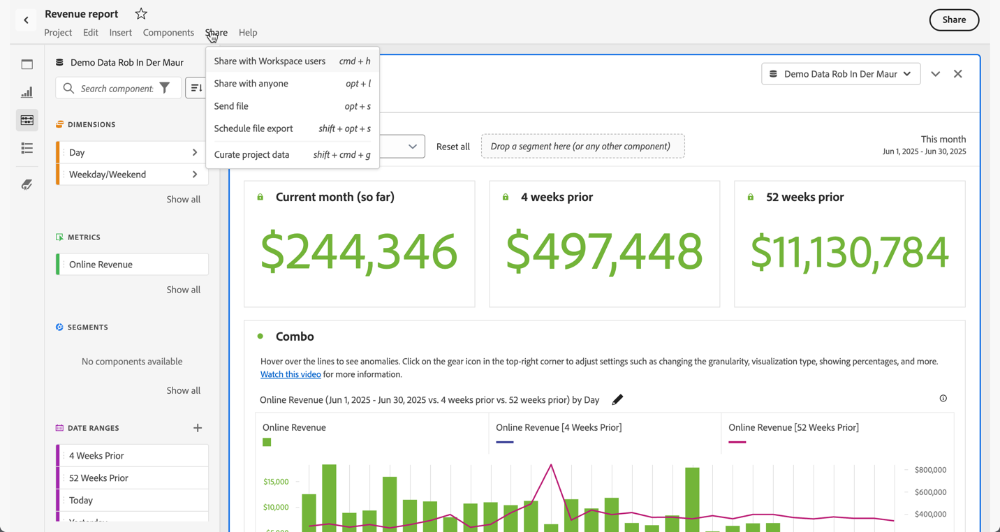

# Share overview

You can curate, share and schedule projects as PDF or CSV files to recipients in your organization or with anyone else using the options available from the **[!UICONTROL Share]** menu in Analysis Workspace or when you select **[!UICONTROL Share]** at the top right of the interface.

| Option|Description|
|---|---|
| **[!UICONTROL Share with Workspace users]** | Make a project available to other Analysis Workspace users in your organization. Share with specific users, or create a shareable link for quick access to a project. Users are required to log in. [Learn more](/help/analyze/analysis-workspace/curate-share/share-projects.md)|
| **[!UICONTROL Share with anyone]** |Grant read-only access to Analysis Workspace projects to people who don't have access to Adobe Analytics. [Learn more](/help/analyze/analysis-workspace/curate-share/share-projects.md)|
| **[!UICONTROL Send file]** |Send a project as a CSV or PDF immediately to specified recipients. [Learn more](/help/analyze/analysis-workspace/curate-share/t-schedule-report.md)|
| **[!UICONTROL Schedule file export]** |Send a project as a CSV or PDF on a schedule to specified recipients. [Learn more](/help/analyze/analysis-workspace/curate-share/t-schedule-report.md)|
| **[!UICONTROL Curate project data]** | Limit the components (dimensions, metrics, segments, date ranges) available in a project. [Learn more](/help/analyze/analysis-workspace/curate-share/curate.md)|
