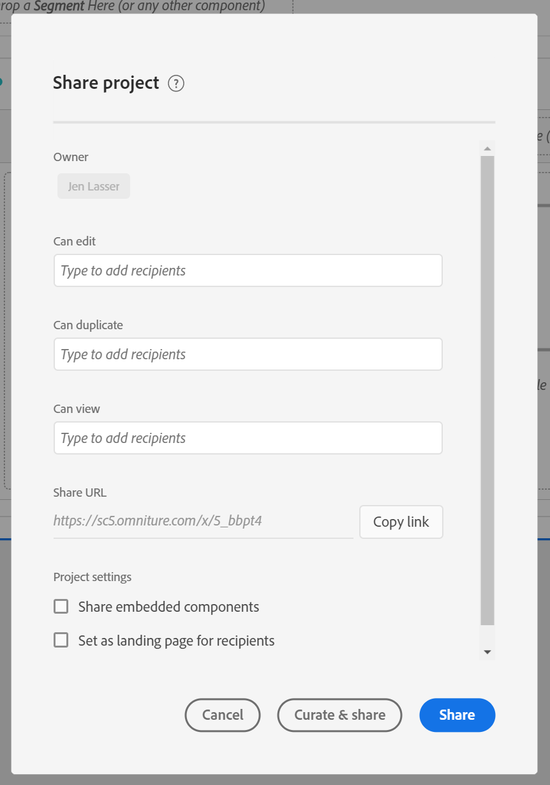
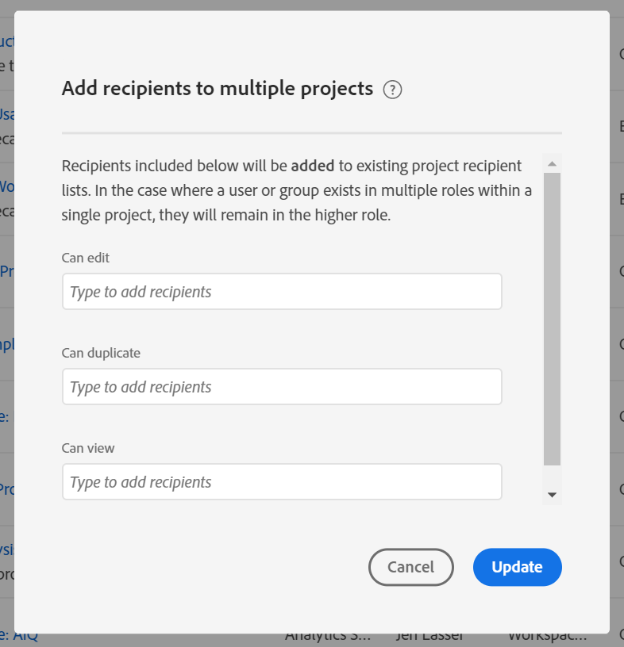

# Share projects

Sharing makes a project available to other Analysis Workspace users in your organization. Any [curation](curate.md) you have applied is reflected when recipients open the project. 

## Project roles {#Roles}

You can add recipients to one of three project roles. Project roles are tied to the user and specific project ID. Project roles are independent of user permissions managed in the [Adobe Experience Cloud admin console](https://experienceleague.adobe.com/docs/ core-services/interface/manage-users-and-products/admin-getting-started.html).

|Role|Project control|
|---|---|
|Can edit|Recipients can **[!UICONTROL Save]** changes to a project and function as co-owners. This role is useful if you want to co-manage a project with other colleagues; this includes editing, deleting, and modifying recipient lists for a shared project.  Note: Analysis Workspace does not currently support live collaboration, so it is recommended that only one user edit a project at a given time. If projects are saved at the same time, the last version will be kept.|
|Can duplicate|Recipients can **[!UICONTROL Save as]** and have access to the left rail. Project interactions are not limited in this role. This role is useful if you want to share a project to users who understand your organization’s data and how to use Analysis Workspace, but you do not want your project altered.|
|Can view|Recipients cannot Save As and do not have access to the left rail. Project interactions are also limited. This role is useful if you want to share a project to users that are less familiar with your organization’s data structure, Analysis Workspace or Adobe Analytics generally. However, you still want them to consume data and insights in a safe environment. Learn more about the [Can view project experience](/help/analyze/analysis-workspace/curate-share/view-only-projects.md).|

>[!IMPORTANT]
> Project recipients added prior to June 18, 2020 have been migrated into a project role. Admin users migrated to the **[!UICONTROL Can edit]** role and Non-admin users migrated to the **[!UICONTROL Can duplicate]** role. These roles provide the same project experience that they had previously. Additionally, all groups (including "All") migrated to the **[!UICONTROL Can duplicate]** role.  

### No role assigned (Project link recipients)

If a recipient is not assigned a role and receives a [link](https://experienceleague.adobe.com/docs/ analytics/analyze/analysis-workspace/curate-share/shareable-links.html) to the project (**[!UICONTROL Share] > [!UICONTROL Get project link]**), they will be placed into a role by default. Admins receive **[!UICONTROL Can edit]** and Non-admins receive **[!UICONTROL Can duplicate]**.

### Multiple roles assigned

If a recipient is placed in multiple roles, they will always get the highest experience. This might occur if a recipient is added both as an individual and as part of a group. For example, if a recipient is given the **[!UICONTROL Can edit]** role as an individual and the **[!UICONTROL Can view]** role as a member of a group, they will receive a **[!UICONTROL Can edit]** project experience.

### Admins and roles

Admins placed in a **[!UICONTROL Can duplicate]** or **[!UICONTROL Can view]** role will receive those limited experiences when they open a project. If desired, an Admin can increase their role to **[!UICONTROL Can edit]** at anytime through **[!UICONTROL Components] > [!UICONTROL Projects]**. 

## Add recipients to shared project {#Add}

To add recipients to your shared project: 

1. Click **[!UICONTROL Share]** > **[!UICONTROL Share project]**. 
   If there are unsaved changes, you will be prompted to save your project first. 
1. Add recipients or groups of recipients. 
   Reference the help icon at the top for descriptions of each role. 
1. (Optional) Share embedded project components (segments, calculated metrics, and date ranges) with all recipients. 
   After being shared, these components will appear in the Components drop-down of the recipient's Workspace. Note that this setting does not persist - it is a singular action at the time of sharing. 
1. (Optional) Set this page as the landing page for recipients.
   This setting does not persist - it is a singular action at the time of sharing. 
1. Click Share. 
  You can also click **[!UICONTROL Curate and Share]** to apply project curation automatically. If a project has already been shared, these buttons will say **[!UICONTROL Update]** and **[!UICONTROL Curate & Update]**. Learn more about [project curation](https://experienceleague.adobe.com/docs/ analytics/analyze/analysis-workspace/curate-share/curate.html).

## Share to groups of recipients {#Groups}

All users can share projects to groups, which are a collection of recipients. In Adobe Analytics, groups are defined by product profiles in the [Adobe Experience Cloud admin console](https://experienceleague.adobe.com/docs/ core-services/interface/manage-users-and-products/admin-getting-started.html).  

* Admins can share to any group, including “All”.  
* Non-admins can share to groups they are a member of, with the exception of “All”. 

## Share a project link {#Links} 

You can get a link a project under **[!UICONTROL Share] > [!UICONTROL Get project link]**. When clicked, recipients will be required to log in before landing in the project. If the recipient has not been placed in a role, they will receive a default role. Admins receive **[!UICONTROL Can edit]** and Non-admins receive **[!UICONTROL Can duplicate]**. [Learn more](https://experienceleague.adobe.com/docs/ analytics/analyze/analysis-workspace/curate-share/shareable-links.html) about creating shareable links to Workspace projects.

## Share projects in the Project manager {#Manager} 

Projects can also be shared from **[!UICONTROL Components] > [!UICONTROL Projects]**. A single project can be shared following the same steps above.  If multiple projects are selected to be shared, recipients will be added to the existing list of recipients for each project. 

For example: 

* Project A is shared to recipients  1, 2, 3 
* Project B is shared to recipients 4, 5, 6 

With Project A and B selected, recipients 4 and 7 are added to the share lists. The new share list for each project is now: 

* Project A: 1, 2, 3, 4, 7 
* Project B: 4, 5, 6, 7 

## FAQs {#FAQs}

|Question|Answer|
|---|---|
|What happens if two editors save a project at the same time?|Changes are not merged and the last saved project version will be kept. Analysis Workspace does not currently support live collaboration.|
|As an admin, what project experience will I see?|Admins placed in a **[!UICONTROL Can duplicate]** or **[!UICONTROL Can view]** role will receive those limited experiences when they open a project. If desired, an Admin can increase their role to **[!UICONTROL Can edit]** at anytime through **[!UICONTROL Components] > [!UICONTROL Projects]**. |
|What happens if a recipient is placed in one role as an individual and another role as a member of a group?|If a recipient is placed in multiple roles, they will always receive the higher experience. For example, if a recipient is given the **[!UICONTROL Can edit]** role as an individual and the **[!UICONTROL Can view]** role as a member of a group, they will receive a **[!UICONTROL Can edit]** project experience.|
|What experience does a recipient get if they open a project link?|Recipients receive the role you placed them in the share modal. If a recipient is not assigned a role and receives a link to the project (**[!UICONTROL Share] > [!UICONTROL Get project link]**), they will be placed into a role by default. Admins receive **[!UICONTROL Can edit]** and Non-admins receive **[!UICONTROL Can duplicate]**.|
