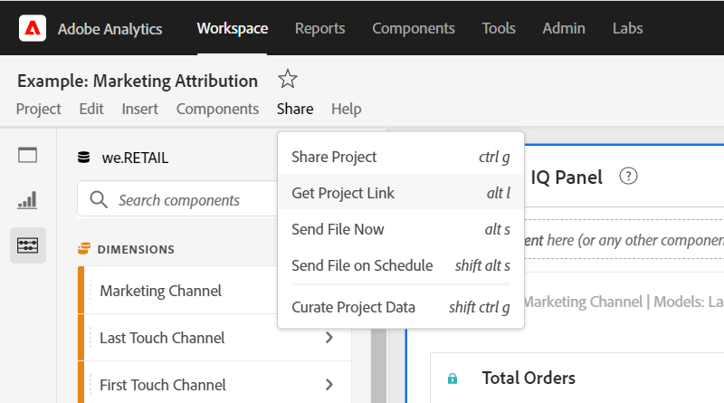
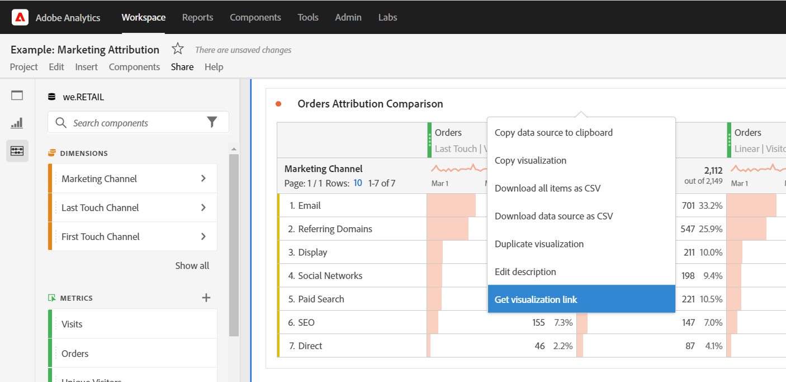

# Create shareable links

Analysis Workspace offers many ways to share a project to your users, including the ability to get a link to a project or a specific part of a project. Some link types require the recipient to log in to Adobe Analytics before accessing the project, while others do not. 

## Get project link {#project-link} 

To share a link to the full project, go to **[!UICONTROL Share > Get project link]**. If the recipient of the link has not been assigned a [project role](https://experienceleague.adobe.com/docs/analytics/analyze/analysis-workspace/curate-share/share-projects.html), Admins receive **[!UICONTROL Can edit]** and Non-admins receive **[!UICONTROL Can duplicate]** experiences. 

## Get public link

{{release-limited-testing-section}}

You can share a view-only link to Analysis Workspace projects with people who don't have access to Adobe Analytics.

For more information, see "Share a public link with anyone (no login required)" in the article [Share projects](/help/analyze/analysis-workspace/curate-share/share-projects.md).

## Get panel or visualization link {#panel-link} 

You can also share a link to a specific part of a project, such as a panel or individual visualization. This is sometimes referred to as intra-linking. This can be useful to draw your users' attention to key insights within the project.  

* From any panel header, right-click **[!UICONTROL Get panel link]** 
* From any table or visualization header, right-click **[!UICONTROL Get visualization link]** 

[Watch the video](https://experienceleague.adobe.com/docs/analytics-learn/tutorials/analysis-workspace/visualizations/intra-linking-in-analysis-workspace.html) on how to create links and use them to drive recipients to specific parts of your project. 

## Use links in a Table of contents {#TOC} 

One tip for leveraging the various link options is to always include a table of contents at the top of your Workspace project. In the table of contents, you can link to other relevant projects, specific panels and specific visualizations. This helps the recipient of the project to navigate more easily.  

[Watch the video](https://experienceleague.adobe.com/docs/analytics-learn/tutorials/analysis-workspace/navigating-workspace-projects/create-a-toc-in-analysis-workspace.html) on how to construct a Table of contents using links and Workspace's rich text editor. 

