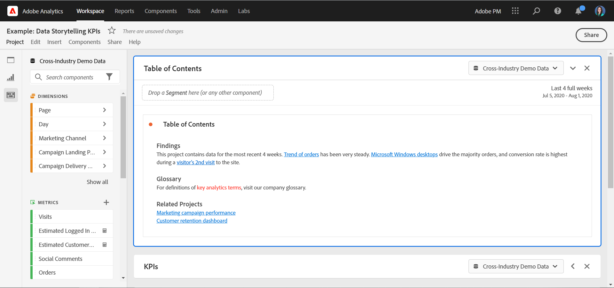

# Create shareable links

Analysis Workspace offers many ways to share a project to your users, including the ability to get a link to a project or a specific part of a project. Some link types require the recipient to log in to Adobe Analytics before accessing the project, while others do not. 

## Get a project link to share with other Workspace users {#project-link} 

To share a link to a project, go to the project you want to share, then select go to **[!UICONTROL Share]** > **[!UICONTROL Get project link]** (or **[!UICONTROL Share]** > **[!UICONTROL Share with Workspace users]** > **[!UICONTROL Share by link]**). Users you share the link with are required to log in. 

If the recipient of the link has not been assigned a [project role](/help/analyze/analysis-workspace/curate-share/share-projects.md), admins receive **[!UICONTROL Edit original]** and non-admins receive **[!UICONTROL Edit copy]** experiences.

## Get a read-only link to share with anyone

You can share a read-only link to Analysis Workspace projects with people who don't have access to Adobe Analytics.

For more information, see [Share with anyone](/help/analyze/analysis-workspace/curate-share/share-projects.md#share-a-project-with-anyone-no-login-required).

## Get a panel or visualization link {#panel-link} 

You can also share a link to a specific part of a project, such as a panel or individual visualization. This is sometimes referred to as intra-linking. This can be useful to draw your users' attention to key insights within the project.  

* From the context menu of a panel header, select **[!UICONTROL Get panel link]** 
* From the context menu of a visualization header, select **[!UICONTROL Get visualization link]** 

[Watch the video](https://experienceleague.adobe.com/docs/analytics-learn/tutorials/analysis-workspace/visualizations/intra-linking-in-analysis-workspace.html) on how to create links and use them to drive recipients to specific parts of your project. 

## Use links in a table of contents {#TOC} 

One tip for leveraging the various link options is to always include a table of contents at the top of your Workspace project. In the table of contents, you can link to other relevant projects, specific panels and specific visualizations. This helps the recipient of the project to navigate more easily.  

[Watch the video](https://experienceleague.adobe.com/docs/analytics-learn/tutorials/analysis-workspace/navigating-workspace-projects/create-a-toc-in-analysis-workspace.html) on how to construct a Table of contents using links and Workspace's rich text editor. 

<!--
# Create shareable links

Analysis Workspace offers many ways to share a project to your users, including the ability to get a link to a project or a specific part of a project. Some link types require the recipient to log in to Adobe Analytics before accessing the project, while others do not. 

## Get a project link to share with other Workspace users {#project-link} 

To share a link to a project, go to the project you want to share, then select go to [!UICONTROL **Share**] > [!UICONTROL **Share with Workspace users**] > [!UICONTROL **Share by link**]. Users you share the link with are required to log in. 

If the recipient of the link has not been assigned a [project role](/help/analyze/analysis-workspace/curate-share/share-projects.md), admins receive **[!UICONTROL Edit original]** and non-admins receive **[!UICONTROL Edit copy]** experiences.

## Get a read-only link to share with anyone

You can share a read-only link to Analysis Workspace projects with people who don't have access to Adobe Analytics. Users you share the link with are not required to log in. 

For more information, see "Share a project with anyone (no login required)" in the article [Share projects](/help/analyze/analysis-workspace/curate-share/share-projects.md).

## Get panel or visualization link {#panel-link} 

You can also share a link to a specific part of a project, such as a panel or individual visualization. This is sometimes referred to as intra-linking. This can be useful to draw your users' attention to key insights within the project.  

* From any panel header, right-click **[!UICONTROL Get panel link]** 
* From any table or visualization header, right-click **[!UICONTROL Get visualization link]** 

[Watch the video](https://experienceleague.adobe.com/docs/analytics-learn/tutorials/analysis-workspace/visualizations/intra-linking-in-analysis-workspace.html) on how to create links and use them to drive recipients to specific parts of your project. 

-->