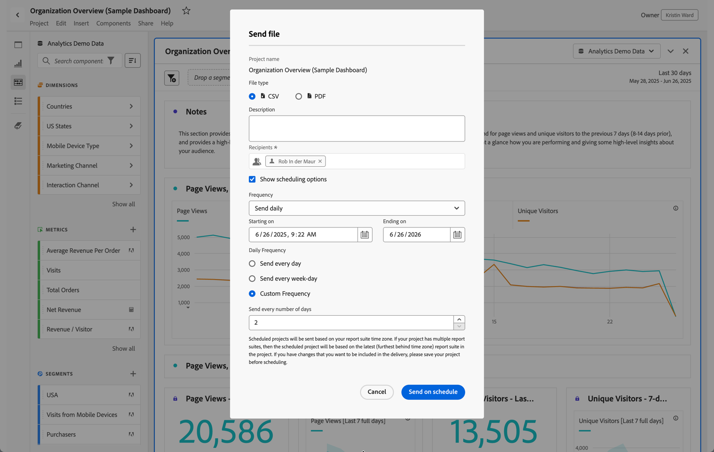

# Send file - schedule a project for delivery

Send an Analysis Workspace project via email, or schedule it for delivery.

1. [Create an Analysis Workspace project](https://marketing.adobe.com/resources/help/en_US/analytics/analysis-workspace/t_freeform_project.html) and save it.
1. Click **[!UICONTROL Share]** > **[!UICONTROL Send File On Schedule]**.

   

1. On the [!UICONTROL Send File] page, specify the file type (CSV or PDF).

   

1. Add recipients email addresses or names, the click **[!UICONTROL Send Now]**.
1. (Optional) Click **[!UICONTROL Show Scheduling Options]** to specify a delivery schedule, then click **[!UICONTROL Send on Schedule]**.
1. Manage scheduled projects in **[!UICONTROL Components]** > [Scheduled Projects](/help/analyze/analysis-workspace/curate-share/schedule-projects.md).
