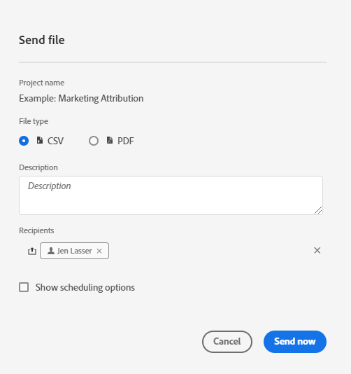
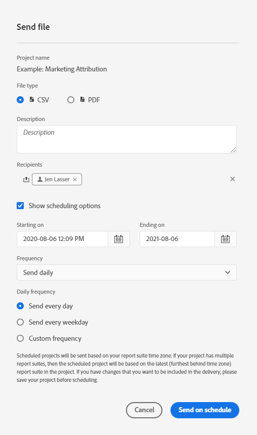
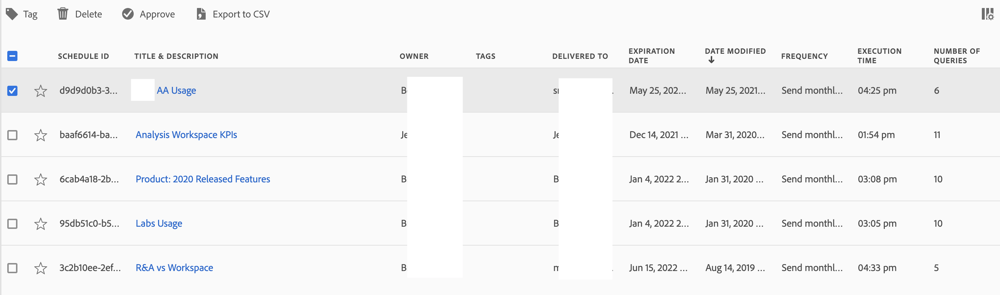

# Schedule projects

From the Workspace **Share menu**, you can send Analysis Workspace projects via email to selected recipients. Files can be sent in CSV or PDF format. 

## Send file now

To send a file immediately to recipients via email:

1. Click **[!UICONTROL Share] > [!UICONTROL Export file]**.
1. Specify the file type (CSV or PDF).
1. (Optional) Add a description that will be included in the email to explain the file being received. 
1. Add recipients or groups. Email addresses can also be entered. 
1. Click **[!UICONTROL Send Now]**.
1. (Optional) Click **[!UICONTROL Show scheduling options]** to specify a delivery schedule.

## Send file on schedule

To send a file on a recurring schedule to recipients via email:

1. Click **[!UICONTROL Share] > [!UICONTROL Schedule file export]**.
1. Specify the file type (CSV or PDF).
1. (Optional) Add a description that will be included in the email to explain the file being received. 
1. Add recipients or groups. Email addresses can also be entered. 
1. Specify the range the schedule should be delivered over by modifying Starting on and Ending on inputs. The end date must be within a year from the day the schedule is created or modified.
1. Specify the delivery frequency. Each frequency allows for different customizations. 
1. Click **[!UICONTROL Send on schedule]**.

## Scheduled Projects manager

Scheduled Analysis Workspace projects can be managed under **Analytics > Components > Scheduled Projects**.

In the Scheduled Projects Manager, you can edit and delete recurring project schedules. Search for a schedule in the search bar or by using the filter options in the left rail. You can filter by tag, approved schedules, owners and more.

| Field | Description |
| --- | --- |
| [!UICONTROL Favorites] | Selecting the star icon makes this schedule a favorite. |
| [!UICONTROL Schedule ID] | This ID is used mainly for debugging purposes. |
| [!UICONTROL Title and Description] | Title and description of this project. |
| [!UICONTROL Owner] | The person who created and owns the project. |
| [!UICONTROL Tags] | (optional) Tagging is a good way to organize projects. All users can create tags and apply one or more tags to a project. However, you can see tags only for those projects that you own or that have been shared with you.  |
| [!UICONTROL Delivered To] | The recipient(s) of this scheduled project. |
| [!UICONTROL Expiration Date] | For any scheduled project frequency, you can set the expiration date for up to one year in the future. |
| [!UICONTROL Frequency] | How often you want to have this schedule project sent to the recipient(s). |
| [!UICONTROL Execution Time] | At what time of day this scheduled project gets sent. |
| [!UICONTROL Number of Queries] | The number of queries against this project. | 

## Common actions

The following are common actions in the Scheduled Projects manager:

|Action|Description|
|---|---|
|**[!UICONTROL Edit schedule]**|Click the title of the schedule to update its delivery settings.|
|**[!UICONTROL Delete schedule]**|Select the scheduled project in the list and then click Delete from the menu. This will delete the selected schedule for the project; the project itself will not be deleted.|
|**[!UICONTROL Add tags]**|Select the scheduled project in the list and then choose "Tag" or "Approve" to organize your schedules and make them easier to search for.|
|**[!UICONTROL View failed schedules]**|Navigate to the left rail > Other filters > Failed to see schedules that have failed.|
|**[!UICONTROL View expired schedules]**|Navigate to the left rail > Other filters > Expired to see schedules that have expired. Click the title of the schedule to setup a new delivery schedule.|
|**[!UICONTROL View schedule ID]**|Navigate to column options in the top right and add the Schedule ID column to the table. The scheduled ID is often useful for debugging.|

The Scheduled Projects Manager shows the items that a specific user has created. If the user account is disabled in the application, all scheduled deliveries stop. Scheduled project ownership can be **transferred** to a new user under **Admin > Analytics Users & Assets > Transfer Assets**.
