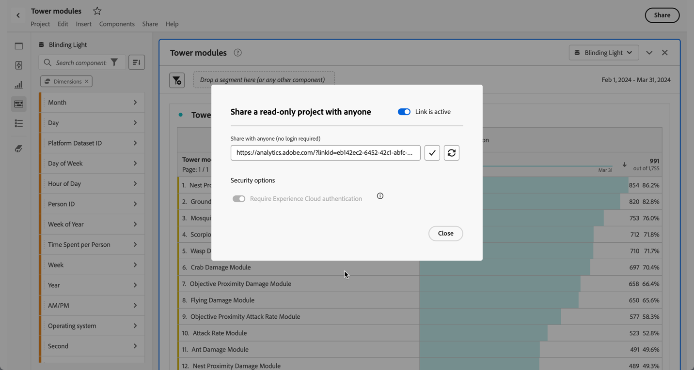
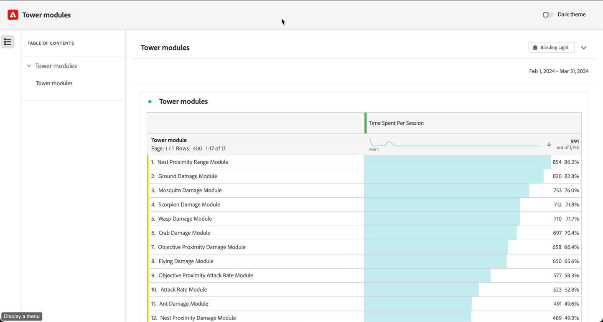
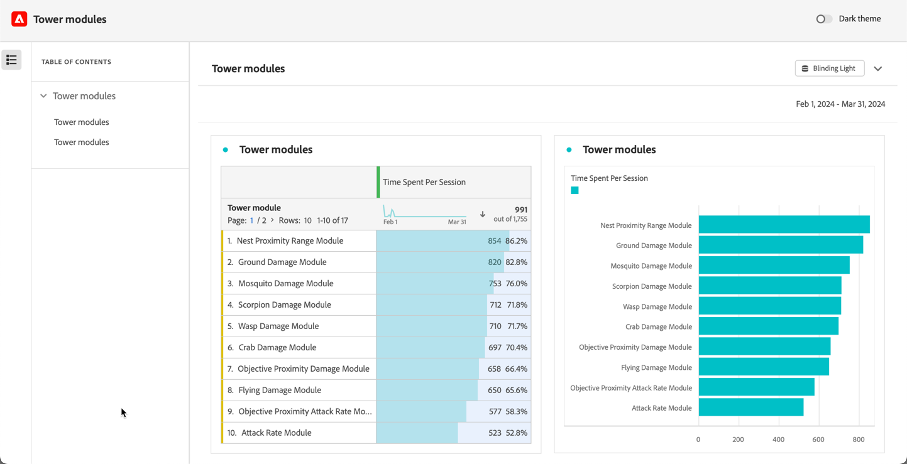

# Read-only projects

You can share projects as read-only to recipients through the [share functionality](share-projects.md). Recipients placed in the **[!UICONTROL Read only]** role will receive a more limited project experience. 

This may be desired if you are sharing a project to users that are less familiar with your organization's data structure, Analysis Workspace or Adobe Analytics generally, but you still want them to consume data and insights in a safe environment. 

The interactions for the read-only recipients are limited.

## Disabled interactions

Disabled interactions in a view-only project include: 

* Hidden left panel 
* Panel calendar date range. Note: If you want to grant calendar control to recipients, add in a [drop-down segment with date ranges](https://experienceleague.adobe.com/docs/analytics-learn/tutorials/analysis-workspace/using-panels/using-drop-down-filters.html). 
* Freeform segmenting 
* Freeform # of visible rows 
* Freeform row, column or visualization settings 
* Panel segments 
* Edit, Insert & Component menus
* Workspace tips

## Enabled interactions

Some of the more notable enabled interactions in a view-only project include: 

| Area | Enabled interactions |
| --- | --- |
| **Freeform tables** |<li>Pagination and sorting</li><li>Hovering</li><li>Cell selections that update linked visualizations</li><li>From the context menu > Get Visualization Link</li><li>From the context menu > Copy to Clipboard</li> |
| **Visualizations** | <li>Clicking to turn on/off legend</li><li>Hovering</li><li>From the context menu > Get Visualization Link</li><li>Collapse/expand</li><li>Flow - expand Flow nodes</li><li>Map - zoom</li></ul> |
| **Panels** | <li>Interactive drop-down segments</li><li>From the context menu > Get Panel Link</li><li>Collapse/expand</li> |
| **Project** | <li>Inspecting all info icons</li><li>Project menu - New, Open, Set as landing page, Refresh, Download CSV/PDF, limited Project Info & Settings</li><li>Share menu - Get project link, Send file now</li><li>Help menu - All actions except Tips & Debugger options</li> |

## Share with anyone experience

If you have selected a project using [Share with anyone](share-projects.md#share-a-project-with-anyone-no-login-required) the receiver of the link can only view the project and not interact with the project.

