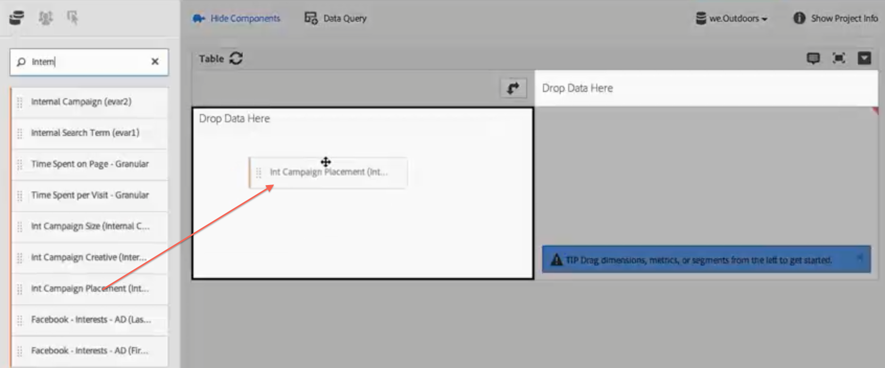
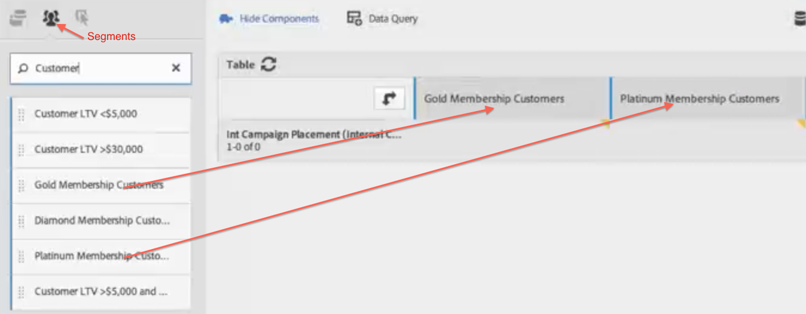

# Analysis Workspace use cases

Examples of how to use data tables, segments, and uses case ideas for Analysis Workspace.

You can direct research across your data to answer specific questions and put together narratives about your customer's interactions and audience interests. In a freeform environment you can apply dimensions, metrics, and segments over a time period to directly retrieve targeted data. Craft your analysis to customize for specific questions, and then publish information in rich reports and visualizations to be shared and easily interpreted by even the most time-constrained frontline business user.

**Examples**

* As a media company, you might want to compare your new visitors, your repeat visitors, and your most loyal visitors to see how content consumption changes over time for each different segment.
* Compare the conversion rates for branded and non-branded keywords.
* Break down page views by internal search, external search, landing pages, and so on, to understand why branded and non-branded terms perform differently.
* Compare day against next day to compare columns or rows to analyze growth across multiple metrics.
* Do a simple query such as bounces per a dimension.

## Retail Example {#section_9EFDEF038CAD4954BCFB118A8F33A96F}

Assume you are a marketing analyst for an outdoor gear retailer and you are tasked with examining how a recent Thanksgiving promotion performed, and with making recommendations on how to improve onsite campaigns. This example shows how you can compare campaign revenue data for different segments and add breakdowns to drill down further into the campaign.

1. Select the appropriate report suite.
1. Search, for example, for your Internal Campaign Placements dimension and drag it into the left-hand section of the table canvas (this data will make up the table rows.)

   

1. Now click the segment icon on the top left and drag different customer loyalty segments into the right half of the canvas. You are going to compare the segments to each other on the fly. These will constitute the table columns.

   

1. Click the Events (Metrics) icon on the top left and add the revenue metric underneath each segment. Notice how the report generates automatically. You can now start comparing campaign revenue for these customer segments.

   

1. Now, if you would like to see which products were most effective in the left banner slot on your pages, break down Left Banner by Product Name. Just click the Dimensions icon and drag the Product name dimension on top of Left Banner.

   

1. But you can drill down even more. You might ask which search terms people used to get to your top-selling product, Norfolk Highland. All you have to do is drag the Internal Search Term dimension on top of the product name:

   

   A new breakdown result will appear:

   

   You have already broken down the data in a way that can result in recommendations and cross-sells for your merchandising teams to implement in other campaigns and realize even more revenue for your company. You can do further breakdowns until you get the results you are looking for.

   Now you can [share](/help/analyze/analysis-workspace/curate-share/curate.md) the report with those merchandising teams.

## Cross-sell Analysis in Analysis Workspace

Here is a video on this topic:

>[!VIDEO](https://video.tv.adobe.com/v/25864/?quality=12)
