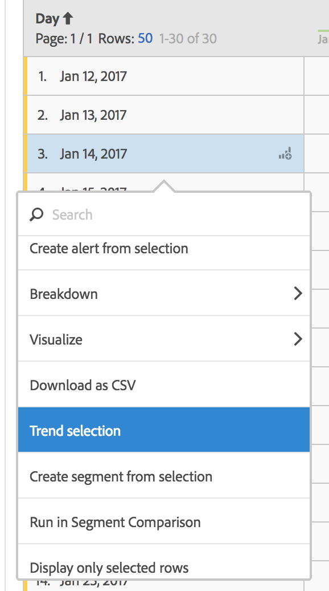

# Freeform table

In Analysis Workspace, a data table (Freeform Table) is not merely a report table but also an interactive visualization. You can interact with individual rows, a number of selected rows, or the entire table.

You can show up to 400 rows in a table.

You can interact with the table in unique ways:

* [Create an alert](../../analysis-workspace/c-intelligent-alerts/alert-builder.md#concept_D11C9EB858FB49F48E8D974B579E2978) from the table selection 
* Run [breakdowns](../../analysis-workspace/components/dimensions/t-breakdown-fa.md#task_B594DA2476E84DFDA8279E831F0BD9C4) and create inline segments (right-click) 
* Run [visualizations](../../analysis-workspace//freeform-analysis-visualizations.md#concept_09242627629147A88A68F1506954C276) on specific cells 
* Export rows to [CSV](../../analysis-workspace/curate-share/download-send.md#concept_BB548979F47F45739679B830428C3025) 
* Run [Trend](../../analysis-workspace/analysis-workspace-features.md#section_34930C967C104C2B9092BA8DCF2BF81A) visualizations from selected cells 
* Create [segments](../../analysis-workspace/components/t-freeform-project-segment.md#task_11C6A2C7717B48049E5750B9D20FEC80) from selection 
* Perform a [segment comparison](../../analysis-workspace/c-panels/c-segment-comparison/segment-comparison.md#concept_74FAC1C6D0204F9190A110B0D9005793) 
* Display only selected rows

See [Create an Analysis Workspace project](../../analysis-workspace/build-workspace-project/t-freeform-project.md#task_C2C698ACC7954062A28E4784911E6CF2) for more information. 
