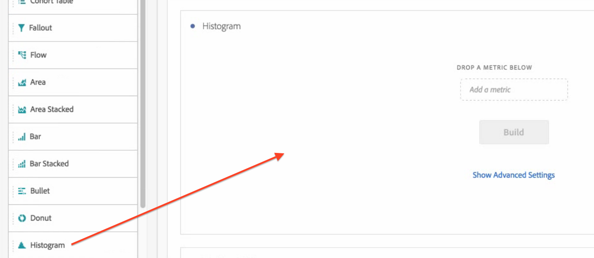
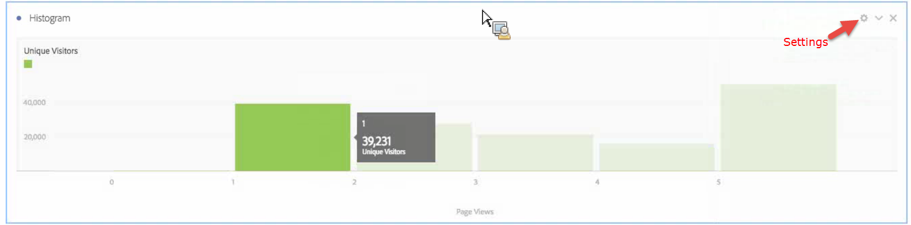
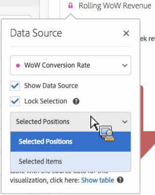

# Histogram

A histogram is a new visualization type in Analysis Workspace.

A histogram is similar to a bar chart, but it groups numbers into ranges (buckets). Analytics automates the "bucketing" of numbers into ranges, but you can change the settings in [Advanced Settings](../../analysis-workspace//histogram.md#section_09D774C584864D4CA6B5672DC2927477).

## Build a histogram {#section_74647707CC984A1CB6D3097F43A30B45}

To create a histogram:

1. Click **[!UICONTROL Visualizations]** in the left rail. 
1. Drag **[!UICONTROL Histogram]** to the panel. 
1. Choose a Metric to drag to the Histogram visualization and click **[!UICONTROL Build]**.

>[!NOTE]
>
>Histograms support only standard metrics, not calculated metrics.

Here we have used the Page Views Metric per Unique Visitors. The first (left) bucket corresponds to 1 page view per unique visitor, the second bucket to two page views, etc.

## Advanced settings {#section_09D774C584864D4CA6B5672DC2927477}

To adjust your histogram settings, click the Settings ("gear") icon in the upper right corner. Here are the settings you can modify: 

|  Histogram Settings  | What it Does  |
|---|---|
|  Starting Bucket  | Determines which bucket the histogram starts with. "1" is the default. You can set starting numbers from 0 to infinity (no negative numbers).  |
|  Metric Buckets  | Lets you increase/decrease the number of data ranges (buckets.) The maximum number of buckets is 50.  |
|  Metric Bucket Size  | Lets you set the size of each bucket. For example, you can change the bucket size from 1 page view to 2 page views.  |
|  Counting Method  | Lets you choose among [Visitor](https://marketing.adobe.com/resources/help/en_US/reference/visitors.html), [Visit](https://marketing.adobe.com/resources/help/en_US/reference/metrics_visit.html), or [Hit](https://marketing.adobe.com/resources/help/en_US/reference/hit.html). For example, page views per visit or page views per visitor or page views per hit. For Hit, “Occurrences” is used as the y-axis metric in a freeform table.  |

**Examples**:

* Starting Bucket: 1; Metric Buckets: 5; Metric Bucket Size: 2 will result in this histogram: 1-2, 3-4, 5-6, 7-8, 9-10. 
* Starting Bucket: 0; Metric Buckets: 3; Metric Bucket Size: 5 will result in this histogram: 0-4, 5-9, 10-14

## View and edit histogram data {#section_B2CD7CDF0F6B432F928103AE7AAA3617}

To view or change the data source for the histogram chart, click the dot next to the Histogram header to go to **[!UICONTROL Data Source Settings]** > **[!UICONTROL Show Data Source]**.

Pre-built segments that show up in the table are internal segments and won't show up in the Segment selector. Click the "i" icon next to the segment name, then click **[!UICONTROL Make public]** to make the segment public.

To explore more ways to manage Freeform data tables and other visualizations, such as doing data breakdowns, go [here](https://marketing.adobe.com/resources/help/en_US/analytics/analysis-workspace/freeform-analysis-visualizations.html). 
