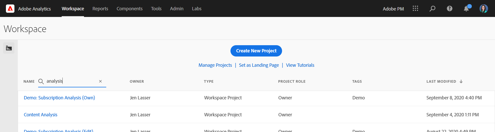
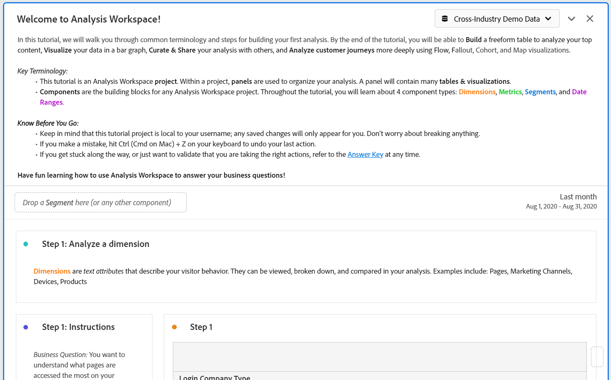
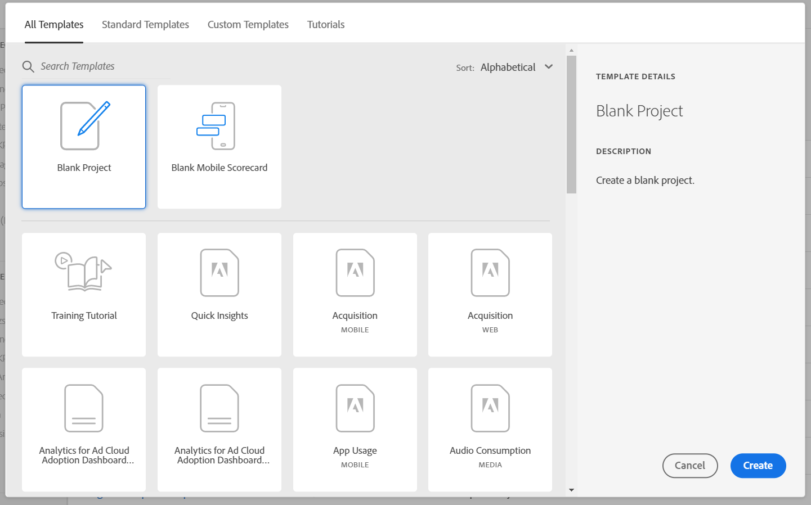
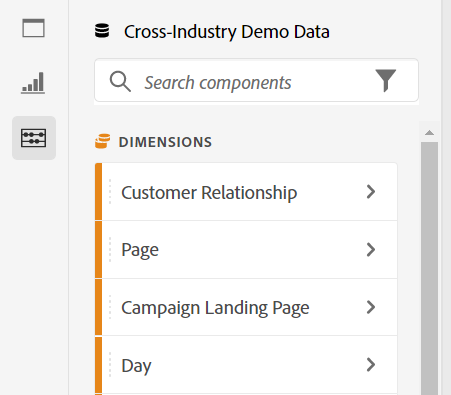
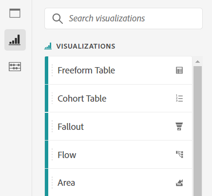
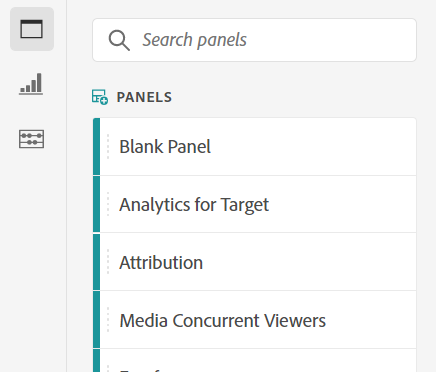

# Analysis Workspace overview

Analysis Workspace is a flexible browser tool that allows you to quickly build analyses and share insights. Using the drag-and-drop interface, you can craft your analysis, add visualizations to bring data to life, curate a dataset, share and schedule projects with anyone in your organization.

If you have only a few minutes, watch this brief overview to see what is possible.

>[!VIDEO](https://video.tv.adobe.com/v/26266/?quality=12)

## Log in to Adobe Analytics {#login}

To start using Analysis Workspace, log in to Adobe Analytics by going to [experience.adobe.com/analytics](http://experience.adobe.com/analytics). You will land on the Workspace project list homepage, if a specific project has not previously been selected for you.

## Use the Training tutorial {#training-tutorial}

Once logged in, your first stop should be the Analysis Workspace Training Tutorial, which walks you through common terminology and steps for building your first analysis in Workspace. To begin the tutorial, click **[!UICONTROL Create New Project]** and then select **Training Tutorial** within the new project modal.

## Create a new project {#new-project}

With the tutorial complete, you are ready to begin building your first project. The **new project modal** provides you with different options for starting your analysis. You can choose to start from a blank project or [blank mobile scorecard](https://experienceleague.adobe.com/docs/ analytics/analyze/mobapp/curator.html), depending on whether you plan to share your analysis from the browser or the Adobe Analytics dashboards mobile app.

You can also begin your analysis from pre-built **templates**, either Adobe-provided standard templates or custom templates that were created by your organization. There a several different templates available, depending on the analysis or use case you have in mind. [Learn more](https://experienceleague.adobe.com/docs/ analytics/analyze/analysis-workspace/build-workspace-project/starter-projects.html) about the different template options available.

## Build your analysis {#analysis}

In your Workspace project, **panels, tables, visualizations, and components** are accessed from the left rail. These are your project building blocks.

### Components

**Components** are dimensions, metrics, segments, or date ranges, all of which can be combined in a **[!UICONTROL Freeform table]** to start answering your business question. Be sure to familiarize yourself with each [component type](/help/analyze/analysis-workspace/components/analysis-workspace-components.md) before diving into your analysis. Once you've mastered component terminology, you can begin dragging and dropping to [build your analysis](https://experienceleague.adobe.com/docs/ analytics/analyze/analysis-workspace/build-workspace-project/t-freeform-project.html) in a **[!UICONTROL Freeform table]**.

### Visualizations

**Visualizations**, such as a bar or line chart, are then added on top of the data to visually bring it to life. On the far left rail, select the middle **[!UICONTROL Visualizations]** icon to see the full list of [visualizations](https://experienceleague.adobe.com/docs/ analytics/analyze/analysis-workspace/visualizations/freeform-analysis-visualizations.html) available.

### Panels

**Panels** are used to organize your analysis within a project and can contain many tables & visualizations. Many of the panels provided in Analysis Workspace generate a full set of analyses based on a few user inputs. On the far left rail, select the top **[!UICONTROL Panels]** icon to see a full list of [panels](https://experienceleague.adobe.com/docs/ analytics/analyze/analysis-workspace/panels/panels.html) available.

## Additional resources {#resources}

* Adobe offers hundreds of [Analytics video training tutorials](https://experienceleague.adobe.com/docs/ analytics-learn/tutorials/overview.html).
* See [What's New in Analysis Workspace](/help/analyze/analysis-workspace/new-features-in-analysis-workspace.md) for updates about new features.
