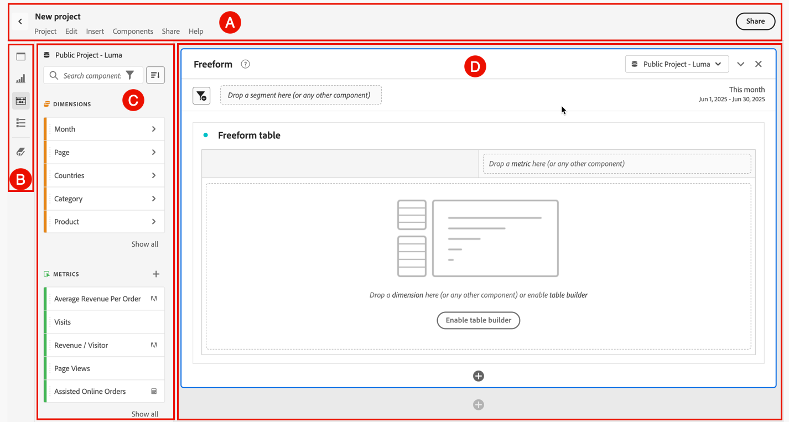

# Analysis Workspace overview {#analysis-workspace-overview}

Analysis Workspace allows you to build analyses quickly to gather insights and then share those insights with others. Using the drag-and-drop browser interface, you can craft your analysis, add visualizations to bring data to life, curate a dataset, and share and schedule [projects](/help/analyze/analysis-workspace/build-workspace-project/freeform-overview.md) with anyone you choose.

>[!BEGINSHADEBOX]

See  [Analysis workspace overview](https://video.tv.adobe.com/v/26266/?quality=12&learn=on){target="_blank"} for a demo video.

>[!ENDSHADEBOX]

## Interface

The following image and accompanying table explain the main elements in the Analysis Workspace user interface:

| Location | Name and function |
|:---------:|----------|
| A | Contains the name of the project, a menu structure to access functionality, a button  to return back to your Project list, and a **[!UICONTROL Share]** button to [share your Workspace project](/help/analyze/analysis-workspace/curate-share/share-projects.md).  Select the name of your project (for example: New project) at any time to change the name.  Select  to mark your project as a favorite project . |
| B | **Button panel:** Contains buttons to access the key [features](#features) of Analysis Workspace:<ul><li> [[!UICONTROL Panels]](/help/analyze/analysis-workspace/c-panels/panels.md)</li><li> [[!UICONTROL Visualizations]](/help/analyze/analysis-workspace/visualizations/freeform-analysis-visualizations.md)</li><li> [[!UICONTROL Components]](/help/components/home.md)</li><li> [[!UICONTROL Table of contents]](/help/analyze/analysis-workspace/build-workspace-project/project-table-of-contents.md)</li><li> [[!UICONTROL Data Dictionary]](/help/analyze/analysis-workspace/components/data-dictionary/data-dictionary-overview.md)</li></ul> |
| C | **Left panel:** This area contains individual panels, visualizations, components, or lists. The content depends on the button selected in the button panel.  |
| D | **Canvas:** The main area where you drag content from the left panel to build your project. The project dynamically updates as you add panels, add visualizations to panels, and add components to visualizations. You can create multiple panels, and within each panel you can create multiple visualizations. Each panel is based on a selected report suite. The selected report suite determines available components like metrics and dimensions. See [Panels - Report suite](/help/analyze/analysis-workspace/c-panels/panels.md#report-suite) for more information. |

## Features

The key features of Analysis Workspace are available through the button panel:

| Icon | Feature | Description |
|:---:|---|---|
|  | **[!UICONTROL Panels]** | [Panels](/help/analyze/analysis-workspace/c-panels/panels.md) are used to organize your analysis within a project and can contain many tables & visualizations. Many of the panels provided in Analysis Workspace generate a full set of analyses based on a few user inputs. |
|  | **[!UICONTROL Visualizations]** | [Visualizations](/help/analyze/analysis-workspace/visualizations/freeform-analysis-visualizations.md), such as a bar or line chart, can be used to bring data visually to life. On the far left panel, select the middle **[!UICONTROL Visualizations]** icon to see the full list of visualizations available. |
|  | **[!UICONTROL Components]** | [Components](/help/components/home.md) include the following elements:<ul><li> [Dimensions](/help/components/dimensions/overview.md)</li><li> [Metrics](/help/analyze/analysis-workspace/components/apply-create-metrics.md)</li><li> [Segments](/help/components/segmentation/seg-overview.md)</li><li> [Date ranges](/help/analyze/analysis-workspace/components/calendar-date-ranges/calendar.md)</li></ul> |
|  | **[!UICONTROL Table of contents]** | The [table of contents](/help/analyze/analysis-workspace/build-workspace-project/project-table-of-contents.md) organizes all panels and visualizations included in the project into a collapsible list, allowing you to access a specific panel or visualization quickly. |
| | **Data dictionary** | The [Data dictionary](/help/analyze/analysis-workspace/components/data-dictionary/data-dictionary-overview.md) helps both users and administrators keep track of and better understand the components in their Analytics environment. |

## Menu

Most of the functionality of Analysis Workspace is available through drag and drop, and trough context menus within panels, visualizations and components.

Functionality is also available through the Workspace menu and shortcuts or hotkeys. Shortcut keys differ depending on the operating system that your browser is running on. See the tables below for an overview.  

Note that on your keyboard the following symbols might be used:

- **⇧** for **[!UICONTROL *shift*]**.
- **⌘** for **[!UICONTROL *cmd*]** (command).
- **⌃** for **[!UICONTROL *ctrl*]** (control).
- **⌥** for **[!UICONTROL *opt*]** (option).
- **⎇** for **[!UICONTROL *alt*]** (alternate).

See the tables below for an overview of the available menus.  

| **[!UICONTROL Project]** | Shortcut Mac | Shortcut Windows | Description |
|---|---|---|---|
| **[!UICONTROL Create project]** | **[!UICONTROL *shift+cmd+p*]** | **[!UICONTROL *shift+ctrl+p*]** | Create a new project. |
| **[!UICONTROL Create a mobile scorecard]** | | | [Create a new mobile scorecard](/help/analyze/mobile-app/create-scorecard.md). |
| **[!UICONTROL Open...]** | **[!UICONTROL *cmd+o*]** | **[!UICONTROL *ctrl+o*]** | [Open an existing project](/help/analyze/analysis-workspace/build-workspace-project/save-projects.md#open-another-project). |
| **[!UICONTROL Open previous version...]** | **[!UICONTROL *opt+cmd+o*]** | **[!UICONTROL *alt+ctrl+o*]** | [Open earlier versions of your project](/help/analyze/analysis-workspace/build-workspace-project/save-projects.md#open-previous-version). |
| **[!UICONTROL Save]** | **[!UICONTROL *cmd+s*]** | **[!UICONTROL *ctrl+s*]** | [Save your project](/help/analyze/analysis-workspace/build-workspace-project/save-projects.md#save-projects). |
| **[!UICONTROL Save with notes...]** | **[!UICONTROL *opt+cmd+s*]** | **[!UICONTROL *alt+ctrl+s*]** | [Add notes to the project version that you save](/help/analyze/analysis-workspace/build-workspace-project/save-projects.md#save-project-options). |
| **[!UICONTROL Save as...]** | **[!UICONTROL *shift+cmd+s*]** | **[!UICONTROL *shift+ctrl+s*]** | [Save the project using a different name and details](/help/analyze/analysis-workspace/build-workspace-project/save-projects.md#save-project-options). |
| **[!UICONTROL Refresh project]** | **[!UICONTROL *opt+r*]** | **[!UICONTROL *alt+r*]** | Refresh the project. |
| **[!UICONTROL Download CSV]** | **[!UICONTROL *shift+cmd+v*]** | **[!UICONTROL *shift+ctrl+v*]** | Download the project as a CSV file. |
| **[!UICONTROL Download PDF]**| **[!UICONTROL *shift+cmd+b*]** | **[!UICONTROL *shift+ctrl+b*]** | Download the project as a PDF document. |
| **[!UICONTROL Project info & settings]** | | | Define settings for your projects, such as name, tags, color palette, and more. |
| **[!UICONTROL User settings]** | | | [Configure preferences for using Analysis Workspace](/help/analyze/analysis-workspace/user-preferences.md). |

| **[!UICONTROL Edit]** | Shortcut Mac | Shortcut Windows | Description |
|---|---|---|---|
| **[!UICONTROL Undo]** | **[!UICONTROL *cmd+z*]** | **[!UICONTROL *ctrl+z*]** | Undo the previous action. |
| **[!UICONTROL Redo]** | **[!UICONTROL *cmd+shift+z*]** | **[!UICONTROL *ctrl+shift+z*]** | Redo the previous action. |
| **[!UICONTROL Clear all]** | **[!UICONTROL *opt+w*]** | **[!UICONTROL *alt+w*]** | Clear all panels in the current project. |

| **[!UICONTROL Insert]** | Shortcut Mac | Shortcut Windows | Description |
|---|---|---|---|
| **[!UICONTROL Blank panel]** | **[!UICONTROL *opt+b*]** | **[!UICONTROL *alt+b*]** |  Insert a [Blank panel](/help/analyze/analysis-workspace/c-panels/blank-panel.md). |
| **[!UICONTROL Media concurrent viewers]** | **[!UICONTROL *opt+h*]** | **[!UICONTROL *alt-h*]** |  Insert a [Media concurrent viewers](/help/analyze/analysis-workspace/c-panels/media-concurrent-viewers.md) panel. |
| **[!UICONTROL Media playback time spent]** | **[!UICONTROL *opt+i*]** | **[!UICONTROL *alt+i*]** |  Insert a [Media playback time spent](/help/analyze/analysis-workspace/c-panels/media-playback-time-spent.md) panel. |
| **[!UICONTROL Media average minute audience]** | **[!UICONTROL *opt+m*]** | **[!UICONTROL *alt+m*]** |  Insert a [Media average minute audience](/help/analyze/analysis-workspace/c-panels/average-minute-audience-panel.md) panel. |
| **[!UICONTROL Attribution]** | **[!UICONTROL *opt+e*]** | **[!UICONTROL *alt+e*]** |  Insert an [Attribution](/help/analyze/analysis-workspace/c-panels/attribution.md) panel. |
| **[!UICONTROL Freeform]** | **[!UICONTROL *opt+a*]** | **[!UICONTROL *alt+a*]** |  Insert a [Freeform](/help/analyze/analysis-workspace/c-panels/freeform-panel.md) panel. |
| **[!UICONTROL Quick insights]** | **[!UICONTROL *opt+j*]** | **[!UICONTROL *alt+j*]** |  Insert a [Quick insights](/help/analyze/analysis-workspace/c-panels/quickinsight.md) panel. |
| **[!UICONTROL Freeform table]** | **[!UICONTROL *opt+1*]** | **[!UICONTROL *alt+1*]**|  Insert a [Freeform table](/help/analyze/analysis-workspace/visualizations/freeform-table/freeform-table.md) visualization. |
| **[!UICONTROL Line]** | **[!UICONTROL *opt+2*]** | **[!UICONTROL *alt+2*]** |  Insert a [Line](/help/analyze/analysis-workspace/visualizations/line.md) visualization. |
| **[!UICONTROL Bar]** | **[!UICONTROL *opt+3*]** | **[!UICONTROL *alt+3*]** |  Insert a [Bar](/help/analyze/analysis-workspace/visualizations/bar.md) visualization. |
| **[!UICONTROL Combo]** | **[!UICONTROL *opt+4*]**| **[!UICONTROL *alt+4*]** |  Insert a [Combo](/help/analyze/analysis-workspace/visualizations/combo-charts.md) visualization. |

| **[!UICONTROL Components]** | Shortcut Mac | Shortcut Windows | Description |
|---|---|---|---|
| **[!UICONTROL Create segment...]** | **[!UICONTROL *shift+cmd+e*]** | **[!UICONTROL *shift+ctrl+e*]** | Create a new [segment](/help/components/segmentation/segmentation-workflow/seg-create.md). |
| **[!UICONTROL Create metric...]** | **[!UICONTROL *shift+cmd+c*]** | **[!UICONTROL *shift+ctrl+c*]** | Create a new [calculated metric](/help/components/calculated-metrics/cm-overview.md). |
| **[!UICONTROL Create date range...]** | **[!UICONTROL *shift+cmd+d*]** | **[!UICONTROL *shift+ctrl+d*]** | Create a new [date range](/help/analyze/analysis-workspace/components/calendar-date-ranges/calendar.md). |
| **[!UICONTROL Create annotation...]** | **[!UICONTROL *shift+cmd+o*]** | **[!UICONTROL *shift+ctrl+o*]** | Create a new [annotation](/help/analyze/analysis-workspace/components/annotations/overview.md). |
| **[!UICONTROL Refresh components]** | **[!UICONTROL *opt+shift+r*]** | **[!UICONTROL *alt+shift+r*]** | Refresh the components in the project. |

| **[!UICONTROL Share]** | Shortcut Mac | Shortcut Windows | Description |
|---|---|---|---|
| **[!UICONTROL Share with Workspace users]** | **[!UICONTROL *cmd+h*]** | **[!UICONTROL *ctrl+h*]** | [Share the project with other Workspace users](/help/analyze/analysis-workspace/curate-share/share-projects.md#share-with-customer-journey-analytics-users-and-groups-in-your-organization). |
| **[!UICONTROL Share with anyone]** | **[!UICONTROL *opt+l*]** | **[!UICONTROL *alt+l*]**| [Share a read-only version of the project with anyone](/help/analyze/analysis-workspace/curate-share/share-projects.md#share-a-link-to-a-project). |
| **[!UICONTROL Send file]** | **[!UICONTROL opt+s]** | **[!UICONTROL *alt+s*]** | [Send the project as a CSV or PDF file to other recipients](/help/analyze/analysis-workspace/curate-share/send-schedule-files.md). |
| **[!UICONTROL Schedule file export]** | **[!UICONTROL *shift+opt+s*]** | **[!UICONTROL *shift+alt+s*]** | [Send the project on a schedule as a CSV or PDF file to other recipients](/help/analyze/analysis-workspace/curate-share/send-schedule-files.md). |
| **[!UICONTROL Curate project data]** | **[!UICONTROL *shift+cmd+g*]** | **[!UICONTROL *shift+ctrl+g*]** | [Curate the project data](/help/analyze/analysis-workspace/curate-share/curate.md). |

| Help |  Description |
|---|---|
| **[!UICONTROL Videos]** | Open the Customer Journey Analytics YouTube channel in a new browser tab. |
| **[!UICONTROL Help documentation]** | Open the documentation (you are actually reading just now...) in a new browser tab. |
| **[!UICONTROL Help forum]** |  Open the Adobe Analytics Experience League communities forum in a new browser tab. |
| **[!UICONTROL Hotkeys]** |  Show an overview of the hotkeys (shortcuts) you can use in Workspace. |
| **[!UICONTROL Enable debugger]** |   Enable the debugger. Your project will reload. |
| **[!UICONTROL Disable debugger]** | Disable the debugger. Your project will reload. |
| **[!UICONTROL Performance]** |  Show a dialog displaying metrics on the **[!UICONTROL Analysis Workspace performance]**. Use **[!UICONTROL Download as CSV]** to download a CSV file of the performance metrics. |
| **[!UICONTROL About Workspace]** |  Show an **[!UICONTROL About Analysis Workspace]** dialog with version information, feature access levels and active feature flags. |

## Data sources

You synchronize visualizations to control which data table or data source corresponds to a visualization. See [manage data sources](/help/analyze/analysis-workspace/visualizations/t-sync-visualization.md) for more information.

## Use Analysis Workspace

To start using Analysis Workspace: 

1. Log in to [Adobe Experience Cloud](https://experience.adobe.com).
1. Select **[!UICONTROL Customer Journey Analytics]** from the app switcher  at the top right of the interface.
1. The **[!UICONTROL Projects]** page of Analysis Workspace is shown by default. If a specific project has been selected for you or you have been working on recently, then that project is shown by default.

### Create a project

An analysis in Analysis Workspace is referred to as a [project](/help/analyze/analysis-workspace/build-workspace-project/freeform-overview.md). 

You can create a project in Analysis Workspace as described in [Create projects](/help/analyze/analysis-workspace/build-workspace-project/create-projects.md).

Projects can be organized into folders and subfolders, as described in [Folders in Analysis Workspace](/help/analyze/analysis-workspace/build-workspace-project/workspace-folders/about-folders.md).

### Save and share a project

As you create an analysis in Analysis Workspace, your work is [automatically saved](/help/analyze/analysis-workspace/build-workspace-project/save-projects.md). 

When you finish building out the project and it's gathering actionable insights, others might want to consume the project. You can share the project with users and groups in your organization, or even with people outside your organization. For information about sharing a project, see [Share projects](/help/analyze/analysis-workspace/curate-share/share-projects.md).

## Additional resources {#resources}

- Adobe offers hundreds of [Analytics video training tutorials](https://experienceleague.adobe.com/en/docs/analytics-learn/tutorials/overview).
- See [Adobe Experience Cloud release notes](https://experienceleague.adobe.com/en/docs/release-notes/experience-cloud/current) for updates about new features.
