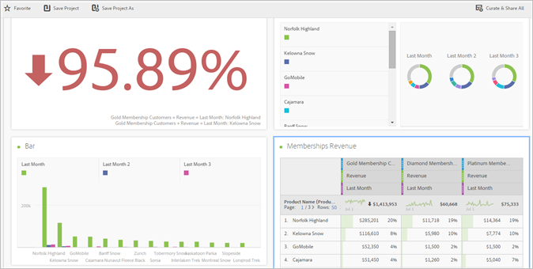
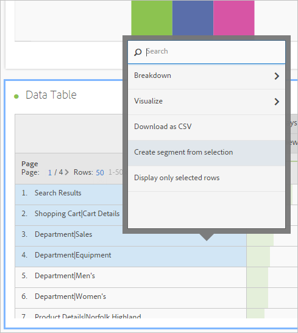
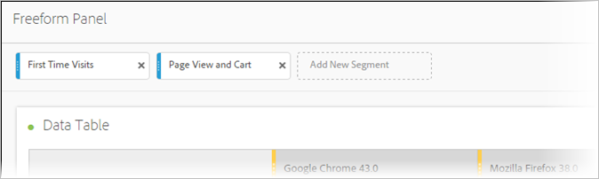
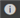

# Analysis Workspace overview

Analysis Workspace removes all of the typical limitations of a single Analytics report. It provides a robust, flexible canvas for building custom analysis projects. Drag-and-drop any number of data tables, visualizations, and components (dimensions, metrics, segments, and time granularities) to a project. Instantly create breakdowns and segments, create cohorts for analysis, create alerts, compare segments, do flow and fallout analysis, and curate and schedule reports for sharing with anyone in your business.

**[!UICONTROL Analytics]** > **[!UICONTROL Workspace]**

## Overview video

>[!VIDEO](https://video.tv.adobe.com/v/26266?quality=12)

Full YouTube playlist available [here](https://www.youtube.com/playlist?list=PL2tCx83mn7GuNnQdYGOtlyCu0V5mEZ8sS).

>[!NOTE]
>
>See [What's New in Analysis Workspace](/help/analyze/analysis-workspace/new-features-in-analysis-workspace.md) for updates about features.

## Full control over project elements and components

Analysis Workspace provides freedom and flexibility:

* Drag-and-drop components (dimensions, metrics, segments, and time granularities)
* Drag and drop multiple visualizations to the project 
* Move, resize, and stack visualizations wherever you want in a project

See [Create an Analysis Workspace project](/help/analyze/analysis-workspace/build-workspace-project/t-freeform-project.md) for more information.

## Multiple visualizations in a project 

Drag-and-drop as many visualizations onto a project that you want.

Create a project showing the percent of change, with multiple visualizations corresponding to cells in a freeform data table.

See [Create an Analysis Workspace project](/help/analyze/analysis-workspace/build-workspace-project/t-freeform-project.md) for more information.

## Intra-linking to panels and visualizations 

In conjunction with the [rich text editing](/help/analyze/analysis-workspace/visualizations/text.md) capabilities of Analysis Workspace, you can link down to specific panels and visualizations within a project from a text box, such as to create a project's table of contents. You can share these links like you share a project link, to direct someone to a specific visualization or panel within a project. New right-click options called "Get Panel Link" and "Get Visualization Link" have been added. To add intra-linking to your project:

1. Drag a text visualization into a project, maybe next to a visualization or table that needs some context.
1. Populate the text box with, for example, a table of content, then highlight an item that you want to link to a panel or visualization, for example Success Metrics.

   

1. Scroll to that panel or visualization and right-click the panel's header.
1. Scroll down and select **[!UICONTROL Get Panel Link]** or **[!UICONTROL Get Visualization Link]**:

   

1. Copy that link and add it to the Success Metrics hyperlink in the text visualization. Click the checkmark to save the text.

If you have panels or visualizations collapsed within your project, clicking a link will expand the panel/visualization so that users can see it.

>[!NOTE] You can also use this feature within the **[!UICONTROL Edit Description]** right-click option.

## Link to other projects 

You can link users to other projects that may be of interest to them by going to  **[!UICONTROL Share]** > **[!UICONTROL Get Project Link]** and embedding this link in project descriptions, for example.

## Dynamic visualization of selected cells 

Select individual cells and see the visualizations change dynamically. Synchronize and lock a visualization with selected cells.

## Lock selected items or positions 

Locking visualizations lets you control which freeform data table sources correspond to visualizations.

See [Manage data sources](/help/analyze/analysis-workspace/visualizations/t-sync-visualization.md).

## Trend visualizations from selected cells 

Create a visualization from selected cells. (Right-click > **[!UICONTROL Trend Selection]**.)

Trend selections are now **linked** to the table below, so if you select a different row in the table, the trend chart will reflect that row.

## Dimensions and dimension item breakdowns 

As a retailer, you can dive deeper than ever before into your campaigns to understand how to better engage your customers. Break down your data in unlimited ways for your specific needs; build queries using relevant metrics, dimensions, segments, time lines, and other analysis breakdown values.

See [Break down dimensions](/help/analyze/analysis-workspace/components/dimensions/t-breakdown-fa.md).

## Segments from table selections 

Select cells in the freeform table and create a segment from the selection.

Compare multiple segments and instantly create and apply segments. You can apply multiple segments to focus on specific customers based on behavior and interaction and then compare and contrast.

Drop a segment to the freeform panel at the project level, and the segment is applied to the entire project.

See [Segments](/help/analyze/analysis-workspace/components/t-freeform-project-segment.md).

## Project and component tagging 

You can apply tags to projects and components in Analysis Workspace:

* Apply or create project-level tags in the Information panel. (  

* Right-click components to tag (or create tags) from the Components panel.
* Use # in the Search field to locate tags.

## Component actions 

Perform component-level actions from the Actions menu at the top of the component left rail. Select a component and click **[!UICONTROL Actions]** to view the actions.

| Component Action | Description |
|--- |--- |
|Tag|Organize or manage components by applying tags to them. It then shows up in the respective component manager, such as   Analytics   >  Components   >  Segments  , or   Analytics   >  Components   >  Projects|
|Favorite|Add the component to your list of favorites. It then shows up in the respective component manager, such as   Analytics   >  Components   >  Segments  , or   Analytics   >  Components   >  Projects  .|
|Approve|Approve the component to make it canonical. It then shows up in the respective component manager, such as   Analytics   >  Components   >  Segments  , or   Analytics   >  Components   >  Projects|
|Share|Applies only to segments.|
|Delete|Applies only to segments.|

See [Visualizations](/help/analyze/analysis-workspace/visualizations/freeform-analysis-visualizations.md) for more information.

## Additional feature descriptions 

**What you can drag and stack**

Components

* Dimensions 
* Segments 
* Metrics 
* Date ranges 
* Time granularities (Hour, Day, Week, and so on).

**Multiple freeform tables and multiple visualizations**

There is no technical limit on the number of freeform tables and visualizations that you can add to the panel. Also, you can run a new visualization (or export to CSV) each freeform table or selected rows of a table.

**Column arranging, sorting, and copying**

* Sort date range presets (does not include custom date ranges).
* CTRL (or Command) + click + drag a column copies the column, and when you drag the copy, it is pasted into the new position in the table.

See [Hotkeys Available in Analysis Workspace](/help/analyze/analysis-workspace/build-workspace-project/fa-shortcut-keys.md) for more information.

**Selections and actions**

You can select rows and columns similar to the way you can select them in Excel. Then, you can take actions on those selections. For example:

* Create visualizations from selections 
* Copy to clipboard (CTRL or Command + C) 
* Break down multiple-selected rows. Select the rows, then drag a dimension onto the selection. Or, right-click the selection and use the Breakdown menu.

**Auto-save and unsaved changes**

You will be prompted to save your changes if you attempt to close the browser (or use the Back button), and the project has not been saved. If your system crashes, you will receive an alert to restore to your previous project state when loading the project.

Already existing (not new) projects auto-save only when the browser crashes or under other circumstances when you were not given a chance to save them.

**All Visits**

A default segment unique to Analysis Workspace. *`All Visits`* displays totals for the components you add to the table.

**Calculated metrics**

Use calculations in the same way you use standard metrics.

See [Calculated Metrics](https://docs.adobe.com/content/help/en/analytics/components/calculated-metrics/cm-overview.html).
