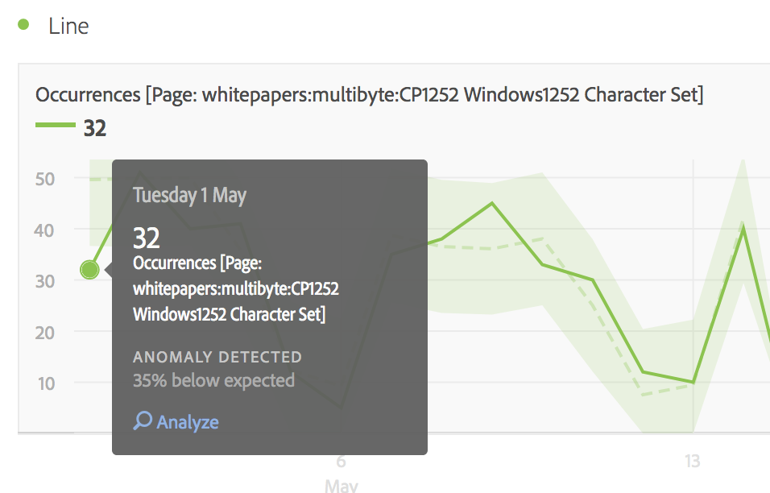

# What's New in Analysis Workspace

>[!IMPORTANT]
>Further Analysis Workspace updates have been rolled into the [Adobe Analytics Documentation Updates](/help/technotes/doc-updates.md) page.

See [Adobe Experience Cloud Release Notes](https://experienceleague.adobe.com/docs/release-notes/experience-cloud/current.html) for updates to the overarching product.

## March 2021

| Feature | Target Date | Description |
| --- | --- | --- |
|[!UICONTROL Components] > [!UICONTROL User preferences] | March 25, 2021 | The [!UICONTROL Components] > [!UICONTROL User preferences] page enables you to manage [!UICONTROL Analysis Workspace] settings and its related components for your user. [!UICONTROL User preferences] applies to all new projects and panels.  **Note:** the following settings have moved to the [!UICONTROL User preferences] page:<ul><li>Report Settings: Thousands separator (now called _Number format_)</li><li>Report Settings: CSV separator</li><li>Workspace projects: Help > Enable tips</li><li>Workspace projects: Blank panel _Start new projects with this panel_ option</li></ul> |
| [!UICONTROL Histogram Smart Bucket Prediction] | March 25, 2021 | [!UICONTROL Histogram Smart Bucket Prediction] helps with high-cardinality-metrics histograms by automatically identifying the right width and number of buckets for your data spread. For low-cardinality metrics, the visualization behaves the same as it did previously. |

## February 2021

| Feature | Target Date | Description |
| --- | --- | --- |
| Component Selection | February 4, 2021 | The drop-down/drop zone component found in [!UICONTROL Quick Insights] will be added to all drop zones in [!UICONTROL Workspace]. This enhancement allows you to pick from a drop-down list of compatible components or continue to use the space as a drop zone. |

## January 2021

| Feature | Target Date | Description |
| --- | --- | --- |
| Image URLs | January 14, 2021 | You can add images to Workspace projects by referencing a public image URL. |
| Combined source & settings manager for visualizations | January 14, 2021 | The [!UICONTROL Data Source] manager (dot) and settings manager (gear) for visualizations have been combined into a single popover, so you can easily manage your source and settings from the same location. |

## October 2020

| Feature | Description |
| --- | --- |
| Line visualization: [Moving average trendline option](https://experienceleague.adobe.com/docs/analytics/analyze/analysis-workspace/visualizations/line.html) | **[!UICONTROL Moving average]** has been added to [!UICONTROL Line] visualization trendline settings. Also known as a rolling average, a moving average uses a specific number of data points (determined by a **[!UICONTROL Periods]** selection), averages them, and uses the average as a point in the line. |
| [Performance Help page](https://experienceleague.adobe.com/docs/analytics/analyze/analysis-workspace/workspace-faq/optimizing-performance.html) | The Analysis Workspace performance help page shows the different factors that impact project performance and links to tips for optimization. |

## September 2020

| Feature | Description |
| --- | --- |
| [Download 50K items for a single dimension](https://experienceleague.adobe.com/docs/analytics/analyze/analysis-workspace/curate-share/download-send.html#download-items) | You can now download 50,000 items for a single dimension in a freeform table, with segments and filters applied. This allows you to access more than the 400 rows of data outside of Analysis Workspace. |
| [Enhancements to Line visualization](https://experienceleague.adobe.com/docs/analytics/analyze/analysis-workspace/visualizations/line.html) | <ul><li>You can show or hide the X-axis and Y-axis of any [!UICONTROL Line] visualization. This can be especially helpful when your [!UICONTROL Line] visualizations are more compact.</li><li>You can overlay a minimum and maximum value label on any Line visualization to quickly highlight the peaks and valleys in a metric.</li><li>You can overlay different regression trend lines on any Line visualization to more easily see the trend in the data. Options include [!UICONTROL Linear], [!UICONTROL Logarithmic], [!UICONTROL Exponential], [!UICONTROL Power] and [!UICONTROL Quadratic].</li></ul> |
| New date ranges | We added 5 new date ranges so you can choose from date ranges that do not include partial day data from today: Last 7 full days, Last 14 full days, Last 30 full days, Last 60 full days, Last 90 full days |

## August 2020

No new features released in August 2020.

## July 2020

New feature released on July 16, 2020.

| Feature | Description |
| --- | --- |
| New date range presets | Added 4 new date ranges: ([!UICONTROL This week/month/quarter/year (excluding today)]). This lets you choose from date ranges that do not include partial-day data from today. |

## June 2020

New features released on June 18, 2020.

| Feature | Description |
|--- |--- |
|Attribution IQ: Algorithmic Attribution|The Algorithmic Attribution model in Analysis Workspace uses statistical techniques to dynamically determine the optimal allocation of credit for the selected metric. Available to Adobe Analytics Ultimate customers. [Learn more...](https://experienceleague.adobe.com/docs/analytics/analyze/analysis-workspace/attribution/algorithmic.html)|
|Attribution IQ: Custom lookback windows|You can now configure any attribution model in Attribution IQ to include touchpoints from up to 90 days before the reporting time period. This will typically increase the attribution accuracy for events that happen early in the reporting period by accounting for interactions that occurred in the prior month(s). Available to Adobe Analytics Foundation, Select, Prime, Premium, Premium Attribution, Premium Complete, and Ultimate customers. [Learn more...](https://experienceleague.adobe.com/docs/analytics/analyze/analysis-workspace/attribution/models.html#lookback-windows)|
|Project roles for shared Workspace projects|When sharing a Workspace project, you can now place recipients in one of three project roles, depending on the project experience you want them to have: Edit, Duplicate and View. [Learn more...](https://experienceleague.adobe.com/docs/analytics/analyze/analysis-workspace/curate-share/share-projects.html)|
|View-only Workspace projects|Workspace projects can be shared to users as “Can view” only. When a View recipient opens the shared project, they receive a more restrictive project experience, with no left rail and limited interactions. [Learn more...](https://experienceleague.adobe.com/docs/analytics/analyze/analysis-workspace/curate-share/view-only-projects.html)|
|Ability to co-edit Workspace projects|Recipients added to the “Can edit” role can save over a project that has been shared to them. This extends to both admins and non-admins. [Learn more...](https://experienceleague.adobe.com/docs/analytics/analyze/analysis-workspace/curate-share/share-projects.html)|
|Updated Blank panel|The blank panel now includes panels and visualizations, giving you a more seamless way to pick the analysis workflow that works best for you.|
|Quick Insights panel (June 25, 2020)|Quick Insights provides guidance for non-analysts and new users of Analysis Workspace to learn how to answer business questions quickly and easily. [Learn more...](/help/analyze/analysis-workspace/c-panels/quickinsight.md)|
| Analytics for Target panel in Workspace (June 25, 2020)|The Analytics for Target (A4T) panel lets you analyze your Adobe Target activities and experiences, with lift and confidence, in Analysis Workspace. [Learn more...](/help/analyze/analysis-workspace/c-panels/a4t-panel.md)|
|About Workspace page|The About Workspace page provides information about your Analysis Workspace environment, about your Adobe Analytics administrators (if you need support), and a way to provide in-product feedback. It can be found under Workspace > Help > About Workspace.|

## May 2020

New features released on May 21, 2020.

| Feature | Description |
|--- |--- |
|Automatically build Freeform Tables from a blank state|Previously, you could not drop components directly into a blank project or blank panel; you had to add a Freeform Table first. You can now drop components directly into a blank project or panel, and a Freeform Table is automatically built for you in a recommended format. Additionally, improvements were made to how mixed component types (such as dimensions and metrics) are handled when dropped into a blank Freeform Table together.|
|Accessibility improvements|The Adobe Analytics team has made several accessibility improvements to Analysis Workspace, including improved keyboard navigation, color contrast, and screen reader support. [Learn more...](https://experienceleague.adobe.com/docs/analytics/analyze/analysis-workspace/workspace-faq/aw-accessibility.html)|

## April 2020

New feature released on April 16, 2020.

| Feature | Description |
|--- |--- |
|Automatically build [!UICONTROL Freeform Tables] from a blank state|Previously, you could not drop components directly into a blank project or blank panel; you had to add a freeform table first. You can now drop components directly into a blank project or panel, and a freeform table will automatically be built for you in a recommended format. Additionally, improvements were made to how mixed component types (e.g. dimensions & metrics) are handled when dropped into a blank [!UICONTROL Freeform Table] together.|

## March 2020

New features released on March 12, 2020.

| Feature | Description |
|--- |--- |
|Support for multiple report suites in Workspace|You can now bring in data from multiple report suites into a single project to view side by side. [Learn more...](https://experienceleague.adobe.com/docs/analytics/analyze/analysis-workspace/build-workspace-project/multiple-report-suites.html)|
|Training Tutorial template|This new standard template walks you through common terminology and steps for building your first analysis in Workspace. It is available as a standard template in the New Project modal and replaces the sample project that exists today for new users that do not have other projects in their list. [Learn more...](/help/analyze/analysis-workspace/build-workspace-project/starter-projects.md)|

## February 2020

New features released on February 20, 2020.

| Feature | Description |
|--- |--- |
|New Workspace template for organizations using Cross-Device Analytics|This template shows how effective CDA is at stitching visits together and educates you on CDA-exclusive dimensions and metrics. A report suite using CDA is required. See [Set up Cross-Device Analytics](/help/components/cda/setup.md) for more information.|
|New hotkeys in Workspace|<ul><li>Collapse/Expand All panels: `alt + m`</li><li>Collapse/Expand Active panel: `alt + ctrl + m`</li><li>Search left rail: `ctrl + /`</li><li>Move to next panel: `alt + Right Key`</li><li>Move to previous panel: `alt + Left Key`</li></ul>[Learn more...](https://experienceleague.adobe.com/docs/analytics/analyze/analysis-workspace/build-workspace-project/fa-shortcut-keys.html)|
|Other Workspace enhancements|<ul><li>When a panel or visualization is dropped into Workspace, the left rail will now auto-switch to components for a more seamless workflow.</li><li>Template components can now be actioned upon (e.g. tagged, favorited, approved).</li><li>Filtered metric and segment lists offer the + button to add a new component if you don't find what you need.</li></ul>|
|Workspace debugger|The Workspace debugger has been added to the Help menu, giving you a more seamless way to enable it for debugging Workspace requests. [Learn more...](https://www.adobe.io/apis/experiencecloud/analytics/docs.html#!AdobeDocs/analytics-2.0-apis/master/reporting-tricks.md)|

## January 2020

New feature released on January 16, 2020.

| Feature | Description |
|--- |--- |
|[Freeform Table Builder](https://experienceleague.adobe.com/docs/analytics/analyze/analysis-workspace/visualizations/freeform-table/freeform-table.html)|With Table Builder enabled, you can drag and drop in many dimensions, breakdowns, metrics and segments to build tables that answer more complex business questions. Data will not update immediately. Instead, updates occur after you click **[!UICONTROL Build]**, saving you time once you know what table you want to construct. Additionally, this feature offers:<ul><li>**Preview**: You can preview the format of a table before spending time to render real data.</li><li>**Flexible Row and breakdown settings**: You can set your row and breakdown levels for every dimension row. Previously, Workspace imposed defaults that could not be changed until after the data was returned.</li><li>**Breakdown by position**: You can set dimension rows to always _breakdown by position_ instead of _by specific item_ (the default).</li><li>**Manual static row ordering**: You can manually order static rows so that the table rows are displayed exactly as you need them. Previously, static rows could be sorted only by a metric column or alphabetically.</li></ul>|

## October 2019

Enhancements released on October 10, 2019.

| Enhancement | Description |
|--- |--- |
|Update to Freeform table totals|Freeform tables now include two totals, a **[!UICONTROL Table total]** and a **[!UICONTROL Grand total]**. The Table total row accounts for [report filters](https://experienceleague.adobe.com/docs/analytics/analyze/analysis-workspace/visualizations/freeform-table/pagination-filtering-sorting.html) applied. Previously, only segmentation impacted totals. [Learn more](https://experienceleague.adobe.com/docs/analytics/analyze/analysis-workspace/visualizations/freeform-table/workspace-totals.html) In addition, **[!UICONTROL Show Totals]** and **[!UICONTROL Show Grand Total]** options have been added to **[!UICONTROL Column Settings]**. With this change to Freeform totals, dependent visualizations will be updated (e.g. linked **[!UICONTROL Summary Number]** visualizations), as well as exported CSV and PDF data. |
|Option to remove Unspecified/None|The ability to easily remove ‘Unspecified (None)’ has been added as an option to report filters.|
|Deprecation of purple granularity components|Purple granularity time components (Minute, Hour, Day, Week, Month, Quarter, Year) have been deprecated. The purple time components have always behaved exactly like their orange dimension counterparts, so this change will simplify the experience. **No action** needs to taken if you previously used one of the purple time components. With this change, the purple **[!UICONTROL Time]** section has also been renamed to **[!UICONTROL Date Ranges]**.|

## August 2019

Enhancement released on August 8, 2019.

| Enhancement | Description |
|--- |--- |
|Increase item limit for dropdown filter from 50 to 200| We increased the limit of items that can be placed in a dropdown filter from 50 to 200. This enhancement accommodates a variety of use cases, such as adding all countries (195) to a filter, or all US states and provinces (52). |

## July 2019

Enhancements released on July 18, 2019.

| Enhancement | Description |
|--- |--- |
|Cohort Analysis enhancements| New [Cohort Analysis settings](https://experienceleague.adobe.com/docs/analytics/analyze/analysis-workspace/visualizations/cohort-table/t-cohort.html) have been added: <ul><li>Only show percent</li><li>Round percent to nearest whole</li><li>Show an average percent row</li></ul> |
|Show items from last 18 months| In the left rail, users now have the option to _Show items from last 18 months_. Previously, the lookback period was a maximum of 6 months. This makes it easier to compare to pages or campaigns from last year, up to 18 months ago. |
| New Analysis Workspace template | We added a new template called ["Magento: Marketing & Commerce"](https://experienceleague.adobe.com/docs/analytics/analyze/analysis-workspace/build-workspace-project/starter-projects.html) to Analysis Workspace. It is designed specifically for Magento e-commerce customers, but any retailer can use it to get unique insights into their commerce activities. |

## June 2019

Enhancement released on June 13, 2019.

| Enhancement | Description |
| --- |--- |
| New out-of-the-box filters | Added new out-of-the-box filters to the left rail search. Beyond what you see today (Dimensions, Metrics, Approved, etc.), new filters such as Calculated Metrics, Customer Attributes, eVars, Props, Video, etc. were added to make it easier to find the components you need. | 

## May 2019

Enhancement released on May 09, 2019.

| Enhancement | Description |
|--- |--- |
|A new setting was added to the Flow visualization settings: Include Repeat Instances.|[Flow Settings](/help/analyze/analysis-workspace/visualizations/c-flow/flow-settings.md)|

## April 2019

Enhancement released on April 11, 2019.

| Enhancement | Description |
|--- |--- |
| Enhancements to optimization best practices | [Optimizing Performance](/help/analyze/analysis-workspace/new-features-in-analysis-workspace.md)|

## January 2019

New features and enhancements released on January 17, 2019.

| Feature | Description |
|--- |--- |
|[Cohort Analysis](/help/analyze/analysis-workspace/visualizations/cohort-table/cohort-analysis.md)|Major improvements to Cohort Analysis let you:<ul><li>Apply a segment inclusion and return metrics separately. </li><li>Show churn instead of retention.</li><li>Show latency tables (time elapsed before and after an inclusion event).</li><li>Customize cohort dimension (to group visitors based on an eVar, not just time).</li><li>Do a rolling cohort calculation: calculate retention/churn based on prior time period, not original cohort. </li><li>Add in multiple metrics in inclusion & return fields, as well as apply segments. (Calculated metrics are not supported)</li></ul>|
|[View Density](/help/analyze/analysis-workspace/build-workspace-project/view-density.md)|This new setting lets you see more data on a single screen by reducing the vertical padding of the left rail, freeform tables and cohort tables. Accessible via Project > Project Info & Settings.|
|[Support for multi-valued variables in Attribution IQ](attribution/overview.md)|Some dimensions in Analytics can contain multiple values on a single hit, such as listVars, the product variable, list props, or merchandising eVars. Analysis Workspace lets you apply Attribution IQ to any of these types of variables at the hit level.|
|Performance improvements|Speed improvements to breakdown visualizations - projects with lots of breakdowns will load faster.|

## November 2018

New features and enhancements released on November 1, 2018.

| Feature | Description |
|--- |--- |
|[VRS and project curation - enhancements](/help/analyze/analysis-workspace/curate-share/curate.md)|These changes were actually introduced in October 2018. Changes were made to which components administrators and non-administrators can see in curated Workspace projects and curated virtual reports suites (VRSs).   Previously, anyone could see non-curated components when clicking Show all Components. The updated curation experience allows for more fine-grained control over which components are visible. |

## October 2018

New features and enhancements released on October 11, 2018.

<table id="table_3DDC812B2F66416F868004416D248BF3"> 
 <thead> 
  <tr> 
   <th colname="col1" class="entry"> Feature </th> 
   <th colname="col2" class="entry"> Description </th> 
  </tr> 
 </thead>
 <tbody> 
  <tr> 
   <td colname="col1"> 
<b>Panel Dropdown Management</b> 
 </td> 
   <td colname="col2"> 
We made a few changes to the management of panel dropdowns, which were introduced in the September MR. When you right-click the dropdown, you can now 
 
    <ul id="ul_4BDEC66EEB2243628FE32B43E377E5BD"> 
     <li id="li_EF8277BE972540D3B2604D82BC7C0918">Delete a dropdown (this option is always present.) </li> 
     <li id="li_6A991208F2744274817DBE1E9D1B443F">Delete a label (if a label is showing.) </li> 
     <li id="li_5C1CFC465C2E41D2B35E8841EFDC82AA">Add a label (if no label is showing.) </li> 
    </ul> </td> 
  </tr> 
  <tr> 
   <td colname="col1"> 
<b>Links in panel and visualization tooltips</b> 
 </td> 
   <td colname="col2"> 
We have added links to pertinent videos and documentation to panel and visualization tooltips. 
 </td> 
  </tr> 
 </tbody> 
</table>

## September 2018

New features and enhancements released on September 13, 2018.

<table id="table_137719BFA03C44A78FDE872DF8B228A4"> 
 <thead> 
  <tr> 
   <th colname="col1" class="entry"> Feature </th> 
   <th colname="col2" class="entry"> Description </th> 
  </tr> 
 </thead>
 <tbody> 
  <tr> 
   <td colname="col1"> 
<b>Panel Dropdowns</b> 
 </td> 
   <td colname="col2"> 
The panel drop zone now has drop-down capabilities. Drop-downs enable end users to interact with the data in a project in a controlled way. Example: Suppose you have several versions of a project to provide country-specific reporting. You can now collapse those projects into a single project, and add in a country drop-down instead. 
 </td> 
  </tr> 
  <tr> 
   <td colname="col1"> 
<b>Color Palettes</b> 
 </td> 
   <td colname="col2"> 
You can now change the color scheme used in Workspace, by choosing from a different color palette or specifying your own palette. This affects many things in Workspace, including most visualizations. It does <b>NOT</b> affect Summary Change, conditional formatting in Freeform tables, and the Map visualization. 
 
Note:  Color palette support is not enabled for Internet Explorer 11. 
 </td> 
  </tr> 
  <tr> 
   <td colname="col1"> 
<b>New template: Audio Consumption</b> 
 </td> 
   <td colname="col2"> 
See <a href="https://experienceleague.adobe.com/docs/media-analytics/using/media-reports/media-workspace-templates.html"  > Audio Analytics </a>. 
 </td> 
  </tr> 
 </tbody> 
</table>

## August 2018

New features and enhancements released on August 9, 2018.

<table id="table_DD77C02344414DCD9AC0A6A22E648B72"> 
 <thead> 
  <tr> 
   <th colname="col1" class="entry"> Feature </th> 
   <th colname="col2" class="entry"> Description </th> 
  </tr> 
 </thead>
 <tbody> 
  <tr> 
   <td colname="col1"> 
<b>Drop Zone Guides</b> 
 </td> 
   <td colname="col2"> 
These guides help you more easily understand what each drag and drop action will do. For example, when you hover over a column, we will show things like Add, Replace, Filter By, and Breakdown. 
 
We also added yellow/red guides that alert you when you are taking an action that is not recommended or prohibited, such as stacking two metrics on top of one another (which leads to invalid data). 
 </td> 
  </tr> 
  <tr> 
   <td colname="col1"> 
<b>Add Blank Panel Option</b> 
 </td> 
   <td colname="col2"> 
We added a + symbol below the starting panel to make it easier to add additional panels. 
 </td> 
  </tr> 
 </tbody> 
</table>

## July 2018

New features and enhancements released on July 19, 2018.

<table id="table_336E121310204DC492EA004F40830B0F"> 
 <thead> 
  <tr> 
   <th colname="col1" class="entry"> Feature </th> 
   <th colname="col2" class="entry"> Description </th> 
  </tr> 
 </thead>
 <tbody> 
  <tr> 
   <td colname="col1"> 
<b> <a href="attribution/overview.md"  > Attribution IQ </a> </b> 
 </td> 
   <td colname="col2"> 
Attribution IQ lets you perform more sophisticated and intelligent analysis on marketing performance. New attribution models can be used on metrics in Analysis Workspace (on any table or on any breakdown) and in calculated metrics. A new Attribution Panel allows for better visualization and comparison. 
 </td> 
  </tr> 
  <tr> 
   <td colname="col1"> 
<b> Improvements to the Left Rail </b> 
 </td> 
   <td colname="col2"> 
Made improvements to the left rail to make it more intuitive and easy to use: 
 
    <ul id="ul_087BEDF4338946DA857CD82CB69F98C2"> 
     <li id="li_C751AACAC60442DC93118F0819F8EEA7"> Brought the Create (+) function for components (metrics, segments, dates) inline with the headers. </li> 
     <li id="li_DE2EB184A02D4CE58C23F518DB85EFDD"> Added "+ See All" to the bottom of each section list to make it apparent that there are more than 5 options. </li> 
     <li id="li_5208F3C6026647B09F4A85131B175175">Surfaced actions (like tag, favorite) with icons when components are selected. </li> 
     <li id="li_11E601488A844515928231E09889BC54">Made aesthetic improvements to the user interface. </li> 
    </ul> </td> 
  </tr> 
  <tr> 
   <td colname="col1"> 
<b>Totals for Calculated Metrics </b> 
 </td> 
   <td colname="col2"> 
When possible, we now display totals for calculated metrics, including for percentages 
 </td> 
  </tr> 
  <tr> 
   <td colname="col1"> 
<b>New <a href="/help/analyze/analysis-workspace/components/calendar-date-ranges/calendar.md"  > date range </a>preset </b> 
 </td> 
   <td colname="col2"> 
Added 'Last 13 full weeks' to the date range presets in Analysis Workspace. 
 </td> 
  </tr> 
 </tbody> 
</table>

## June 2018

New features and enhancements released on June 14, 2018.

<table id="table_57035A06D99447A6BE6ED825A648ED3F"> 
 <thead> 
  <tr> 
   <th colname="col1" class="entry"> Feature </th> 
   <th colname="col2" class="entry"> Description </th> 
  </tr> 
 </thead>
 <tbody> 
  <tr> 
   <td colname="col1"> 
<b> <a href="/help/analyze/analysis-workspace/components/dimensions/view-dimensions.md"  > Dynamic Dimension Columns </a> </b> 
 </td> 
   <td colname="col2"> 
Previously, when a dimension was dropped on a column, we showed the top 5 values for non-time dimensions (and 15 for time dimensions) and kept those values static (i.e., the 5 values picked never changed). 
 
From now on, by default, we show dynamic values instead of static ones, with the option to turn them into static values. Other things to note: 
 
    <ul id="ul_C802BC32CB084E30B4E58E9E90B9A63D"> 
     <li id="li_452466AB416F4737B532849C604BD4CC">Click (i) on dynamic dimension and you will see the ranking (top 1 of 5) and dimension type. </li> 
     <li id="li_588F6199E38D47869AC855A4C2A4D1B7">As your data updates, the dynamic dimension columns will update to show the current 5/15 dimension items. </li> 
     <li id="li_19D47638D4D94416B0DAD2B2FB835ABE">A dynamic dimension column that is copied or moved will become static. </li> 
     <li id="li_B95411689AE04774B7B9BA128F2DB96F">When hovering a static dimension column you will see a lock icon, indicating that the dimension is static. </li> 
    </ul> </td> 
  </tr> 
  <tr> 
   <td colname="col1"> 
<b>New Workspace Features modal </b> 
 </td> 
   <td colname="col2"> 
Similar to the Tips of the Day introduced last month, this modal shows new Workspace features the first time you log in to Workspace after a new release. 
 </td> 
  </tr> 
 </tbody> 
</table>

## May 2018

New features and enhancements released on May 10, 2018.

<table id="table_EE4C690A178B4F80BDAF2BB4424D6020"> 
 <thead> 
  <tr> 
   <th colname="col1" class="entry"> Feature </th> 
   <th colname="col2" class="entry"> Description </th> 
  </tr> 
 </thead>
 <tbody> 
  <tr> 
   <td colname="col1"> 
<b>Tips of the Day</b> 
 </td> 
   <td colname="col2"> 
We will provide Tips of the Day (along with a short video) in the bottom right-hand corner of the interface. These tips are meant to familiarize you with a multitude of cool Analysis Workspace features. You can choose to dismiss these Tips or access them through  Help  &gt;  Tips  at any time. 
 
 
 </td> 
  </tr> 
  <tr> 
   <td colname="col1"> 
<b> <a href="/help/analyze/analysis-workspace/components/segments/t-freeform-project-segment.md"  > Segment templates </a> and <a href="/help/analyze/analysis-workspace/components/apply-create-metrics.md"  > calculated metrics templates </a></b> 
 </td> 
   <td colname="col2"> 
The left rail now shows segment templates and calculated metrics templates. 
 </td> 
  </tr> 
  <tr> 
   <td colname="col1"> 
<b>Ability to scroll while dragging components</b> 
 </td> 
   <td colname="col2"> 
You can now scroll up and down while dragging components to a new location. 
 </td> 
  </tr> 
  <tr> 
   <td colname="col1"> 
<b>Additional information on <a href="/help/analyze/analysis-workspace/virtual-analyst/c-anomaly-detection/view-anomalies.md"  > anomalies </a></b> 
 </td> 
   <td colname="col2"> 
When hovering over an anomaly in a line chart, the information now shows the date and the raw value of the anomaly. 
 </td> 
  </tr> 
 </tbody> 
</table>

## April 2018

New features and enhancements released on April 12, 2018.

<table id="table_B9E784CD14A1453EB360FCCDC612250F"> 
 <thead> 
  <tr> 
   <th colname="col1" class="entry"> Feature </th> 
   <th colname="col2" class="entry"> Description </th> 
  </tr> 
 </thead>
 <tbody> 
  <tr> 
   <td colname="col1"> 
 <a href="/help/analyze/analysis-workspace/visualizations/freeform-table/column-row-settings/column-settings.md"  > Wrap Header Text enabled by default </a> 
 </td> 
   <td colname="col2"> 
The column setting to  Wrap Header Text  is now enabled by default for Freeform tables. 
 </td> 
  </tr> 
  <tr> 
   <td colname="col1"> 
 <a href="/help/analyze/analysis-workspace/visualizations/freeform-table/column-row-settings/table-settings.md"  > New row setting </a> 
 </td> 
   <td colname="col2"> 
The new  Calculate percentage by row  setting forces the Freeform table to calculate the cell percentages across the row as opposed to down the column. This is especially useful for trending percentages, such as trending how one dimension item fairs against the rest over time. It is turned on by default when clicking the  Visualize  icon. 
 </td> 
  </tr> 
  <tr> 
   <td colname="col1"> 
 <a href="/help/analyze/analysis-workspace/visualizations/freeform-analysis-visualizations.md#section_D3BB5042A92245D8BF6BCF072C66624B"  > "100% Stacked" Visualization Setting </a> 
 </td> 
   <td colname="col2"> 
A new visualization setting on area stacked/bar stacked/horizontal bar stacked visualizations turns the chart into a "100% stacked" visualization, so you can gauge relative proportions. 
 
 
 </td> 
  </tr>
  <tr> 
   <td colname="col1"> 
 <a href="/help/analyze/analysis-workspace/virtual-analyst/overview.md"  > Anomaly Detection and Contribution Analysis </a> now available only via Analysis Workspace 
 </td> 
   <td colname="col2"> 
Anomaly Detection and Contribution Analysis have been removed from the Reports &amp; Analytics feature set and are now available only via Analysis Workspace. 
 
Note that Adobe Analytics Select and Adobe Analytics Foundation customers have access only to "daily-granularity" Anomaly Detection in Workspace. 
 </td> 
  </tr> 
 </tbody> 
</table>

## March 2018

New features and enhancements released on March 8, 2018.

<table id="table_580CF2C1322E4FB78870BE2B1F497B2F"> 
 <thead> 
  <tr> 
   <th colname="col1" class="entry"> Feature </th> 
   <th colname="col2" class="entry"> Description </th> 
  </tr> 
 </thead>
 <tbody> 
  <tr> 
   <td colname="col1"> 
 <a href="/help/analyze/analysis-workspace/visualizations/freeform-table/column-row-settings/column-settings.md"  > Header Text Wrapping </a> 
 </td> 
   <td colname="col2"> 
You can now wrap the header text in Freeform tables to make headers more readable and tables more shareable. We have added an option in Column settings called "Wrap Header Text." This is especially useful for .pdf rendering and for metrics with long names. 
 </td> 
  </tr> 
  <tr> 
   <td colname="col1"> 
 <a href="/help/analyze/analysis-workspace/components/apply-create-metrics.md"  > Right-Click to Create Metric </a> 
 </td> 
   <td colname="col2"> 
To make it easier to quickly create calculated metrics,  Create metric from selection  has been added to the right-click menu in Freeform Tables. This option displays when one or more header column cells are selected. 
 </td> 
  </tr> 
  <tr> 
   <td colname="col1"> 
 <a href="/help/analyze/analysis-workspace/visualizations/map-visualization.md"  > Map visualization enhancements </a> 
 </td> 
   <td colname="col2"> 
To be able to show period-over-period (such as, year-over-year) comparisons in the Map visualization, we have added these enhancements: 
 
    <ul id="ul_F570E6AB174C45788620CF50E2742A08"> 
     <li id="li_746E329037764644A9CCF79161C26350">The Map visualization can now show negative numbers. For example, if you are plotting a year-over-year metric, the map can show -33% over New York. </li> 
     <li id="li_E05F0380627044E6A4E8A60C98494BF7">With metrics that are of type "percent", clustering averages the percentages together. </li> 
     <li id="li_44C04306EA1B413E91B8256B340D5296">A new color scheme: Positive/Negative (green/red) </li> 
    </ul> </td> 
  </tr> 
  <tr> 
   <td colname="col1"> 
 <a href="/help/analyze/analysis-workspace/build-workspace-project/starter-projects.md"  > Custom Template updates </a> 
 </td> 
   <td colname="col2"> 
For the recently released custom templates, we have 
 
    <ul id="ul_787F48253F454163B99F6DD50F199FE2"> 
     <li id="li_828DD547DDB54A81B9FFB9FE92790F6C">Added a template icon to the top of the project (near the title) to help differentiate the edit template mode from using a template as a starting point for a project. </li> 
     <li id="li_EEAA4D115CB74A57BABD524B2561E0CC">Allow non-admins to create (save-as) and edit Workspace project templates, provided they have been granted the Create/Curate Projects in Analysis Workspace permission. (   Admin   &gt;  All admin   &gt;  User management   &gt;  Groups   &gt;  Edit All Report Access   &gt;  Customize Analytics Tools   &gt;  Create/Curate Projects in Analysis Workspace  ). </li> 
    </ul> </td> 
  </tr> 
 </tbody> 
</table>

## February 2018

New feature and enhancements released on February 8, 2018.

<table id="table_824BBE4A554B4DB092ADA9044383D0FA"> 
 <thead> 
  <tr> 
   <th colname="col1" class="entry"> Feature </th> 
   <th colname="col2" class="entry"> Description </th> 
  </tr> 
 </thead>
 <tbody> 
  <tr> 
   <td colname="col1"> 
 <a href="/help/analyze/analysis-workspace/build-workspace-project/starter-projects.md#create-custom-template"  > Custom Workspace Templates </a> 
 </td> 
   <td colname="col2"> 
You can now build your own Workspace templates and save them so that other users in your organization can start with data that is relevant to them. 
 </td> 
  </tr> 
  <tr>  
   <td colname="col2"> 
Clicking "new project" launches a new screen that gives you the choice to start from 
 
    <ul id="ul_FE90E6B9AF334A029D66A43901F8FA0B"> 
     <li id="li_F1DFD9AE140C4E5B849D4C522D5968DB">a blank project, or </li> 
     <li id="li_23BD391D68674C299858A97BFE10598B">a standard (built-in) Workspace template, or </li> 
     <li id="li_04D84FE375B84BF88843AA0D43A234BF">a custom Workspace template (see above) </li> 
    </ul> </td> 
  </tr> 
  <tr> 
   <td colname="col1"> 
Right-click support for copy 
 </td> 
   <td colname="col2"> 
We added a right-click "Copy to clipboard" option to allow you to consistently copy cells/tables. 
 </td> 
  </tr> 
  <tr> 
   <td colname="col1"> 
 <a href="/help/analyze/analysis-workspace/visualizations/freeform-table/column-row-settings/column-settings.md"  > Improvement to Column % </a> 
 </td> 
   <td colname="col2"> 
The "percentage of total" shown in columns was capped at 100%, even when certain scenarios lead to rows being more than 100% of the total (such as with averages). 
 
We now show percentages greater than 100%, to be more accurate. We are also moving the upper bound cap to 1,000% to ensure columns can grow in width too large. 
 </td> 
  </tr> 
  <tr> 
   <td colname="col1"> 
 <a href="/help/analyze/analysis-workspace/visualizations/freeform-table/column-row-settings/column-settings.md#section_3DD847151DA14914888A70FC4FD7BDFB"  > Conditional Formatting enabled on Breakdowns </a> 
 </td> 
   <td colname="col2"> 
Applying conditional formatting (colors, etc) within Freeform tables is now automatically enabled on breakdowns, unless "Custom" limits are selected. 
 </td> 
  </tr> 
  <tr> 
   <td colname="col1"> 
Changes to default <a href="/help/analyze/analysis-workspace/components/calendar-date-ranges/calendar.md"  > calendar </a> view 
 </td> 
   <td colname="col2"> 
By default, the Workspace calendar will now show current month and last month, instead of current month and next month. 
 </td> 
  </tr> 
  <tr> 
   <td colname="col1"> 
Improved hover/selection colors in Workspace tables 
 </td> 
   <td colname="col2"> 
The difference in colors when hovering over a Freeform table cell versus clicking on a cell has been made more distinct. 
 </td> 
  </tr> 
 </tbody> 
</table>

## January 2018

New features and enhancements released on January 18, 2018.

<table id="table_7A2E678577F94BDABB1276C826E6554F"> 
 <thead> 
  <tr> 
   <th colname="col1" class="entry"> Feature </th> 
   <th colname="col2" class="entry"> Description </th> 
  </tr> 
 </thead>
 <tbody> 
  <tr> 
   <td colname="col1"> 
More dimension item <a href="/help/analyze/analysis-workspace/visualizations/freeform-table/pagination-filtering-sorting.md"  > filtering options </a> in freeform tables 
 </td> 
   <td colname="col2"> 
These (advanced) filtering options for dimension items have been added (besides the existing "contains" and "does not contain" options): 
 
    <ul id="ul_869B3E943E304C0282D56AD96BB79E18"> 
     <li id="li_81A49BA0CA3041C7AB892FAD2D129E5A">Contains all terms </li> 
     <li id="li_2AB564F917844F82839A91949D0B684A">Contains any term </li> 
     <li id="li_16C7938EDC8F422EA006FB63F2881EF1">Contains the phrase </li> 
     <li id="li_5130EBE9A7A54CCFA313F3C3C268B367">Does not contain any term </li> 
     <li id="li_861825154EDC49EBA57514FD0A2AE462">Does not contain the phrase </li> 
     <li id="li_5364BFB73ECF4B92A6663693ABD4BCF5">Equals </li> 
     <li id="li_1EBF3119B6364842A35D39BAD645F4AF">Does not equal </li> 
     <li id="li_487886E0A6EC4245A0E85D2E8B4A20FB">Starts with </li> 
     <li id="li_A73F54DFBAAB44D4A4134342A3124E47">Ends with </li> 
    </ul> </td> 
  </tr> 
  <tr> 
   <td colname="col1"> 
 <a href="/help/analyze/analysis-workspace/visualizations/freeform-analysis-visualizations.md#section_05B7914D4C9E443F97E2BFFDEC70240C"  > Copy &amp; paste visualizations/panels </a> across panels &amp; projects 
 </td> 
   <td colname="col2"> 
You can now right-click and copy a visualization or panel, and then paste ("insert") that copied element into another place within the project, or into a different project. 
 
You can use this capability to create "building blocks" - predefined visualizations/panels - that can be copied into other projects to get started more quickly, with data specific to your business. 
 </td> 
  </tr> 
  <tr> 
   <td colname="col1"> 
 <a href="/help/analyze/analysis-workspace/build-workspace-project/starter-projects.md"  > New Mobile Templates for "Messaging" and "Location" </a> 
 </td> 
   <td colname="col2"> 
Two new project templates have been added: 
 
    <ul id="ul_2F5976C849474A2B8A6BCDA2559F2855"> 
     <li id="li_51B7830E062A4CFDBDF219C56249A733">A new Mobile project template for "Messaging" that focuses on in-app and push messaging performance. </li> 
     <li id="li_D2FB258EF3AF4EB19CEB258D08F4EBBE">A new Mobile project template for "Location" that includes a Map showcasing location data. </li> 
    </ul> </td> 
  </tr> 
  <tr> 
   <td colname="col1"> 
Column Resizing Improvement 
 </td> 
   <td colname="col2"> 
When resizing the left-most column, Workspace now maintains the width percentages of the rest of the columns (not simply adjust the next column width on the right). This change speeds up table creation for both analysis and sharing. 
 </td> 
  </tr> 
  <tr> 
   <td colname="col1"> 
Display <a href="/help/analyze/analysis-workspace/visualizations/freeform-table/freeform-table.md"  > 400 rows </a> in a table 
 </td> 
   <td colname="col2"> 
You can now display 400 rows in a table (up from 200), to allow for 365-day trends. 
 </td> 
  </tr> 
  <tr> 
   <td colname="col1"> 
 <a href="/help/analyze/analysis-workspace/visualizations/map-visualization.md"  > Map Visualization </a> support in PDF 
 </td> 
   <td colname="col2"> 
The Map visualization, introduced in October 2017, can now be rendered in PDF. 
 </td> 
  </tr> 
  <tr> 
   <td colname="col1"> 
 <a href="/help/analyze/analysis-workspace/home.md"  > Relative intra-links </a> when copying/saving-as Project 
 </td> 
   <td colname="col2"> 
Previously, when you copied a project or did a "save as", all the intra-links saved in the project pointed to the original project, not the copied project. 
 
The intra-links are now relative to the project they live within, after you copy/save-as. 
 </td> 
  </tr> 
  <tr> 
   <td colname="col1"> 
Contribution Analysis: <a href="https://experienceleague.adobe.com/docs/analytics/analyze/analysis-workspace/virtual-analyst/anomaly-detection/anomaly-detection.html"  > Token Notification </a> 
 </td> 
   <td colname="col2"> 
If your company has a limited number of Contribution Analysis tokens, the Analysis Workspace UI now shows a notification when you consume a token. It lets you know how many tokens you have left.&amp;nbsp; 
 
(Admin users: you can restrict who can use these tokens, by editing the group permission. The permission is called "Anomaly Detection and Contribution Analysis" under  Analytics  &gt;  Admin  &gt;  All admin   &gt;  User management &gt;  Edit Groups  &gt;  Edit All Report Access  &gt;  Customize Report Suite Tools  &gt;  Tools And Reports . )&nbsp; 
 </td> 
  </tr> 
  <tr> 
   <td colname="col1"> 
CSV files with multi-bye characters 
 </td> 
   <td colname="col2"> Emailed CSV files containing multi-byte characters can now be opened in MS Excel. </td> 
  </tr> 
  <tr> 
   <td colname="col1"> 
Changes to event#, eVar#, and prop# 
 </td> 
   <td colname="col2"> 
Event#, eVar#, and prop#, which were added to dimension names in the left rail (in 2017), will only appear when you <b>search</b> for the component. 
 
(Also applies to Virtual Report Suite builder.) 
 </td> 
  </tr> 
  <tr> 
   <td colname="col1"> 
Changes to None/Unspecified 
 </td> 
   <td colname="col2"> 
Changed how None/Unspecified works in Analysis Workspace so that it is consistent with Reports &amp; Analytics, the Segment Builder and the dimension items menu in Analysis Workspace. 
 
This means that the value will show up as "Unspecified" instead of "None" in most projects in Analysis Workspace. 
 </td> 
  </tr> 
 </tbody> 
</table>

## November 2017

New feature released on November 09, 2017.

<table id="table_C502E81253634E6CBAE7F12C7B62F7B6"> 
 <thead> 
  <tr> 
   <th colname="col1" class="entry"> Feature </th> 
   <th colname="col2" class="entry"> Description </th> 
  </tr> 
 </thead>
 <tbody> 
  <tr> 
   <td colname="col1"> 
List of Incompatible Components 
 </td> 
   <td colname="col2"> 
Sometimes, not all components included in a project are included in the report suite. The resulting "Incompatible Report Suite" message that displays when loading a project or switching to a report suite now lists the components that are not compatible. 
 </td> 
  </tr> 
 </tbody> 
</table>

## October 2017

New features released on October 26, 2017.

<table id="table_892279F2B4AF4DB38C64AA9AFC5657A7"> 
 <thead> 
  <tr> 
   <th colname="col1" class="entry"> Feature </th> 
   <th colname="col2" class="entry"> Description </th> 
  </tr> 
 </thead>
 <tbody> 
  <tr> 
   <td colname="col1"> 
 <a href="/help/analyze/analysis-workspace/visualizations/map-visualization.md"  > Map Visualization </a> 
 </td> 
   <td colname="col2"> 
The new&amp;nbsp;Map Visualization&amp;nbsp;lets you easily view your customer interactions within the context of their location. From a macro (global) view to a micro (city) view, you can easily zoom in and out of various hierarchy levels in the visualization to see clusters of users across regions. 
 
You can visualize location data via IP address (for non-mobile data sets) or you can bring latitude and&amp;nbsp;longitude data (for customers using the Mobile SDK) to life in Analysis Workspace.&amp;nbsp; 
 </td> 
  </tr> 
  <tr> 
   <td colname="col1"> 
 <a href="/help/analyze/analysis-workspace/visualizations/line.md"  > Granularity selector for trended visualizations </a> 
 </td> 
   <td colname="col2"> 
You can now easily toggle between time granularities when the dimension in the data source is a time dimension. You can switch granularities from a drop-down in the visualization settings. 
 </td> 
  </tr> 
  <tr> 
   <td colname="col1"> 
 <a href="/help/analyze/analysis-workspace/components/t-freeform-project-segment.md"  > Full dimensions &amp; events in segment drop zone </a> 
 </td> 
   <td colname="col2"> 
Previously, you could drop only dimension items, date ranges, or segments into segment drop zones. You can now drop a full dimension or event into the segment drop zone. In both cases, Analysis Workspace will create "exists" hit segments. 
 
Examples: "Hit where eVar1 exists" or "Hit where event1 exists". 
 
Note:  You cannot drop calculated metrics into a segment zone. Only those dimensions/metrics for which you can build segments qualify for the segment zone. 
 </td> 
  </tr> 
  <tr> 
   <td colname="col1"> 
 <a href="/help/analyze/analysis-workspace/visualizations/t-sync-visualization.md"  > Connected visualizations listed in Data Source Settings </a> 
 </td> 
   <td colname="col2"> 
If there are visualizations connected to a freeform or cohort table, the top left dot (Data Source Settings) will now list the connected visualizations. Hovering will highlight the linked visualization, and clicking it will take you to it. 
 
In addition, there is a "Show/Hide Data Table" checkbox that lets you show or hide the data table. 
 </td> 
  </tr> 
  <tr> 
   <td colname="col1"> 
 <a href="/help/analyze/analysis-workspace/home.md"  > Event# added to left-rail event names </a> 
 </td> 
   <td colname="col2"> 
Prior to October 2017, evar# and prop# were appended to the dimension names, and you could search on those numbers. The same functionality is now available for events. 
 
Example: "Subscriptions" now shows up in the left rail as "Subscriptions (event1)". 
 
Keep in mind: 
 
    <ul id="ul_5DF85C65F7004539949DDC4F23922296"> 
     <li id="li_A685834B4914460D87568583BB39C474">The event number does not show in the table (to keep the titles short). </li> 
     <li id="li_D742D04470244633900335B7F5A79FD9">For consistency, props and eVars no longer show their numbers within tables, either. </li> 
    </ul> </td> 
  </tr> 
  <tr> 
   <td colname="col1"> 
 <a href="/help/analyze/analysis-workspace/home.md"  > Out-of-the-box dimensions sorted in logical order by default </a> 
 </td> 
   <td colname="col2"> 
The default sort order for some out-of-the-box dimensions has been updated in these cases: 
 
    <ul id="ul_B9C0C761F39E43A4977EC028F4D4525C"> 
     <li id="li_FE72ADDCD32A4FF7907462726D6E7758">When they are dragged into a freeform table. </li> 
     <li id="li_5D78DD0DCB7347AC85E260F53109010C">When they are viewed in the left rail. </li> 
    </ul> 
For example, if "Hour of Day" is dropped into a table, it will be sorted from 12AM-11PM. You still have the option to sort by any metric column. 
 </td> 
  </tr> 
  <tr> 
   <td colname="col1"> 
 <a href="/help/analyze/analysis-workspace/virtual-analyst/c-anomaly-detection/view-anomalies.md"  > Option to allow confidence interval from re-scaling a chart </a> 
 </td> 
   <td colname="col2"> 
The Anomaly Detection Confidence interval does not automatically scale the y-axis of a visualization to potentially make the chart more legible. 
 
You now have the option to allow the confidence interval to scale the chart. 
 </td> 
  </tr> 
  <tr> 
   <td colname="col1"> 
 <a href="/help/components/c-alerts/alert-manager.md"  > Alerts: Added <b>Renew</b> Option </a> 
 </td> 
   <td colname="col2"> 
In the Alert Manager, when one or more alerts are selected, they can be renewed by clicking  Renew . 
 
This extends their expiration dates to 1 year from the day  Renew  was clicked, regardless of their original expiration date. 
 </td> 
  </tr> 
  <tr> 
   <td colname="col1"> 
UI Improvements 
 </td> 
   <td colname="col2"> 
    <ul id="ul_645B43AC6F554353B887DD58F0AA86E8"> 
     <li id="li_05B16A84008E4DA3A5DE91AF3C942D55">Blank panel: We now start out by highlighting all the visualizations you can add to the panel, such as Map, Fallout, Flow, Histogram, Cohort, and Venn. You have the option to save this panel as your default project starting state. </li> 
     <li id="li_9F1ED138DB0E453DA6BD4B4A512492CC">New left rail styling make Panels, Visualizations, and Components on the left rail more visible and usable. </li> 
     <li id="li_5DF6177F0EFD4D4D9D432768DEA3F37D">Freeform table: Blank freeform tables will now show an animated GIF that demonstrates the drag-and-drop paradigm of Analysis Workspace. </li> 
    </ul> </td> 
  </tr> 
 </tbody> 
</table>

## September 2017

New features released on September 21, 2017.

<table id="table_DC0DA93B8A3B481080FCB2BA8F985753"> 
 <thead> 
  <tr> 
   <th colname="col1" class="entry"> Feature </th> 
   <th colname="col2" class="entry"> Description </th> 
  </tr> 
 </thead>
 <tbody> 
  <tr> 
   <td colname="col1"> 
 <a href="/help/analyze/analysis-workspace/components/dimensions/time-parting-dimensions.md"  > Time-Parting Dimensions in Analysis Workspace </a> 
 </td> 
   <td colname="col2"> 
Dimensions based on timestamp have been added out-of-the-box to Analysis Workspace. Dimensions include: 
 
    <ul id="ul_9BDBC0B344504E85840040E493873A47"> 
     <li id="li_826A8CBF4FDB4C98AC176C7145C09DB2">Hour of Day (e.g. 01, 12, 15, 23) </li> 
     <li id="li_FD6AAD4D3F544224A757D8124F973BE5">AM/PM (e.g. AM PM) </li> 
     <li id="li_5CAE35FB8E3E490A8FCF72DF8AC619CC">Day of week (e.g. Monday, Tuesday, Wednesday,etc) </li> 
     <li id="li_930DFC6BFCC740A392EC7FA859FF0E73">Weekend/Weekday (e.g. Weekend, Weekday) </li> 
     <li id="li_C09F8BF8C598498392732C183C5BB720">Day of Month (e.g. 1, 2, .... 30, 31) </li> 
     <li id="li_E80A8932C32B4410A9BC703090FB5CFF">Month of Year (e.g. January, February, March) </li> 
     <li id="li_67620F09B58244B2B17317E0DB97067A">Day of Year (e.g. Day 1, Day 2 , etc) </li> 
     <li id="li_A96CD77357064FC19D92EFA8244560D6">Quarter of Year (e.g. Q1, Q2, etc) </li> 
    </ul> </td> 
  </tr> 
  <tr> 
   <td colname="col1"> 
 <a href="/help/analyze/analysis-workspace/visualizations/freeform-table/column-row-settings/column-settings.md"  > Manage Multiple Columns at Once in Freeform Tables </a> 
 </td> 
   <td colname="col2"> 
You can now change the settings on multiple columns at once. Just select multiple columns and click the settings icon of any one of those columns. Any changes that you make apply to all columns with cells selected in them. 
 </td> 
  </tr> 
  <tr> 
   <td colname="col1"> 
 <a href="/help/analyze/analysis-workspace/visualizations/c-flow/multi-dimensional-flow.md"  > Flow: Inter-dimensional Labeling </a> 
 </td> 
   <td colname="col2"> 
A new dimension label at the top of each Flow column makes using multiple dimensions in a flow visualization more intuitive. 
 </td> 
  </tr> 
  <tr> 
   <td colname="col1"> 
 <a href="/help/analyze/analysis-workspace/visualizations/histogram.md#section_09D774C584864D4CA6B5672DC2927477"  > Histogram Hit Counting Method </a> 
 </td> 
   <td colname="col2"> 
Previously, there were 2 counting methods in a Histogram visualization: Visit and Visitor (default). 
 
You can now use a third counting method, "Hit", as a segment container. "Occurrences" is used as the y-axis metric in the freeform table. 
 </td> 
  </tr> 
  <tr> 
   <td colname="col1"> 
  Clear All button for Segment Comparison and Contribution Analysis configuration 
 </td> 
   <td colname="col2"> 
Rather than manually deleting each element, you can now Clear All elements in the following Workspace areas: 
 
    <ul id="ul_73E06D64CDCA4E83B9FEC2FD99D41CD3"> 
     <li id="li_A51EF8FADFA04CC19FD79C1675597659"> <a href="/help/analyze/analysis-workspace/virtual-analyst/contribution-analysis/run-contribution-analysis.md#section_F6932F4BF74544B5872164E7B1E0C6FC"  > Contribution Analysis Excluded Components </a> </li> 
     <li id="li_30E612D5A7584484967260931DB9E30E"> <a href="/help/analyze/analysis-workspace/c-panels/c-segment-comparison/segment-comparison.md"> Segment Comparison Excluded Components </a> </li> 
    </ul> </td> 
  </tr> 
  <tr> 
   <td colname="col1"> 
 <a href="/help/analyze/analysis-workspace/visualizations/summary-number-change.md"  > Updated names for Summary Change display types </a> 
 </td> 
   <td colname="col2"> 
Two current Summary Change Options were renamed to clarify their meaning: 
 
    <ul id="ul_7301D1C73E72424F911EE8DAAD9247A0"> 
     <li id="li_89D94632E0C94263A84887AF5B360E27">Show Change &gt; Show Percent Change </li> 
     <li id="li_D48EB4055019449DAF2998CB9A5D23DF">Show Difference &gt; Show Raw Difference </li> 
    </ul> </td> 
  </tr> 
  <tr> 
   <td colname="col1"> 
 <a href="/help/analyze/analysis-workspace/visualizations/summary-number-change.md"  > Extended decimal places for abbreviated Summary Number/Changes </a> 
 </td> 
   <td colname="col2"> 
Previously, abbreviated Summary number/change visualizations showed 0 decimal places. 
 
You can now choose 0-3 decimal places to enhance your reporting. 
 </td> 
  </tr> 
 </tbody> 
</table>

## August 2017

New features released on August 17, 2017.

<table id="table_C29887097C894B1C91AD7086F0DAEC73"> 
 <thead> 
  <tr> 
   <th colname="col1" class="entry"> Feature </th> 
   <th colname="col2" class="entry"> Description </th> 
  </tr> 
 </thead>
 <tbody> 
  <tr> 
   <td colname="col1"> 
 <a href="/help/analyze/analysis-workspace/home.md"  > Tag a project during Save </a> 
 </td> 
   <td colname="col2"> 
You can now add tags to a project while saving the project. 
 </td> 
  </tr> 
  <tr> 
   <td colname="col1"> 
 <a href="/help/analyze/analysis-workspace/build-workspace-project/freeform-overview.md"  > Tags column in Project list page </a> 
 </td> 
   <td colname="col2"> 
Added a  Tags  column to the Workspace project list page. This column displays the tags for each project. 
 </td> 
  </tr> 
  <tr> 
   <td colname="col1"> 
 <a href="/help/analyze/analysis-workspace/visualizations/c-flow/flow.md"  > Export Flow visualizations as .CSV files </a> 
 </td> 
   <td colname="col2"> 
You can download Flow visualizations as .csv files, which lets you analyze Flow results within Microsoft Excel (visualized as a table) or elsewhere. 
 </td> 
  </tr> 
  <tr> 
   <td colname="col1"> 
 <a href="/help/components/c-alerts/intellligent-alerts.md"  > Intelligent Alerts: Additional confidence intervals </a> 
 </td> 
   <td colname="col2"> 
For Anomaly Detection-based alerts, two new confidence levels (99.75% and 99.9%) have been added. The defaults for some granularity selections have also changed: 
 
    <ul id="ul_EB1F07A4D2204D57B2DDD9838CE4F5D9"> 
     <li id="li_542AAACE703F4EBFBD91F11F5ABC2929">hourly: now 99.75% </li> 
     <li id="li_D01E4598FB33473FAAC5D60441FD081B"> daily: now 99% </li> 
    </ul> </td> 
  </tr> 
 </tbody> 
</table>

## July 2017

New features released on July 20, 2017.

<table id="table_64E3A9960F314E2F9FFC738696EACDF7"> 
 <thead> 
  <tr> 
   <th colname="col1" class="entry"> Feature </th> 
   <th colname="col2" class="entry"> Description </th> 
  </tr> 
 </thead>
 <tbody> 
  <tr> 
   <td colname="col1"> 
<b> <a href="/help/analyze/analysis-workspace/visualizations/text.md"  > Rich Text Editor </a></b> 
 </td> 
   <td colname="col2"> 
Lets you change the font settings (bold, italics, and so on) and hyperlink within text box visualizations and panel / visualization descriptions. 
 </td> 
  </tr> 
  <tr> 
   <td colname="col1"> 
<b> <a href="/help/analyze/analysis-workspace/home.md#section_253EA04E067F4A29A8B54CE2B7631086"  > Intra-linking (Quick-visualize links) </a></b> 
 </td> 
   <td colname="col2"> 
<b>Intra-linking</b> lets you link down to specific panels and visualizations within a project from a text box, such as to create a project table of contents. You can share these links like you share a project link, to direct someone to a specific visualization or panel within a project. New right-click options called "Get Panel Link" and "Get Visualization Link" have been added. 
 </td> 
  </tr> 
  <tr> 
   <td colname="col1"> 
<b> <a href="/help/analyze/analysis-workspace/visualizations/freeform-analysis-visualizations.md#section_94F1988CB4B9434BA1D9C6034062C3DE"  > Legend Label Editing </a></b> 
 </td> 
   <td colname="col2"> 
Lets you rename series names in visualization legends (Fallout, Area, Area Stacked, Bar, Bar Stacked, Donut, Histogram, Horizontal Bar, Horizontal Bar Stacked, Line, Scatter, and Venn) to help you make visuals more consumable. 
 
Legend editing <b>does not</b> apply to: Treemap, Bullet, Summary Change or Number, Text, Freeform, Histogram, Cohort or Flow visualizations. 
 </td> 
  </tr> 
  <tr> 
   <td colname="col1"> 
<b> <a href="/help/analyze/analysis-workspace/visualizations/t-sync-visualization.md"  > Updates to "Manage Data Sources" </a></b> 
 </td> 
   <td colname="col2"> 
We've redeveloped how data sources (powering the visualizations) are managed. There are no longer separate, hidden tables when you lock your data source to a table. 
 
Instead, we will keep the visual tied to the table you created it from. This will also resolve a bug with live-linked tables, where you change the granularity and then it reverts to the old granularity on the next project load. 
 </td> 
  </tr> 
  <tr> 
   <td colname="col1"> 
<b> <a href="/help/analyze/analysis-workspace/virtual-analyst/contribution-analysis/run-contribution-analysis.md"  > Ability to highlight a specific anomaly </a></b> 
 </td> 
   <td colname="col2"> 
We now highlight the anomaly with a blue dot within contribution analysis and the intelligent alert projects linked to it. This provides a clearer indication of the anomaly being analyzed. 
 </td> 
  </tr> 
  <tr> 
   <td colname="col1"> 
<b>'Get Project Link' for Experience Cloud logins</b> 
 </td> 
   <td colname="col2"> 
Previously, if you logged in with your Experience Cloud credentials and navigated to Analytics, you could not use the   Share   &gt;  Get Project Link   feature. We've fixed this issue. You still have to save the project before this option becomes clickable. 
 </td> 
  </tr> 
  <tr> 
   <td colname="col1"> 
<b> <a href="/help/analyze/analysis-workspace/curate-share/t-schedule-report.md"  > 'Expired Projects' filter in Scheduled Projects manager </a></b> 
 </td> 
   <td colname="col2"> 
You can now filter expired projects in the Scheduled project manager. You can then decide whether to restart or delete these projects. 
 </td> 
  </tr> 
 </tbody> 
</table>

## June 2017

New features released on June 8, 2017.

<table id="table_5B859A64363A44A98FC55E7AFB3C1D0C"> 
 <thead> 
  <tr> 
   <th colname="col1" class="entry"> Feature </th> 
   <th colname="col2" class="entry"> Description </th> 
  </tr> 
 </thead>
 <tbody> 
  <tr> 
   <td colname="col1"> <b> <a href="/help/analyze/analysis-workspace/visualizations/fallout/configuring-fallout.md"  > Fallout </a></b> enhancements </td> 
   <td colname="col2"> 
    <ul id="ul_8A979BC0BE0F4D008F68B019A2D83A08"> 
     <li id="li_C8093834980B43A094FA9E2A7906E135">Unlimited segments for comparison </li> 
     <li id="li_45D709C9B04F4E6A9BD94FD03E0C80FA">Ability to name and more easily manage touchpoint groups (add, remove, move, etc.) </li> 
     <li id="li_BC609CDFD9AA4EB081987922DB318040">Right-click &gt;  Trend Touchpoint % : trends the total fallout percentage </li> 
     <li id="li_C72BB725368644DDA3FCE479A918CDB3">Right-click &gt;  Trend All Touchpoint % : trends all the touchpoint percentages in the fallout (except for  All Visits  if it's included), on the same chart. </li> 
     <li id="li_40D0A8B481B04F21BEC0A4E421C77865">Ability to constrain individual touchpoints to the next hit (as opposed to eventually) within the path </li> 
    </ul> </td> 
  </tr> 
  <tr> 
   <td colname="col1"> <a href="/help/analyze/analysis-workspace/visualizations/c-flow/flow-settings.md"  > <b>Flow</b> </a> enhancements </td> 
   <td colname="col2"> 
    <ul id="ul_54675DB3F59E4B24AF0C8F6E6AB2F3C1"> 
     <li id="li_DEF7D9BF03CD4A2D86A4BDD89FB3731A">Added a new visualization setting called  Disable Label Truncation  (default = unchecked). </li> 
    </ul> </td> 
  </tr> 
  <tr> 
   <td colname="col1"> <b> <a href="/help/analyze/analysis-workspace/components/calendar-date-ranges/calendar.md"  > Calendar </a></b> changes </td> 
   <td colname="col2"> Changes to the calendar to bring it in line with the Reports &amp; Analytics calendar: 
    <ul id="ul_BD706B07369F4339BF4925F22FEC1C7F"> 
     <li id="li_33A47BAAD3C04C8784D2FC00A6F6782E">The first click starts a date range selection. Then highlight the range in either direction until the second click, which selects the end of the date range. If the Shift key is held down (or right-click is used) while clicking the first date, it will append to the range. </li> 
     <li id="li_C3BEC56ABCED482C82A41EA0550B3077">Extended look-back periods for the various rolling date pieces (e.g., allow days to go back up to two years) </li> 
    </ul> </td> 
  </tr> 
  <tr> 
   <td colname="col1"> 
<b>Improved Search for Dimension Items</b> 
 </td> 
   <td colname="col2"> 
    <ul id="ul_E955585818FF4553A869003B94DDB697"> 
     <li id="li_A37D2DB6290842578FE752DD8E712B73">Enhanced speed </li> 
     <li id="li_BADFD0FF3D574F1C8F19EFB37F95969C">A  Show Top Items from the Last 6 Months  option that pulls in more data, if necessary </li> 
    </ul> </td> 
  </tr> 
  <tr> 
   <td colname="col1"> 
<b> <a href="/help/analyze/analysis-workspace/visualizations/freeform-table/column-row-settings/column-settings.md"  > Use Percent Limits checkbox </a></b> 
 </td> 
   <td colname="col2"> 
    <ul id="ul_7B6B794EDF874A4D87770AB9BAB42F33"> 
     <li id="li_0B403D892320434FBAD9A7F7B808947C"> Added a checkbox to denote percent cutoffs, especially for percent-based metrics (also works with non-percent based metrics). </li> 
    </ul> </td> 
  </tr> 
  <tr> 
   <td colname="col1"> 
<b>Component Manager </b>enhancements 
 </td> 
   <td colname="col2"> 
    <ul id="ul_BB22F84ABFB04685A9752AD4BDE6E60A"> 
     <li id="li_B3D460C15C454911A9D7254F50815355">Added expiration dates for alerts and scheduled projects </li> 
    </ul> </td> 
  </tr> 
  <tr> 
   <td colname="col1"> 
<b> <a href="/help/components/c-alerts/alert-manager.md"  > Alert Manager </a> </b>enhancements 
 </td> 
   <td colname="col2"> 
    <ul id="ul_72464DC499744290BA37DB3B1E143F74"> 
     <li id="li_C687F0A3A99F4CC39B482BDA0F7B75DD">Added the ability to enable/disable alerts. </li> 
     <li id="li_F7415EE7DF29417FAF416594E36A38A4">Added an enabled/disabled column. </li> 
     <li id="li_61B3A60A2AFB4BD0AA4D83803AB95B1E">Added a filter for enabled/disabled alerts. </li> 
    </ul> </td> 
  </tr> 
  <tr> 
   <td colname="col1"> 
New <b> <a href="/help/analyze/analysis-workspace/build-workspace-project/fa-shortcut-keys.md"  > Hotkeys </a></b> 
 </td> 
   <td colname="col2"> 
Added the following hotkeys: 
 
    <ul id="ul_5AE965D910DA4883BC2067CDFDBBA75A"> 
     <li id="li_6DBD6DFB9CA54F89B9A0627F3B1D5928">alt + shift + 1 = Go to Panels pane </li> 
     <li id="li_1B7E7C1115A84DB8A1BC07EA1C3AB15F">alt + shift + 2 = Go to Visualizations Pane </li> 
     <li id="li_1BDB09DDEEDC4E7DB0D1C08A4E02A613">alt + shift + 3 = Go to Components Pane </li> 
    </ul> </td> 
  </tr> 
 </tbody> 
</table>

## April 2017

New features released on April 20, 2017.

<table id="table_53EEFB870ED943F5BFD71FAB2DBCE49B"> 
 <thead> 
  <tr> 
   <th colname="col1" class="entry"> Feature </th> 
   <th colname="col2" class="entry"> Description </th> 
  </tr> 
 </thead>
 <tbody> 
  <tr> 
   <td colname="col1"> 
 <a href="/help/analyze/analysis-workspace/build-workspace-project/starter-projects.md"  > People Template </a> 
 </td> 
   <td colname="col2"> 
Note:  The People template and its associated People metric is available for use only as part of the <a href="https://experienceleague.adobe.com/docs/device-co-op/using/data/people.html"  > Adobe Experience Cloud Device Co-op </a>. 
 
The template is based on the People metric, which is a de-duplicated version of the Unique Visitors metric. The People metric provides a measure of how often consumers using multiple devices interact with your brand. 
 </td> 
  </tr> 
  <tr> 
   <td colname="col1"> 
Improvements to Undo/Redo option 
 </td> 
   <td colname="col2"> 
These lists show what you can and cannot undo/redo in Analysis Workspace </a>. 
 </td> 
  </tr> 
 </tbody> 
</table>

## February 2017

New feature released on February 16, 2017: 

<table id="table_227D3668E9FD4FF4A1906FC619DCAFBF"> 
 <thead> 
  <tr> 
   <th colname="col1" class="entry"> Feature </th> 
   <th colname="col2" class="entry"> Description </th> 
  </tr> 
 </thead>
 <tbody> 
  <tr> 
   <td colname="col1"> 
 <a href="/help/analyze/analysis-workspace/visualizations/freeform-table/column-row-settings/table-settings.md"  > Breakdown by position </a> 
 </td> 
   <td colname="col2"> 
Allows breakdown by table position. Example: "I always want the top 7 rows in a Freeform table to be broken down." There is now a checkbox when you create a Freeform table that allows you to enable "Breakdown by Position." This setting is disabled by default. 
 
Previously, the list of values in the breakdown was "locked". This led to a situation where, for example, if you did a breakdown of  Date  by  Page , you got a list of the top 50 pages for your selected date range. 
 
If you saved that report and then ran it a month later, the top 50 pages would likely have changed. However, Analysis Workspace "trusted" the results from the original breakdown and returned the same pages, but with the current month as the date range. 
 </td> 
  </tr> 
 </tbody> 
</table>

## January 2017

New feature released on January 19, 2017: 

<table id="table_0AB06B81BFA34521A9BF1150E64663C3"> 
 <thead> 
  <tr> 
   <th colname="col1" class="entry"> Feature </th> 
   <th colname="col2" class="entry"> Description </th> 
  </tr> 
 </thead>
 <tbody> 
  <tr> 
   <td colname="col1"> 
 <a href="/help/analyze/analysis-workspace/curate-share/download-send.md"  > Send and download a PDF without having to save the project </a> 
 </td> 
   <td colname="col2"> 
You can now send and download a PDF in Workspace without having to save the project. The name of the PDF file matches the current name of the project. The downloaded PDF includes the unsaved changes in the project. Note that you cannot schedule unsaved projects. (You can also send and download unsaved CSV files, but you cannot schedule them.) 
 </td> 
  </tr> 
  <tr> 
   <td colname="col1"> 
 <a href="/help/analyze/analysis-workspace/curate-share/curate.md"  > Auto-share project components </a> 
 </td> 
   <td colname="col2"> 
You now have the option to auto-share project components (segments, calculated metrics, and date ranges) with all recipients. After being shared, these components will appear in the components drop-down of the recipient's Workspace. 
 </td> 
  </tr> 
  <tr> 
   <td colname="col1"> 
Fallout visualization in CSV format 
 </td> 
   <td colname="col2"> 
Added support for Fallout visualization in CSV format. 
 </td> 
  </tr> 
  <tr> 
   <td colname="col1"> 
 <a href="/help/analyze/analysis-workspace/components/segments/t-freeform-project-segment.md"  > Date ranges in segments </a> 
 </td> 
   <td colname="col2"> 
You can drop date ranges on segment drop zones (for example, panel segment drop zones, Fallout visualization segment drop zones, and so on.). The date ranges are auto-converted into segments. The date ranges can be custom and non-custom but not granularities like hour/day/week/month/quarter/year. 
 </td> 
  </tr> 
  <tr> 
   <td colname="col1"> 
 <a href="/help/analyze/analysis-workspace/components/calendar-date-ranges/time-comparison.md"  > Add a time period to each column in a table </a> 
 </td> 
   <td colname="col2"> 
You can now add a time period to each column in a table, enabling you to add a time period that is different from the one your calendar is set to. This feature is another way you can compare dates. You can also align dates from each column to all start on the same row. 
 </td> 
  </tr> 
 </tbody> 
</table>

## November 2016

New feature released on November 10, 2016: 

<table id="table_9B2B9CC7A3574A99A716BF1C9745E32B"> 
 <thead> 
  <tr> 
   <th colname="col1" class="entry"> Feature </th> 
   <th colname="col2" class="entry"> Description </th> 
  </tr> 
 </thead>
 <tbody> 
  <tr> 
   <td colname="col1"> 
 <a href="/help/analyze/analysis-workspace/components/calendar-date-ranges/time-comparison.md"  > Date Comparison </a> 
 </td> 
   <td colname="col2"> 
The new Date Comparison feature lets you take any column and create a common date comparison, such as: year-over-year, quarter-over-quarter, month-over-month, and do on. 
 
Date Comparisons automatically include a Difference column, which shows the percentage change. 
 </td> 
  </tr> 
 </tbody> 
</table>

## October 2016

New features released on October 20, 2016: 

<table id="table_56258080C60F480AA83E1D5DE7D2C782"> 
 <thead> 
  <tr> 
   <th colname="col1" class="entry"> New Feature </th> 
   <th colname="col2" class="entry"> How you can use it </th> 
  </tr> 
 </thead>
 <tbody> 
  <tr> 
   <td colname="col1"> <b> <a href="/help/analyze/analysis-workspace/visualizations/fallout/fallout-flow.md"  > Fallout Analysis </a></b> </td> 
   <td colname="col2"> 
The new fallout feature will bring marketing funnel functionality to Analysis Workspace. A funnel lets you identify where customers abandon a marketing campaign or divert from a defined conversion path while interacting with your website or cross-channel campaign. Fallout Analysis allows you to build robust funnels with new visualizations and the inherent flexibility that Analysis Workspace provides in order to identify conversion for key success metrics. Fallout Analysis lets you 
 
 
 
    <ul id="ul_E7C8255BA5D84F74ABBC6CC0E148DFB0"> 
     <li id="li_B7AC104F2A9348DCB2BCAA2FC9D3F3E6">Drag, drop, and rearrange funnel steps (touchpoints) </li> 
     <li id="li_CC85524BC64546CD84794CC02C24CF21">Analyze multi-dimensional fallout (mix and match values from different dimensions and metrics) </li> 
     <li id="li_FA59CEE0211E4894B9109FF6A2FA3F80">Identify next steps to know where customers go immediately after falling out </li> 
    </ul> 
 
 </td> 
  </tr> 
  <tr> 
   <td colname="col1"> <b> <a href="/help/analyze/analysis-workspace/visualizations/c-flow/flow.md"  > Flow Visualization </a></b> </td> 
   <td colname="col2"> 
The new flow feature allows you to view customer flow/journey through sites/apps via new, updated and flexible visualizations in Analysis Workspace in order to discover how customers are moving and progressing through their sites/apps. Flow lets you 
 
 
 
    <ul id="ul_F1D4A99743664CB3B17E9485CF5E72FC"> 
     <li id="li_0F7AF953EAB746DC95032FF9A533E560">Visualize the customer journey through assets </li> 
     <li id="li_697A47BE06CF4284ACA3DBE4CA4012BF">Analyze immediate next steps from entry, exit, or a specific dimension item in the customer journey </li> 
     <li id="li_D13AD928AC434D599D43836FB334B14D">Dynamically create a segment of users by designating a specific point in a chosen path </li> 
    </ul> 
 
 </td> 
  </tr> 
  <tr> 
   <td colname="col1"> <b> <a href="/help/components/c-alerts/intellligent-alerts.md"  > Intelligent Alerts </a></b> </td> 
   <td colname="col2"> 
As the new alert system for all of Adobe Analytics, Intelligent Alerts let you create and manage alerts in Analysis Workspace, complete with alert preview and rule contribution. You can: 
 
 
 
    <ul id="ul_02BD64D3047942009880B8F1DA1F2A40"> 
     <li id="li_01504AABBC514DF38354683843222541">Build alerts based on anomalies (90%, 95%, or 99% thresholds; % change; above/below). </li> 
     <li id="li_9BFE2B4C429D441287F1A37A08E62A40">Preview how often an alert will trigger. </li> 
     <li id="li_08D310196581483DB499C00358835B73">Send alerts by e-mail or SMS with links to auto-generated Analysis Workspace projects. </li> 
     <li id="li_2ADF9465EE474CDB839ED867662CCE6F">Create "stacked" alerts that capture multiple metrics in a single alert. </li> 
    </ul> 
 
 </td> 
  </tr> 
  <tr> 
   <td colname="col1"> <b> <a href="/help/analyze/analysis-workspace/virtual-analyst/c-anomaly-detection/anomaly-detection.md"  > Anomaly Detection and Contribution Analysis </a></b> </td> 
   <td colname="col2"> 
Lets you know if a change in trended data is significant, and what caused it. 
 
Both Anomaly Detection and Contribution Analysis are now core workflows in Analysis Workspace. 
 
Important:  Contribution Analysis is available only to Adobe Analytics Premium customers. 
 
You can: 
 
 
 
    <ul id="ul_9CEE47788F3640838D8598F2E2C020D6"> 
     <li id="li_787236BB5EA545B8833B311C06C24337">Automatically detect statistically significant data anomalies in your data. </li> 
     <li id="li_2FB3D94DEEF14DD5ADA6AD69E15F243D">Run Contribution Analysis against any daily anomaly and embed it in your Analysis Workspace project. </li> 
    </ul> 
 
 
 
 </td> 
  </tr> 
  <tr> 
   <td colname="col1"> <b> <a href="/help/analyze/analysis-workspace/build-workspace-project/starter-projects.md"  > Starter Projects </a></b> </td> 
   <td colname="col2"> To make it easier for users to get started with Analysis Workspace, we have created some pre-built project templates for common business problems, such as 
 
 
    <ul id="ul_603F5ACC16F74D53AEB9F762FAC91656"> 
     <li id="li_6B3F2E5D4B044EC19D45E5501E33DB91">User Retention </li> 
     <li id="li_7240EE8852FC4642B3AD4837C990A775">Mobile App Acquisition </li> 
    </ul> 
 
 </td> 
  </tr> 
  <tr> 
   <td colname="col1"> <b> <a href="/help/analyze/analysis-workspace/visualizations/freeform-analysis-visualizations.md"> Histogram Visualization </a></b> </td> 
   <td colname="col2"> 
Histograms let users see distributions of users across any success event. You can customize the buckets and bucket sizes to accommodate any distribution and to identify high-value and low-value users. 
 
 
 </td> 
  </tr> 
  <tr> 
   <td colname="col1"> Miscellaneous Updates </td> 
   <td colname="col2"> 
    <ul id="ul_2585F74DC7754C819017F280E16BF06F"> 
     <li id="li_412446013E7F42DBB1BF50F9E2C4D92F"> 
      <!--AN-124610: -->Added "Count Repeat Instances" as a project-level setting (  Project  &gt;  Project Info &amp; Settings ). This setting specifies whether repeat instances are counted in reports. If you have multiple sequential values for the same variable, you can count them either as one or as multiple instances of the variable. </li> 
     <li id="li_480E1B307C62418CBC2F50ADE32B9EE9">Added a new button called "Apply to All Panels" next to "Cancel" and "Run" in the Calendar. Changed "Run" to "Apply". If you click the new button, it will not only change the selected date range for the current panel, but also for all other panels within the project. </li> 
     <li id="li_4D10DFE307344D06AA60792FABE5B57E"> 
      <!--AN-124168: -->Added an "Actions" button on the left navigation rail that features these actions: Tag, Favorite, Approve, <b>Share (new!)</b>, <b>Delete (new!)</b>. </li> 
     <li id="li_946EC05568D4447193E9307546DF6F9B">Added a filter to the search bar that lets you filter on tags, favorites, approved items, and components. </li> 
     <li id="li_4EA118ACCD3B4F88B0ECF72717F631FA">Added a preview icon to manual rows (not to dynamic rows which list dimension items) that lets you preview segments, metrics, date ranges. </li>  
     <li id="li_D81DB98C49664D2884CCCC1DB0058CD8"> 
      <!--AN-124004:-->For visualizations, we added a right-click option called  Start Over  from the context menu (will work for Flow, Venn, Histogram), which deletes the configuration for the current visualization and opens a new panel where you can re-configure it. </li> 
     <li id="li_84632BFCE1794B49A31FF45067FA04B7">A new visualization setting called "Legend Visible" lets you hide the filter details text for the Summary Number/Summary Change visualization. </li> 
     <li id="li_EE8C48642DD54A04B08F4222F9565BF6">A new visualization setting for Summary Change visualizations lets you "Show Difference" between 2 percentages. For non-percentage values, if you select the "Show Difference" option, it will show a number. </li> 
     <li id="li_17AAABCA7B3A477182FB70453CA2EEBB">Adjusted the number of rows for time dimensions. </li> 
     <li id="li_35A91D50CD514CD0B939C24AEEC64BF4">Updated the look and feel of the left navigation rail in the Segment Builder and the Calculated Metric Builder to look like Analysis Workspace. </li> 
    </ul> </td> 
  </tr> 
 </tbody> 
</table>

## June 2016

New features released on June 16, 2016: 

* [New group permission](https://experienceleague.adobe.com/docs/analytics/admin/user-product-management/user-groups/groups.html) that allows administrators to allow or deny access to the **[!UICONTROL Analytics]** > **[!UICONTROL Workspace]** tab for users. As of June 16, 2016, all users have permission to access this tab. To deny access, just remove users from the Analysis Workspace Access group.
* The [Segment Comparison Panel](/help/analyze/analysis-workspace/c-panels/c-segment-comparison/segment-comparison.md)discovers the most statistically significant differences between any two segments through an automated analysis of every single metric and dimension you have access to.
* [New Projects Menu structure](/help/analyze/analysis-workspace/build-workspace-project/freeform-overview.md) that rearranges the top menu and makes it more extensible. For example, creating a **new Cohort Panel** now involves creating a Blank Panel and dragging in a Cohort Table visualization.
* [New left rail](/help/analyze/analysis-workspace/build-workspace-project/freeform-overview.md): Panels, Visualizations, Components 
* A new [Venn visualization type](/help/analyze/analysis-workspace/visualizations/venn.md) that lets you drag in up to 3 segments and a metric and build a Venn diagram.
* [Trend Selection](/help/analyze/analysis-workspace/home.md#section_34930C967C104C2B9092BA8DCF2BF81A) (line chart) on a ranked table is now linked.
* ["Create Visual" icon](/help/analyze/analysis-workspace/visualizations/freeform-analysis-visualizations.md): clicking this icon provides an intelligent guess at your next action (bar chart, Venn...).
* Expanded [Manual Rows](/help/analyze/analysis-workspace/visualizations/freeform-table/column-row-settings/manual-vs-dynamic-rows.md) functionality 
* [Add Segment](/help/analyze/analysis-workspace/components/segments/t-freeform-project-segment.md) drop zone 
* Minor Updates:

    * Ability to delete all visualizations in a panel, and all panels in a project. (Previously, you had to keep at least one visualization or one panel.) 
    * Changes to the [shortcut keys](/help/analyze/analysis-workspace/build-workspace-project/fa-shortcut-keys.md) (hotkeys) that can facilitate work with Analysis Workspace.
    * Style changes: Smaller fonts in visualizations; color swatches on rows; moved the date selector down (on panels).

## April 2016

New features released on April 21, 2016: 

<table id="table_2649645FDED84B71952F741ABB3FC20E"> 
 <thead> 
  <tr> 
   <th colname="col1" class="entry"> Feature </th> 
   <th colname="col2" class="entry"> Description </th> 
  </tr> 
 </thead>
 <tbody> 
  <tr> 
   <td colname="col1"> Send File </td> 
   <td colname="col2"> 
Send an Analysis Workspace project via email, or schedule it for delivery. See <a href="/help/analyze/analysis-workspace/curate-share/t-schedule-report.md"  > Send File - Schedule a project for delivery </a>. 
 </td> 
  </tr> 
  <tr> 
   <td colname="col1"> Download PDF </td> 
   <td colname="col2"> 
From the Action menu, you can download an Analysis Workspace project in PDF format (similar to downloading in CSV format). 
 </td> 
  </tr> 
 </tbody> 
</table>

## January 2016

New features released on January 21, 2016.

* [Undo Actions](/help/analyze/analysis-workspace/new-features-in-analysis-workspace.md#section_12890C393D5E4FC8A3CF050318BD8482) 
* [Link to This Project](/help/analyze/analysis-workspace/new-features-in-analysis-workspace.md#section_453E70F7409F4501B8E976A0D18C9A46)
* [Bullet Graph, Scatterplot, and Treemap Visualizations](/help/analyze/analysis-workspace/new-features-in-analysis-workspace.md#section_B19EA50EBF5546E99D3A142827153FD6) 
* [Save As for Segments, Metrics, and Dates](/help/analyze/analysis-workspace/new-features-in-analysis-workspace.md#section_04C8B10A0751453AAE5F1BC35938C6CE) 
* [Add New Segment Button](/help/analyze/analysis-workspace/new-features-in-analysis-workspace.md#section_85CC88C02C79456EA2B41F2BFBB64FC4) 
* [Conditional Formatting](/help/analyze/analysis-workspace/new-features-in-analysis-workspace.md#section_5775B505D83041408B8C3EAEC5D7C32B) 
* [Dimension Preview](/help/analyze/analysis-workspace/new-features-in-analysis-workspace.md#section_F519EBF889B244E8B25BB6BA2833325A) 
* [Legend Visible](/help/analyze/analysis-workspace/new-features-in-analysis-workspace.md#section_28D10D86CAE343AB838808C1DD2E7983) 
* [Anchor Y Axis at Zero](/help/analyze/analysis-workspace/new-features-in-analysis-workspace.md#section_83DF5DE79EF04F9F8DCB3154F5E799B3) 
* [Project Name on Tab Title](/help/analyze/analysis-workspace/new-features-in-analysis-workspace.md#section_497C61A030984BCCA2CEA553312C3226) 
* [Transfer Project Ownership](/help/analyze/analysis-workspace/new-features-in-analysis-workspace.md#section_989C2CCB80B5408EB85E6B12C8D943E3) 

## Undo Actions {#section_12890C393D5E4FC8A3CF050318BD8482}

You can now undo most actions you take in Analysis Workspace.

To undo, click **[!UICONTROL Undo]** from the action menu.

You can also use standard Windows and Mac [keyboard shortcuts](/help/analyze/analysis-workspace/build-workspace-project/fa-shortcut-keys.md) (ctrl or cmd + z) for Undo.

*`Undo`* is particularly useful when undoing breakdowns in the table.

Actions that are *`not`* undoable:

* Changing the configuration of a [!UICONTROL Cohort Table] (such as dragging metrics, changing values). However, you can click **[!UICONTROL Undo]** after clicking **[!UICONTROL Run]**.

* Resizing or moving panels and sub-panels.

Actions that clear your undo history:

* Saving the project.
* Changing the report suite.

## Link to This Project {#section_453E70F7409F4501B8E976A0D18C9A46}

In a project, click **[!UICONTROL Link to This Project]** from the Actions menu to email a saved project's URL to other users. Administrative recipients can edit and save a project shared this way. Otherwise, these projects are read only.

>[!NOTE]
>
>Sharing report links is not available if your company uses single sign-on (both the legacy single sign-on and when logging in via the Experience Cloud).

## Bullet Graph, Scatterplot, and Treemap Visualizations {#section_B19EA50EBF5546E99D3A142827153FD6}

The following new visualizations are available in the January 2016 release.

**Bullet Graph**

You can see how a value you are interested in compares to or measures against other performance ranges (goals).

The bullet graph features a single, primary measure (for example, current year-to-date revenue), compares that measure to one or more other measures to enrich its meaning (for example, compared to a target revenue), and displays it in the context of qualitative ranges of performance, such as high, mid, and low. You can specify goal ranges in [!UICONTROL Visualization Settings].

**Scatterplot**

Shows impressions served and how many unique users have seen those impressions. The size of each data point provides a visual cue about the average number of times a viewer was exposed to an ad. The size and data vary according to the dimensions, date ranges, and filters you select.

>[!NOTE]
>
>A table associated with a Scatterplot chart requires at least two columns. The first column defines the X axis, and the second column defines the Y axis. If there is a third column available, the Scatterplot chart uses it to determine the radius of the dot. In other words, columns *1*, *2*, and *3* map to *X*, *Y*, and *dot radius*.

**Treemap**

Displays hierarchical (tree-structured) data as a set of nested rectangles. Each branch of the tree is given a rectangle, which is then tiled with smaller rectangles representing sub-branches.

When the color and size dimensions are correlated in some way with the tree structure, one can often easily see patterns that would be difficult to spot in other ways, such as if a certain color is particularly relevant. A second advantage of treemaps is that, by construction, they make efficient use of space.

## Save As for Segments, Metrics, and Dates {#section_04C8B10A0751453AAE5F1BC35938C6CE}

When editing an existing (saved) segment the Analysis Workspace Segment Builder, click **[!UICONTROL Save As]** to make a copy.

The new segment displays in the [!UICONTROL Segments] group in the [!UICONTROL Components] panel.

*`Save As`* is also available for the [!UICONTROL Calculated Metric Builder] and [!UICONTROL Date Range Builder].

## Add New Segment

The **[!UICONTROL Drop a Segment here]** drop zone has been added so you can drag and drop segments onto a project.

This enhancement is helpful if you prefer to directly create segments when working in a project, rather than using the [!UICONTROL Segment] panel to create segments.

## Conditional Formatting {#section_5775B505D83041408B8C3EAEC5D7C32B}

In Column Settings, you can apply conditional formatting to cell data.

<table id="table_4285E6982FBD4B66AC95AAF6C5C7B347"> 
 <thead> 
  <tr> 
   <th colname="col1" class="entry"> Element </th> 
   <th colname="col2" class="entry"> Description </th> 
  </tr> 
 </thead>
 <tbody> 
  <tr> 
   <td colname="col1"> Conditional Formatting </td> 
   <td colname="col2"> 
 Applies the following colors to cells, based on data values: 
 
    <ul id="ul_97E3AD5F6B41460C882D8B4EE0A8C77A"> 
     <li id="li_88874B4250224DE781C03E4A5931D6A2">Green: high values </li> 
     <li id="li_B4863F967C7544D7AA2847696FB85525">Yellow: midpoint values </li> 
     <li id="li_5B06D7CD0C39437898DA55EA653A1124">Red: low values </li> 
    </ul> 
Replacing a dimension in the table resets the conditional formatting limits. Replacing a metric recalculates the limits for that column (where a metric is on the X axis and a dimension is on the Y axis). 
 </td> 
  </tr> 
  <tr> 
   <td colname="col1"> Auto-generated </td> 
   <td colname="col2"> 
Automatically generates limits for conditional formatting. The upper limit is the largest value in this column. The lower limit is the lowest, and the midpoint is the average of the upper and lower limits. 
 </td> 
  </tr> 
  <tr> 
   <td colname="col1"> Custom </td> 
   <td colname="col2"> 
You can manually assign the values for the  Upper ,  Midpoint , and  Lower Limit  fields for conditional formatting. This gives you the flexibility to determine when a column value becomes good, average, or poor. 
 </td> 
  </tr> 
 </tbody> 
</table>

## Dimension Preview {#section_F519EBF889B244E8B25BB6BA2833325A}

In the [!UICONTROL Dimensions] component panel, you can hover over the information icon next to a dimension and see a top-five preview.

## Legend Visible {#section_28D10D86CAE343AB838808C1DD2E7983}

In [!UICONTROL Visualization Settings] the **[!UICONTROL Legend Visible]** option shows or hides a visualization's legend.

## Anchor Y Axis at Zero {#section_83DF5DE79EF04F9F8DCB3154F5E799B3}

Depending on what the numbers are for a line and area charts, the bottom of the Y-axis might not be zero. Enabling **[!UICONTROL Anchor Y Axis at Zero]** in [!UICONTROL Visualization Settings] forces the Y-axis to zero, for a more accurate view of trends. The following examples show how a Revenue chart changes with this setting enabled and disabled:

**Anchor Y Axis at Zero Disabled**

**Anchor Y Axis at Zero Enabled**

## Project Name on Tab Title {#section_497C61A030984BCCA2CEA553312C3226}

When saving a project, the title on the browser tab will be displayed as "`<Project Name>` - Analysis Workspace". This enhancement is helpful if you open multiple projects in multiple browser tabs.

## Transfer Project Ownership {#section_989C2CCB80B5408EB85E6B12C8D943E3}

Administrators can transfer [!UICONTROL Analysis Workspace] projects from one user to another.

Navigate to **[!UICONTROL Admin]** > **[!UICONTROL All admin]** > **[!UICONTROL User management]** > **[!UICONTROL Transfer]** to transfer projects.
