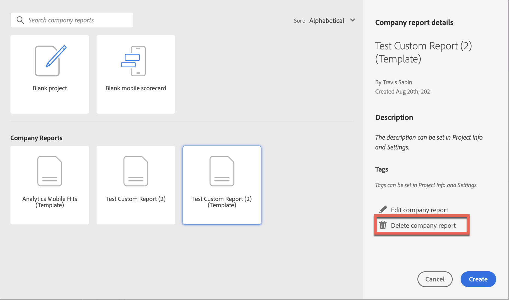

# Create and manage custom company reports

You can create custom reports and save them for others in your login company to use. Company reports are available to choose when creating a project, as described in [Create a project from a blank project or a report](/help/analyze/analysis-workspace/build-workspace-project/create-projects.md#create-a-project-from-a-blank-project-or-a-report) in the article, [Create projects in Analysis Workspace](/help/analyze/analysis-workspace/build-workspace-project/create-projects.md).

## Create a custom company report

To create a new Company report:

1. Build a project in Analysis Workspace to your desired state.
1. Select [!UICONTROL **Project**] > **[!UICONTROL Save as company report…]**.
   
   

1. Update the name of the report, add a description, and add any tags, then select [!UICONTROL **Save as company report**]. 

   The report is added to the Company Reports list in the Create Project modal and is available to users in your login company. 

   For more information about how users can create a project based on a company report, see "Create a project from a blank project or a report" in [Create projects](/help/analyze/analysis-workspace/build-workspace-project/create-projects.md).

## Manage company reports

Admins can filter the project list to display and manage company reports. Pinned items remain pinned followed by the list of company reports that are identified by the  report icon . In this view, you can delete, rename, tag, or approve one or more reports.

To display and manage company reports

1.  In the filter rail, select **OTHER FILTERS** and then select **Company reports**. 
    A list of the company reports are displayed. All regular projects, unless they're pinned, are not displayed.

    

    With company reports displayed, Admins can delete, rename, add a tag, or approve the report. 

1.  In the report list, select a single report or select multiple reports.

1.  Click the **...** elilpsis icon next to a report to view the available options (Delete, Rename, Tag, and Approve). 

    

1.  Select an option (Delete, Rename, Tag, and Approve).

1.  To return to the regular view when your done, in the filter rail, uncheck the Company reports option again.

### Delete a company report

Admins can delete a report using the Company report list option (described above) or delete a report from the Create project modal.

