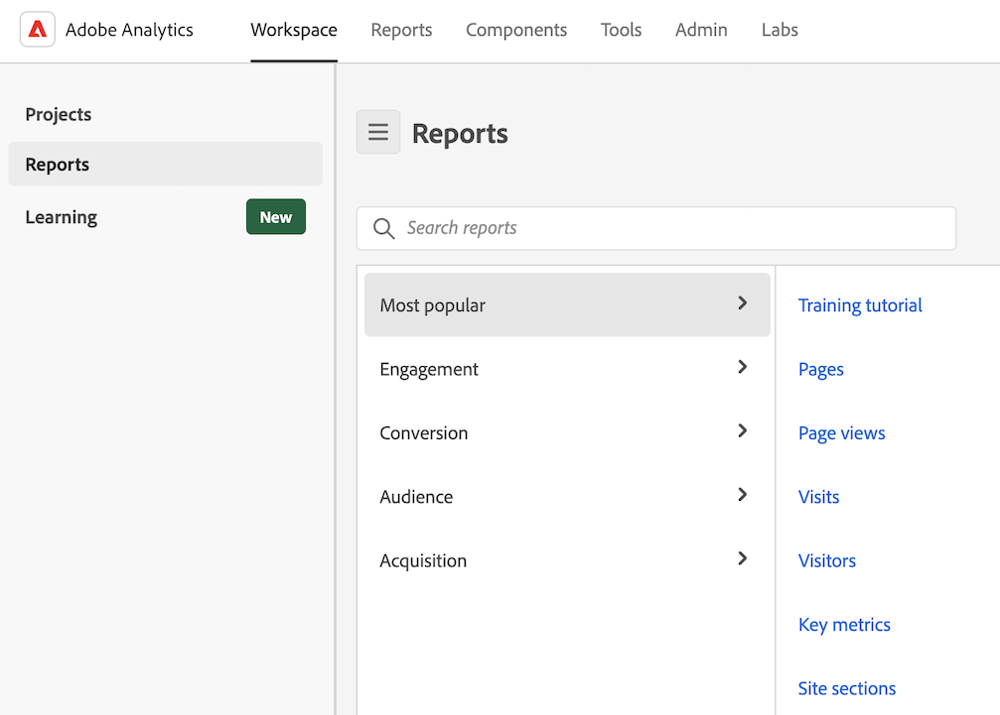

# Use pre-built reports

>[!NOTE]
>
>The pre-built reports that are available in the [!UICONTROL Reports] tab in Analysis Workspace were previously available in Reports & Analytics, which Adobe intends to discontinue on December 31, 2023. 
>
>Only the most commonly used reports that were formerly grouped in Reports & Analytics are available. A handful of rarely used or no-longer-relevant reports are no longer available in the [!UICONTROL Reports] tab in Analysis Workspace. For more details, see the [Reports that were not migrated from Reports & Analytics](#reports-that-were-not-migrated-from-reports--analytics) section below.

Pre-built reports in Analysis Workspace provide quick insights into the most common reporting scenarios. Some are some examples of questions that you can answer with prebuilt reports:

* How many people visit your site 
* How many of those visitors are unique visitors (counted only once) 
* How they came to the site (such as whether they followed a link or came there directly) 
* What keywords visitors used to search site content 
* How long visitors stayed on a given page or on the entire site 
* What links visitors clicked, and when they left the site 
* Which marketing channels are most effective at generating revenue or conversion events 
* How much time they spent watching a video 
* Which browsers and devices they used to visit your site

The following information describes how to access and use pre-built reports from the [!UICONTROL Reports] tab in Analysis Workspace.

## Access and run a report

1. In Analysis Workspace, select the [!UICONTROL **Workspace**] tab.

1. Select [!UICONTROL **Reports**].

   

1. In the search field, begin typing the name of the report you want to find, then select it from the list of reports. You can also search the report list by prop, eVar, and event number. <!-- still true? -->

   Or

   Select the category of report that you want to view, then select the report from the list of reports.

   >[!TIP]
   >
   >   To navigate the menu using the arrow keys, press the Forward Slash key (/), and then press the Down Arrow key. Press Enter to load the selected report.

For a list of reports that are available, see the [Available reports](#available-reports) section below.

## Save a report {#use-reports}

If you navigate away from a report after making changes, you are prompted to save or discard your changes. Saving changes to a report saves the report as a new project.

1. Go to the [!UICONTROL **Reports**] tab.
1. Select the report you want to view. For example, under [!UICONTROL **Most popular**], select the [!UICONTROL **Pages**] report.

   

1. The Pages report, as displayed in Analysis Workspace, shows two [visualizations](/help/analyze/analysis-workspace/visualizations/freeform-analysis-visualizations.md) ([Bar chart](/help/analyze/analysis-workspace/visualizations/bar.md) and [Summary number](/help/analyze/analysis-workspace/visualizations/summary-number-change.md)) and a [Freeform table](/help/analyze/analysis-workspace/visualizations/freeform-table/freeform-table.md). The metric used is Occurrences.
1. Do any of the following:

   * View the report.
   * Drag one or more segments into the Segment drop zone at the top. For example, drag the segment [!UICONTROL **Mobile Customers**] and view the results. 
   * Change the date range by going to the calendar at the top-right.
   * Add dimension breakdowns, drag in other metrics, and generally customize the report to suit your needs.

1. (Optional) Save the report as a project by selecting [!UICONTROL **Project**] > [!UICONTROL **Save**].

   The report is saved as a new project; it does not modify the existing report. For more information about saving a report as a project, see [Save projects](/help/analyze/analysis-workspace/build-workspace-project/save-projects.md).

## Available reports

The following reports are available:

   | Menu item | Reports under this menu item | 
   | --- | --- |
   | **[!UICONTROL Most Popular]** | <ul><li>Training Tutorial (Pre-existing Workspace template)</li><li>Pages (What are my top pages?)</li><li>Page views (How many page views am I generating?)</li><li>Visits (How many visits am I getting?)</li><li>Visitors (How many visitors am I getting?)</li><li>Key metrics (How are my most important metrics performing?)</li><li>Site sections (Which sections of my site generated the most page views?</li><li>Next page (What are the next pages my visitors go to?)</li><li>Previous page (What are the previous pages my visitors went to?)</li><li>Campaigns (What campaigns are driving my key metrics?)</li><li>Products (What products are driving my key metrics?)</li><li>Last touch channel (Which last touch channel is performing best?</li><li>Last touch channel detail (Which specific last touch channel is outperforming others?)</li><li>Revenue (How is my revenue performing?)</li><li>Orders (How are my orders performing?)</li><li>Units (How many units am I selling?)</li></ul> |
   | **[!UICONTROL Engagement]** | <ul><li>Key metrics (How are my most important metrics performing?)</li><li>Page views (How many page views am I generating?)</li><li>Pages (What are my top pages?)</li><li>Visits (How many visits am I getting?)</li><li>Visitors (How many visitors am I getting?)</li><li>Time spent per visit (How much time do my users spend per visit?)</li><li>Time prior to event (How much time do my users spend prior to a success event?)</li><li>Site sections (Which sections of my site generated the most page views?</li><li>Web content consumption (Which content is consumed most and is engaging users?)</li><li>Media content consumption (Which content is consumed most and is engaging users?)</li><li>Next and previous page flow (What are/were the next/previous paths my visitors take/took?)</li><li>Fallout (Where am I seeing fallout through my digital properties?)</li><li>Cross-device analysis (Using cross-device analysis in Analysis Workspace)</li><li>Web retention (Who are my loyal users and what do they do?)</li><li>Media audio consumption (What are trends and top metrics of audio consumption?)</li><li>Media recency, frequency, loyalty (Who are my loyal readers?)</li><li>Page analysis > Reloads (Which pages generate the most reloads?)</li><li>Page analysis > Time spent on page (How much time do my users spend on my pages?)</li><li>Entries & exits > Entry pages (What are my top entry pages?)</li><li>Entries & exits > Original entry pages (What page did my visitor originally enter from?)</li><li>Entries & exits > Single-page visits (Which pages generated the most single-page visits?)</li><li>Entries & exits > Exit pages (What are my top exit pages?)</li></ul> |
   | **[!UICONTROL Conversion]** | <ul><li>Products > Products (Which products are driving my key metrics?)</li><li>Products > Product performance (Which products are performing best?)</li><li>Products > Categories (What are my best performing product categories?</li><li>Shopping cart > Carts (How many users added a product to cart?</li><li>Shopping cart > Cart views (How many times did my visitors view their carts?)</li><li>Shopping cart > Cart additions (How often are users adding a product to their cart?)</li><li>Shopping cart > Cart removals (How often are users removing a product from their cart?)</li><li>Purchases > Revenue (How is my revenue performing?)</li><li>Purchases > Orders (How are my orders performing?)</li><li>Purchases > Units (How many units am I selling?)</li><li>[Magento: marketing and commerce](https://experienceleague.adobe.com/docs/analytics/analyze/analysis-workspace/build-workspace-project/starter-projects.html#commerce)</li></ul> |
   | **[!UICONTROL Audience]** |<ul><li>People metric (How many people are interacting with my brand?)</li><li>Visitor profile > Location overview (Which locations are driving the most usage among users)</li><li>Visitor profile > Geosegmentation > Geo Counties, Geo US States, Geo Regions, Geo Cities, Geo US DMA (Which geographies are my users visiting from?)</li><li>Visitor profile > Languages (Which language do my users prefer?)</li><li>Visitor profile > Time zones (Which time zones are my users visiting from?)</li><li>Visitor profile > Domains (Which ISPs are my visitors using to access my site?)</li><li>Visitor profile > Top level domains (Which domains are driving traffic to my site?)</li><li>Visitor profile > Technology > Technology overview (What technologies are people using to access my site?)</li><li>Visitor profile > Technology > Browsers, Browser type, Browser width, Browser height (Which company's browser, browser version, and its width and height, are people using to access my site?)</li><li>Visitor profile > Technology > Operating system, Operating system types (Which OS and which version of it do my visitors use?)</li><li>Visitor profile > Technology > Mobile carrier (Which mobile carriers do my visitors use to access my site?)</li><li>Visitor retention > Return frequency (How much time passes between my user's current visit and previous visits?)</li><li>Visitor retention > Return visits (How many of my visits are returning users?)</li><li>Visitor retention > Visit number (Which visit number bucket drives most of my key metrics)</li><li>Visitor retention > Sales cycle > Customer loyalty (Which loyalty segment do my users belong to?)</li><li>Visitor retention > Sales cycle > Days before first purchase (How many days passed between my users' first visit and their first purchase?)</li><li>Visitor retention > Sales cycle > Days since last purchase (How many days have passed between my users' current visit and their last purchase? )</li><li>Visitor retention > Mobile > Devices and Device types (Which devices and device types are my visitors using?)</li><li>Visitor retention > Mobile > Manufacturer (Which mobile device manufacturer do my visitors use?)</li><li>Visitor retention > Mobile > Screen size, Screen height, Screen width (Which mobile screen size/height/width do my visitors have?)</li><li>Visitor retention > Mobile > [Mobile app usage](https://experienceleague.adobe.com/docs/analytics/analyze/analysis-workspace/build-workspace-project/starter-projects.html#mobile)</li><li>Visitor retention > Mobile > [Mobile app journeys](https://experienceleague.adobe.com/docs/analytics/analyze/analysis-workspace/build-workspace-project/starter-projects.html#mobile)</li><li>Visitor retention > Mobile > [Mobile app metrics](https://experienceleague.adobe.com/docs/analytics/analyze/analysis-workspace/build-workspace-project/starter-projects.html#mobile)</li><li>Visitor retention > Mobile > [Mobile app messaging](https://experienceleague.adobe.com/docs/analytics/analyze/analysis-workspace/build-workspace-project/starter-projects.html#mobile)</li><li>Visitor retention > Mobile > [Mobile app performance](https://experienceleague.adobe.com/docs/analytics/analyze/analysis-workspace/build-workspace-project/starter-projects.html#mobile)</li><li>Visitor retention > Mobile > [Mobile app retention](https://experienceleague.adobe.com/docs/analytics/analyze/analysis-workspace/build-workspace-project/starter-projects.html#mobile)</li></ul> |
   | **[!UICONTROL Acquisition]** |<ul><li>Marketing channels > First touch channel, First touch channel detail (Which first touch channel, and which specific first touch channel is performing best?)</li><li>Marketing channels > First last channel, First last channel detail (Which last touch channel, and which specific last touch channel is performing best?)</li><li>Campaigns > Campaigns (Which campaigns are driving my key metrics?)</li><li>Campaigns > Campaign performance (What campaigns are driving the most revenue?)</li><li>Campaigns > Tracking code (Which campaign tracking codes perform the best?)</li><li>[Web acquisition](https://experienceleague.adobe.com/docs/analytics/analyze/analysis-workspace/build-workspace-project/starter-projects.html#web)</li><li>[Mobile acquisition](https://experienceleague.adobe.com/docs/analytics/analyze/analysis-workspace/build-workspace-project/starter-projects.html#mobile)</li><li>[Advertising Analytics: paid search](https://experienceleague.adobe.com/docs/analytics/analyze/analysis-workspace/build-workspace-project/starter-projects.html#advertising)</li><li>Search keywords - all, paid, natural (Which search keywords and paid/natural search keywords drive my key metrics the best?)</li><li>Search engines - all, paid, natural (Which search engines and paid/natural search engines drive my key metrics the best?)</li><li>All search page ranking (Which search page are my users visiting from?)</li><li>Referring domains (Which domains are driving traffic to my site?)</li><li>Original referring domains (What was the first domain users were on before visiting my site?)</li><li>Referrers (Which URLs were my users on before clicking through to my site?)</li><li>Referrer types (Which category do my referring URLs belong to?)</li></ul> |

<!-- Delete this table if the team agrees

Following is a list of templates that were previously available, 

| Report (template) name | Report location |
| --- | --- |
| Training Tutorial | Most Popular > Training tutorial |
| Web Content Consumption | Engagement > Web Content Consumption |
| Media Content Consumption | Engagement > Media Content Consumption |
| Cross-Device Analysis | Engagement > Cross-Device Analysis |
| Web Retention | Engagement > Web Retention |
| Media Audio Consumption | Engagement > Media Audio Consumption |
| Media Recency, Frequency, Loyalty | Engagement > Media Recency, Frequency, Loyalty |
| ITP Impact | Engagement > ITP Impact |
| Product Performance | Conversion > Products > Product Performance |
| Magento: Marketing & Commerce | Conversion > Magento: Marketing & Commerce |
| People Metric | Audience > People Metric |
| Location Overview | Audience > Visitor Profile > Location Overview |
| Technology Overview | Audience > Visitor Profile > Technology > Technology Overview |
| Mobile App Usage | Audience > Mobile > Mobile App Usage |
| Mobile App Journeys | Audience > Mobile > Mobile App Journeys |
| Mobile App Metrics | Audience > Mobile > Mobile App Messaging |
| Mobile App Performance | Audience > Mobile > Mobile App Performance |
| Mobile App Retention | Audience > Mobile > Mobile App Retention |
| Campaign Performance | Acquisition > Campaigns > Campaign Performance |
| Mobile Acquisition | Acquisition > Mobile Acquisition |
| Web Acquisition | Acquisition > Web Acquisition |
| Advertising Analytics: Paid Search | Acquisition > Advertising Analytics: Paid Search |

-->

## Navigation overview

<table id="table_3BA295966BBC4C94ABDC3718D1894698"> 
 <thead> 
  <tr> 
   <th colname="col1" class="entry"> Menu Item </th> 
   <th colname="col2" class="entry"> Description </th> 
  </tr>
 </thead>
 <tbody> 
  <tr> 
   <td colname="col1">Experience Cloud Solutions Menu  </td> 
   <td colname="col2"> Clicking this icon expands the Experience Cloud menu to allow you to access other Marketing Could solutions. </td> 
  </tr> 
  <tr> 
   <td colname="col1">Toggle Reports Menu  </td> 
   <td colname="col2"> Clicking this button expands or collapses the Reports menu so you can to view a report using the entire width of the browser window. </td> 
  </tr> 
  <tr> 
   <td colname="col1">Segments  </td> 
   <td colname="col2">Brings up the segment rail that lets you add or manage segments. You can also access the <a href="/help/components/segmentation/segmentation-workflow/seg-build.md"  > Segment Builder</a> and <a href="https://experienceleague.adobe.com/docs/analytics/components/segmentation/segmentation-workflow/seg-manage.html"  > Segment Manager</a> interfaces from the segment rail. </td> 
  </tr> 
  <tr> 
   <td colname="col1">Metrics  </td> 
   <td colname="col2"> Brings up the metrics rail that lets you add or manage metrics and calculated metrics. </td> 
  </tr> 
  <tr> 
   <td colname="col1"> View All Reports </td> 
   <td colname="col2">All of your report-suite-specific reports, dashboards, bookmarks, calculated metrics, and targets are contained in the  View All Reports sections. Click here at any time to navigate through everything that is available to you. </td> 
  </tr> 
  <tr> 
   <td colname="col1">Search Bar within  View All Reports </td> 
   <td colname="col2"> 
 Lets you search for the resource you need. It uses so-called "fuzzy" search, so you don't need to enter the exact wording you are looking for. The search results are displayed in a straight list that you can navigate using up, down, and side arrows. Pressing  Enter on a search result takes you directly to that report. 
 </td> 
  </tr> 
  <tr> 
   <td colname="col1"> My Favorites  </td> 
   <td colname="col2">You can easily retrieve the reports you marked as  Favorited from this area. On a per-user and per-report-suite basis, it shows ten Favorites and a  More... link if you have more than ten favorites. 
Note that you can rename reports but not dashboards in My Favorites. 
 
Favorites are similar to bookmarks, but they are not stored in a folder or managed through the <a href="/help/analyze/reports-analytics/bookmarks.md"  > Bookmark Manager</a> like bookmarks are. 
 </td> 
  </tr> 
  <tr> 
   <td colname="col1"> Frequently Viewed </td> 
   <td colname="col2"> Adobe Analytics keeps track of the ten reports you have run most often during the last 90 days and shows them here, sorted by how frequently you run them. If you have not been in this report suite for more than 90 days, it populates the list with a general list of ten popular reports. </td> 
  </tr> 
  <tr> 
   <td colname="col1"> Report History </td> 
   <td colname="col2"> Here, you find the most recent ten reports or dashboards that you have accessed in the last 90 days. You can easily find your way back to a previous step in your analysis or reporting. </td> 
  </tr> 
  <tr> 
   <td colname="col1"> Download </td> 
   <td colname="col2">Lets you download the report in PDF, CSV, Excel, and Word formats. </td> 
  </tr> 
  <tr> 
   <td colname="col1"> Send </td> 
   <td colname="col2">Lets you email the report immediately or schedule the email on a one-time or recurring basis. Format options include PDF, CSV, Excel, HTML, Word, or Mobile (text only).</td> 
  </tr> 
  <tr> 
   <td colname="col1"> Bookmark... </td> 
   <td colname="col2">Lets you <a href="/help/analyze/reports-analytics/bookmarks.md"  > bookmark</a> the report. </td> 
  </tr> 
  <tr> 
   <td colname="col1"> Dashboard... </td> 
   <td colname="col2">Lets you add the report to a <a href="/help/analyze/reports-analytics/dashboard.md"  > dashboard</a>. </td> 
  </tr> 
  <tr> 
   <td colname="col1"> More... </td> 
   <td colname="col2"> Lets you perform all or some of the following actions: print it, extract data from it, add an alert to it, create a custom report, copy a graph, link to this report, and open a new window. </td> 
  </tr> 
  <tr> 
   <td colname="col1">Report Suite Selector  </td> 
   <td colname="col2">Lets you select <a href="https://experienceleague.adobe.com/docs/analytics/admin/manage-report-suites/report-suites-admin.html"  > base report suites</a> or <a href="https://experienceleague.adobe.com/docs/analytics/components/virtual-report-suites/vrs-about.html"  > virtual report suites</a>. </td> 
  </tr> 
  <tr> 
   <td colname="col1">Calendar  </td> 
   <td colname="col2">Brings up the <a href="/help/analyze/reports-analytics/overview/report-overview.md#section_8C6C4AD84D9043E8ABD53FF8F645AAB1"  > calendar</a> so you can determine the reporting period. </td> 
  </tr> 
 </tbody> 
</table>

## Customizing the All Reports Menu {#section_7E47312747564FBE8A55EE5726B7DFF4}

Administrators can change the reports contained within the Reports menu. See [Menu Customizing](https://experienceleague.adobe.com/docs/analytics/admin/admin-tools/customize-menus.html) in Admin Help.

## Reports that were not migrated from Reports & Analytics

Only the most commonly used reports that were formerly grouped in Reports & Analytics are available in the [!UICONTROL Reports] tab in Analysis Workspace. The following reports were rarely used or no longer relevant, and so are no longer available. 
<ul><li>Any custom eVars/props/events/classifications<li>My Recommended Reports</li><li>Hourly/Daily/Weekly/Monthly/Quarterly/Yearly unique visitors</li><li>DailyWeekly/Monthly/Quarterly/Yearly unique customers</li><li>Action name depth</li><li>Action name summary</li><li>Add dashboard</li><li>Age</li><li>Audio support</li><li>Billing information</li><li>Clicks to page</li><li>Color depth</li><li>Cookie support</li><li>Cookies</li><li>Connection types</li><li>Creative elements</li><li>Credit card type</li><li>Cross sell</li><li>Custom event funnels</li><li>Custom links</li><li>Customer ID</li><li>Day of week</li><li>Entry action name</li><li>Exit action name</li><li>Exit links</li><li>Fallout</li><li>File downloads</li><li>Find in store</li><li>Full paths</li><li>Gender</li><li>Hit ype VISTA rule</li><li>Image support</li><li>Java</li><li>JavaScript</li><li>JavaScript version</li><li>Manage bookmarks</li><li>Manage dashboards</li><li>Monitor color depth</li><li>Monitor resolutions</li><li>Newsletter signups</li><li>Next action name</li><li>Next action name flow</li><li>Null searches</li><li>Operating system</li><li>Order review</li><li>Page of day</li><li>Pages not found</li><li>Pathfinder</li><li>Path length</li><li>Previous action name</li><li>Previous action name flow</li><li>Product activity</li><li>Product cost</li><li>Product department</li><li>Product inventory category</li><li>Product name</li><li>Product reviews</li><li>Product season</li><li>Product shares</li><li>Product zooms</li><li>Reload</li><li>Searches</li><li>Servers</li><li>Single page visits</li><li>Shipping information</li><li>Site hierarchy</li><li>Social mentions</li><li>Time of day</li><li>Time spent on action name</li><li>Video support</li><li>Visitor state</li></ul>
