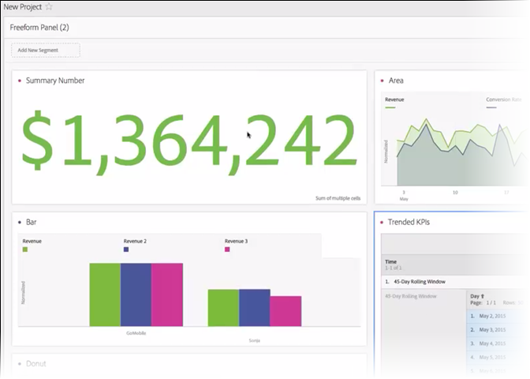

# Summary Number and Summary Change

**Summary Number** visualization:

* Selects the total of the column if no cell is selected. 
* If a single cell is selected, it shows the summary for that cell. 
* If more than one cell is selected, it shows the first cell selected. 
* If the column is selected, it picks the first cell value in the column.

** Summary Change** visualization:

* If no cell is selected, it compares the first two cell values in the column. 
* If one cell is selected, it shows 0, because it compares the cell value to itself. 
* If two cells are selected, the first selected cell is taken as numerator and the second as denominator. 
* If more than two cells are selected, it only considers the first two for comparison. 
* If a range of cells is selected, it compares the first to the last cells selected in the range. 
* If the column is selected, it compares the first value to itself, which shows a change of 0. 
* The green and red color of the summary change can be controlled through:

    * [Custom event polarity](https://marketing.adobe.com/resources/help/en_US/reference/success_event.html). 
    * A calculated metric's [Show Upward Trend As](https://marketing.adobe.com/resources/help/en_US/analytics/calcmetrics/cm_build_metrics.html) option.

## Summary Change settings {#section_2581AC0107634FB4990AB8347E5897AA}

Click the gear icon next to the visualization to configure the Summary settings: 

<table id="table_A8179879E15A4ECC91DCEA26927F03CF"> 
 <thead> 
  <tr> 
   <th colname="col1" class="entry"> Setting </th> 
   <th colname="col2" class="entry"> Definition </th> 
  </tr>
 </thead>
 <tbody> 
  <tr> 
   <td colname="col1"> Percentages </td> 
   <td colname="col2"> Use percentages instead of raw numbers. </td> 
  </tr> 
  <tr> 
   <td colname="col1"> Legend Visible </td> 
   <td colname="col2"> Shows the metrics used. </td> 
  </tr> 
  <tr> 
   <td colname="col1"> 
Summary Number Options: Abbreviate Value 
 </td> 
   <td colname="col2"> You can choose from 0 to 3 decimal places for abbreviated values. </td> 
  </tr> 
  <tr> 
   <td colname="col1"> 
Summary Change Options: Show Percent Change 
 </td> 
   <td colname="col2"> Shows the change, in percent, between the 2 numbers. </td> 
  </tr> 
  <tr> 
   <td colname="col1"> 
Summary Change Options: Show Raw Difference 
 </td> 
   <td colname="col2"> Shows the raw difference between the 2 numbers. </td> 
  </tr> 
 </tbody> 
</table>

