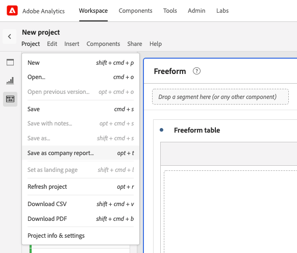

# Create and manage company templates

You can create custom reports and save them for others in your login company to use. Company templates are available to choose when creating a project, as described in [Create a project from a blank project or a report](/help/analyze/analysis-workspace/build-workspace-project/create-projects.md#create-a-project-from-a-blank-project-or-a-report) in the article, [Create projects in Analysis Workspace](/help/analyze/analysis-workspace/build-workspace-project/create-projects.md).

## Create a custom company template

To create a new company template:

1. Build a project in Analysis Workspace to your desired state.
1. Select [!UICONTROL **Project**] > **[!UICONTROL Save as company template...]**.
   
   

1. Update the name of the report, add a description, and add any tags, then select [!UICONTROL **Save as company template**]. 

   The template is added to the Company templates list in the Create Project modal and is available to users in your login company. 

   For more information about how users can create a project based on a company template, see "Create a project from a blank project or a report" in [Create projects](/help/analyze/analysis-workspace/build-workspace-project/create-projects.md).

## Manage company templates

Administrators can delete, rename, tag, and approve company templates.  

To display and manage company templates:

1. In Analysis Workspace, select the [!UICONTROL **Workspace**] tab, then select the **[!UICONTROL Projects tab]** in the left rail.

1. Select the filter icon to filter the list of projects.

1. In the filter rail, select **OTHER FILTERS** and then select **Company templates**. 
    
   A list of the company templates are displayed. All regular projects, unless they're pinned, are not displayed.

   Company templates can be identified by the  that precedes the template name. 

   

1. Click the **...** elilpsis icon next to a template to view the available options. 

   <!-- Update screenshot -->

   

1. Select **[!UICONTROL Delete]**, **[!UICONTROL Rename]**, **[!UICONTROL Tag]**, or **[!UICONTROL Approve]**).

1. (Optional) To return to the regular view, in the filter rail, deselect **[!UICONTROL Company templates]**.

### Delete a company template

Admins can delete a report using the Company templates list option (described above) or delete a report from the Create project modal.

