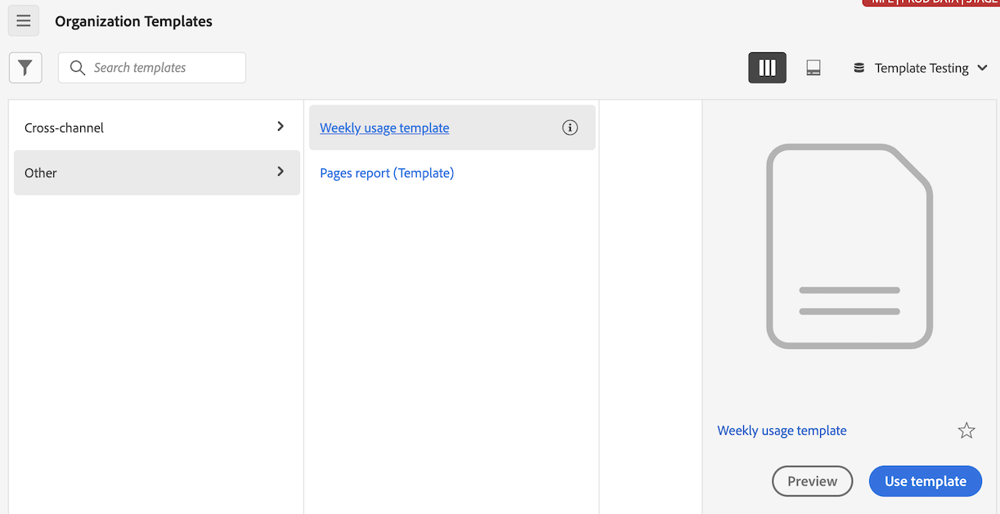
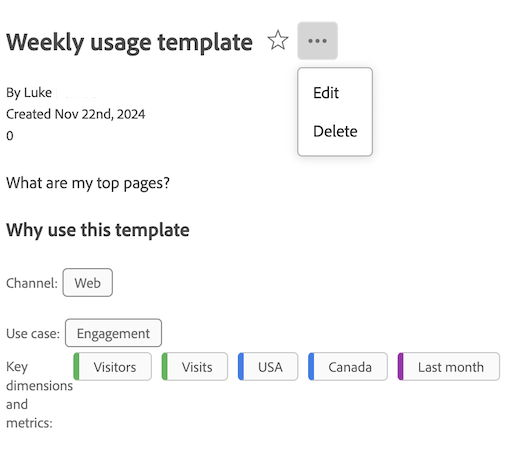
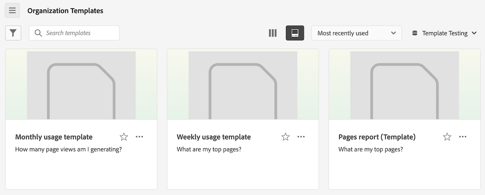
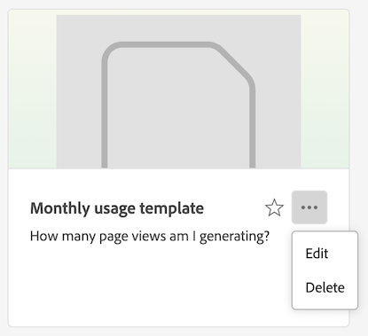
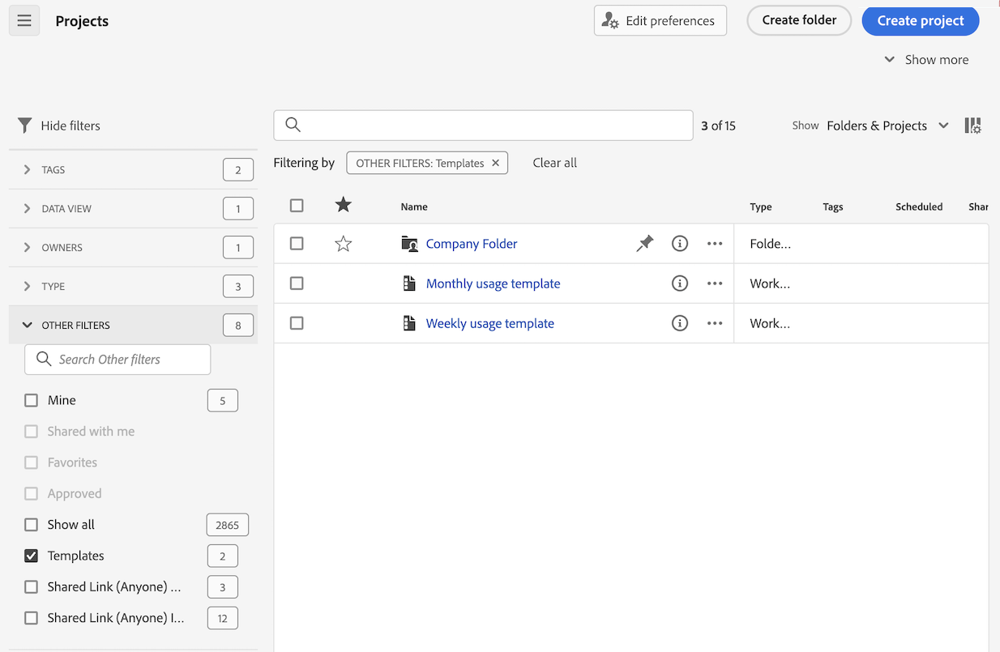
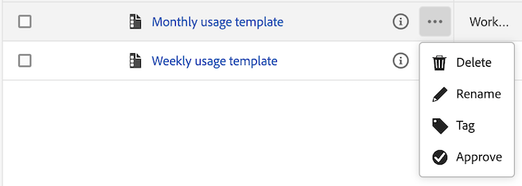

# Create and manage templates

Administrators can create templates and save them for others in their login company to use.

People in the login company can use these company templates as described in [Use templates](/help/analyze/analysis-workspace/templates/use-templates.md).

## Create a template

To create a new template that can be used by people in your login company:

1. In Analysis Workspace, build a project to your desired state.

1. Select [!UICONTROL **Project**] > **[!UICONTROL Save as template…]**.
   
   

1. Specify the following information in the [!UICONTROL Save as template] dialog box:
   
   | Field | Description |
   |---------|----------|
   | **[!UICONTROL Name]** | Provide a descriptive name for the template. |
   | **[!UICONTROL Description]** | Provide a short description for the template that describes its intended uses. |
   | **[!UICONTROL Why use this template]** | Provide a short explanation to inform people in the organization about how this template could be used. This explanation displays on the template's Preview page. |
   | **[!UICONTROL Use cases]** | Choose any use cases that apply to this template. You can select multiple use cases: **[!UICONTROL Engagement]**, **[!UICONTROL Conversion]**, **[!UICONTROL Audience]**, and **[!UICONTROL Acquisition]**. 
The selections you choose determine where the template is displayed and which filters apply for users accessing it from the Organization Templates page.
 |
   | **[!UICONTROL Tags]** | Specify any tags that you want to apply to the template. People can filter the list of templates by the tags you add. |

1. Select [!UICONTROL **Save as template**].

For information about how users can create a project based on a template, see [Create a project based on a template](/help/analyze/analysis-workspace/templates/use-templates.md#create-a-project-based-on-a-template) in [Use templates](/help/analyze/analysis-workspace/templates/use-templates.md).

## Edit or delete a template

Administrators can edit or delete company templates.

1. In Analysis Workspace, select the [!UICONTROL **Workspace**] tab, then select **[!UICONTROL _login_company_name_ templates]**.

1. If you are viewing templates in a column view :

   1. Go to the template that you want to edit or delete, select the info icon next to the template name.

      

   1. Select **[!UICONTROL Preview]**.

   1. Select the More icon, then select **[!UICONTROL Edit]** or **[!UICONTROL Delete]**.

      

1. If you are viewing templates in a card view :

   1. Locate the template that you want to edit or delete.

      

   1. Select the More icon, then select **[!UICONTROL Edit]** or **[!UICONTROL Delete]**.

      

1. If you are editing a template, make any desired edits, then select [!UICONTROL **Project**] > **[!UICONTROL Save as template…]**.
   
   

1. Specify the following information in the [!UICONTROL Save as template] dialog box:
   
   | Field | Description |
   |---------|----------|
   | **[!UICONTROL Name]** | Provide a descriptive name for the template. |
   | **[!UICONTROL Description]** | Provide a short description for the template that describes its intended uses. |
   | **[!UICONTROL Why use this template]** | Provide a short explanation to inform people in the organization about how this template could be used. This explanation displays on the template's Preview page. |
   | **[!UICONTROL Use cases]** | Choose any use cases that apply to this template. You can select multiple use cases: **[!UICONTROL Engagement]**, **[!UICONTROL Conversion]**, **[!UICONTROL Audience]**, and **[!UICONTROL Acquisition]**. 
The selections you choose determine where the template is displayed and which filters apply for users accessing it from the Organization Templates page.
 |
   | **[!UICONTROL Tags]** | Specify any tags that you want to apply to the template. People can filter the list of templates by the tags you add. |

1. Select [!UICONTROL **Save as template**].

## Rename, tag, or approve templates

Administrators can Rename, tag, and approve company templates.  

1. In Analysis Workspace, select the [!UICONTROL **Workspace**] tab, then select the **[!UICONTROL Projects tab]** in the left rail.

1. Select the filter icon to filter the list of projects.

1. In the filter rail, select **OTHER FILTERS** and then select **Company templates**. 
    
   A list of the company templates are displayed. All regular projects, unless they're pinned, are not displayed.

   Company templates can be identified by the  that precedes the template name. 

   

1. Click the **...** elilpsis icon next to a template to view the available options. 

   

1. Select **[!UICONTROL Rename]**, **[!UICONTROL Tag]**, or **[!UICONTROL Approve]**.

   You can also delete a template, or you can delete a template as described in [Edit or delete templates](#edit-or-delete-templates).

1. (Optional) To return to the regular view, in the filter rail, deselect **[!UICONTROL Company templates]**.

## Access a company template

Like with templates that are provided by Adobe, users in the organization can access templates that administrators create. 

For information about how to access a company template, see [Access and run a template](/help/analyze/analysis-workspace/templates/use-templates.md#access-and-run-a-template) in [Use templates](/help/analyze/analysis-workspace/templates/use-templates.md).

## Hide the Templates tab {#hide-reports}

Administrators can hide the Templates tab for all users within their organization.

1. Go to **[!UICONTROL Analytics]** > **[!UICONTROL Components]** > **[!UICONTROL Preferences]** > **[!UICONTROL Company]**.
1. Select the option to **[!UICONTROL Hide Templates Tab]**.
