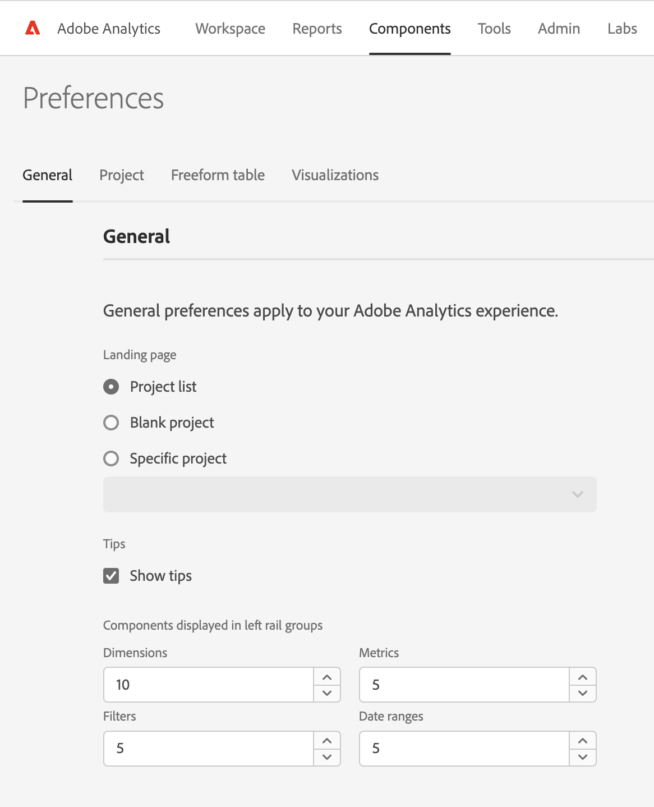
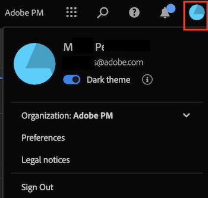

# Preferences

You can manage settings for Analysis Workspace and its related components for all new projects or panels that you create. Existing projects and panels are not affected.

View this video for a brief overview of preferences:

>[!VIDEO](https://video.tv.adobe.com/v/332600/?quality=12)

## Update preferences

1. In Adobe Analytics, go to the [!UICONTROL **Project**] landing page, then select [!UICONTROL **Preferences**].

    

1. For information about the available preferences on each tab, continue with any of the following sections in this article:

   * [General preferences](#general-preferences)

   * [Project preferences](#project-preferences)

   * [Freeform table preferences](#freeform-table-preferences)

   * [Visualizations preferences](#visualizations-preferences)

## General preferences

You can customize general preferences for all new projects that you create in Analysis Workspace. For information about how to access these preferences, see [Update preferences](#update-preferences).

| Preference | Options |
| --- | --- |
| Landing page | Choose what page displays as the default page when you access Adobe Analytics: <ul><li>Project list (default)</li><li>Blank project</li><li>Specific project selected from a list</li></ul> |
| Show tips | Displays tips in a blue box in the lower-right area of Analysis Workspace. 
This option is enabled by default.
 |
| Components displayed in left rail groups | Choose how many of each component to display in the Components menu in the left rail. 
If you choose 0, the component is no longer accessible from the left rail of your workspaces.

By default, 5 components display for each of the following:
 <ul><li>Dimensions</li><li>Metrics</li><li>Filters</li><li>Date ranges</li></ul> 
For more information about Components in Analysis Workspace, see [Components overview](/help/analyze/analysis-workspace/components/analysis-workspace-components.md).
 |

## Project preferences

You can customize project preferences for all new projects that you create in Analysis Workspace. For information about how to access these preferences, see [Update preferences](#update-preferences). 

Some of these same preferences can also be customized for individual projects, as described in [Project overview](/help/analyze/analysis-workspace/build-workspace-project/freeform-overview.md). 

Click the linked preference titles for more information and context about each preference. 

| Section | Preference | Options |
| --- | --- | --- |
| **Display** | | |
|  | [View density](https://experienceleague.adobe.com/docs/analytics/analyze/analysis-workspace/build-workspace-project/view-density.html) | Choose how much content to display on the screen by reducing the vertical padding of the left rail, freeform tables, and cohort tables. <ul><li>Compact</li><li>Comfortable</li><li>Expanded (default)</li></ul> |
| | [Color palette](https://experienceleague.adobe.com/docs/analytics/analyze/analysis-workspace/build-workspace-project/color-palettes.html) | Choose the visualization color palette used in Analysis Workspace. <ul><li>Adobe-provided palettes (default)</li><li>Conditional formatting palette </li><li>Up/down palette (diverging)<li>Custom-defined palettes</li></ul> |
| **Data** | | |
|  | [Report suite](https://experienceleague.adobe.com/docs/analytics/analyze/analysis-workspace/panels/panels.html?#report-suite) | Choose from where tables and visualizations derive their data. <ul><li>Most recent (default)</li><li>Specific report suite selected from a list</li></ul> |
|  | [Calendar](https://experienceleague.adobe.com/docs/analytics/analyze/analysis-workspace/panels/panels.html?#calendar) | Select from a list of: <ul><li>Adobe-provided ranges (default is This Month)</li><li>Custom-defined ranges</li></ul> |
|  | [Panel Type](https://experienceleague.adobe.com/docs/analytics/analyze/analysis-workspace/panels/panels.html) | <ul><li>Freeform (default)</li><li>Blank</li><li>Quick Insights</li></ul> |
|  | Count repeat instances | Specifies whether repeat instances are counted in reports. For example, this setting (when activated) treats multiple consecutive page views to the same page as multiple page views. With it off, they count as a single page view. 
**Note:** This setting affects only certain metrics (such as Single Page Visits) and it does not apply to Flow or Fallout visualizations.
 |
|  | Number format | <ul><li>1,000.00 (default)</li><li>1.000,00</li><li>1 000,00</li></ul> |
|  | CSV separator character | <ul><li>Comma (default)</li><li>Semicolon</li><li>Colon</li><li>Pipe</li><li>Period</li><li>Space</li><li>Tab</li></ul> |
|  | Show annotations | Choose whether annotations are visible in your projects. For more information about annotations, see [Annotations overview](/help/analyze/analysis-workspace/components/annotations/overview.md). |

## Freeform table preferences

You can customize freeform table preferences for all new projects that you create in Analysis Workspace. For information about how to access these preferences, see [Update preferences](#update-preferences). 

Some of these same preferences can also be customized for individual tables.

Click the linked section titles for more information and context about the available preferences.

| Section | Preference | Options |
| --- | --- | --- |
| **Table** | | |
| | Table type | <ul><li>Freeform</li><li>Table builder</li></ul> |
| | Default table metric | <ul><li>Occurrences</li><li>Unique Visitors</li><li>Visits</li></ul> |
| | Default table dimension | Choose from Minute, Hour, Day, Week, Month, Quarter, or Year. |
| | Align dates | Select this option to align dates from each column to all start on the same row. |
| **[Column](/help/analyze/analysis-workspace/visualizations/freeform-table/column-row-settings/column-settings.md)** | | |
| | Wrap header text | Lets you wrap the header text in Freeform tables to make headers more readable and tables more shareable. This is useful for .pdf rendering and for metrics with long names. Enabled by default. |
| | Show totals | This total is typically equal to or a subset of the [!UICONTROL Grand Total]. It reflects any table filters applied within the freeform table, including the [!UICONTROL Include None] option. |
| | Show grand totals | This total represents all hits that have been collected, sometimes referred to as 'report suite total'. When a segment is applied either at the panel level or within the freeform table, this total adjusts to reflect all hits that match the segment criteria. Grand total is not supported for tables or breakdowns with [static rows](/help/analyze/analysis-workspace/visualizations/freeform-table/workspace-totals.md). |
| | Show sparkline  | Show or hide line charts at the bottom of the chart. When hidden, the legend changes to no longer visually reference the lines. |
| | Number | Determines if a cell shows/hides the numeric value for the metric. For example, if the metric is Page Views, the numeric value is the number of page views for the row item. |
| | Percent | Determines if a cell shows/hides the percent value for the metric. For example, if the metric is Page Views, the percent value is the number of page views for the row item divided by the total page views for the column.  Note:  We can show percentages greater than 100%, to be more accurate. We are also moving the upper bound cap to 1,000% to ensure columns can grow in widths too large. |
| | Show anomalies <!-- This setting was moved from the "Project" tab. this is already in the tool/docs under "Freeform table, But the doc doesn't give a definition. --> | Determines if anomaly detection is run on the values in this column. |
| | Interpret zero as no value | For cells with a 0 value, determines whether to show a 0 or a blank cell. This is useful when you look at data for each day of a month, and some days haven't happened yet.  Instead of showing 0's for future dates, blank cells can be shown instead. Charts respect this setting as well (i.e., they do not showing a line or bar with 0 values when this setting is checked). |
| | Background | Determines if a cell shows/hides all cell formatting, including the bar graph and conditional formatting <ul><li>Bar graph</li> Shows a horizontal bar graph representing the cell's value relative to the total for the column. <li>Conditional formatting</li>For more information about conditional formatting, see "Conditional formatting" in [Column Settings](/help/analyze/analysis-workspace/visualizations/freeform-table/column-row-settings/column-settings.md)</ul> |
| | Cell preview | Shows a preview of how each cell appears with the currently selected formatting options applied. |
| **[Row](/help/analyze/analysis-workspace/visualizations/freeform-table/column-row-settings/table-settings.md)** | | |
| | Breakdown by position | Select this option if you want the breakdown to remain with the position of the item rather than with the item itself. For more information about breakdowns, see [Break down dimensions](/help/analyze/analysis-workspace/components/dimensions/t-breakdown-fa.md). |
| | Percentage calculation | <ul><li>Column</li><li>Row</li></ul> |

## Visualizations preferences

You can update visualization preferences for all new prjects that you create in Analysis Workspace. For information about how to access these preferences, see [Update preferences](#update-preferences). 

Some of these same preferences can also be customized for individual visualizations. 

Click the linked section titles for more information and context about the available preferences. 

| Section | Preference | Options |
| --- | --- | --- |
| **General Defaults** | | |
| | Percentages | Displays values in percentages for all visualizations. |
| | Legend visible | Lets you hide the detailed legend text for all visualizations.  |
| | Limit max items | Reduces the number of items on the X-axis for all visualizations. This can be useful if you have a large data set.  |
| | Display dual axis (when applicable) | Only applies if you have two metrics - you can have a y-axis on the left (for one metric) and on the right (for the other metric). This is helpful when plotted metrics are of very different magnitudes.  |
| | Normalization (when applicable) | Forces metrics to equal proportions. This is helpful when plotted metrics are of very different magnitudes.  |
| | Anchor Y-axis at zero | If all the values plotted on the chart are considerably above zero, the chart default will make the bottom of the y-axis NON-ZERO. If you check this box, the y-axis will be forced to zero (and it will re-draw the chart).  |
| | Allow anomalies to scale Y-axis | If you have multiple metrics in a chart, you have to hover over each anomaly to see the confidence band for that metric. To make the visualization more legible, the Anomaly Detection confidence interval does not automatically scale the y-axis. This option allows the confidence interval to scale the visualization. 
For more information, see [View anomalies in Analysis Workspace](/help/analyze/analysis-workspace/virtual-analyst/c-anomaly-detection/view-anomalies.md).
  |
| **[Line](/help/analyze/analysis-workspace/visualizations/line.md)** | | |
| | Percentages  | Displays values in percentages for the Line visualizations. |
| | Legend visible | Lets you hide the detailed legend text for the Line visualization. |
| | Limit max items | Reduces the number of items on the X-axis in the Line visualization. This can be useful if you have a large data set. |
| | Display dual axis (when applicable) | Only applies if you have two metrics - you can have a y-axis on the left (for one metric) and on the right (for the other metric). This is helpful when plotted metrics are of very different magnitudes. |
| | Normalization (when applicable) | Forces metrics to equal proportions. This is helpful when plotted metrics are of very different magnitudes. |
| | Show x-axis | Displays the x-axis on the Line chart. |
| | Show y-axis | Displays the y-axis on the Line chart.  |
| | Anchor Y-axis | If all the values plotted on the chart are considerably above zero, the chart default will make the bottom of the y-axis NON-ZERO. If you check this box, the y-axis will be forced to zero (and it will re-draw the chart). |
| | Show min | Overlay a minimum value label to quickly highlight the valleys in a metric. Note: The min values are derived from the visible data points in the visualization, not the full set of values within a dimension. |
| | Show max | overlay a maximum value label to quickly highlight the peaks in a metric. Note: The max values are derived from the visible data points in the visualization, not the full set of values within a dimension. |
| | Show trendline | Show a regression or moving average trendline to your line series. Trendlines help to depict a clearer pattern in the data. |
| **[Cohort](/help/analyze/analysis-workspace/visualizations/cohort-table/t-cohort.md)** | | |
| | Granularity | For trended visualizations, you can change the time granularity (Day, Week, Month, Quarter, or Year). This change also applies to the data source table. |
| | Only show percent | Removes the number value and only shows the percentage. |
| | Round percent to nearest whole | Rounds the percent value to the nearest whole instead of showing the decimal value. |
| | Show average percent row | Inserts a new row at the top of the table and then adds the average for the values within each column.  |
| | Cohort Preview | A preview of how the color palette appears in the cohort visualization. |
| | Cohort Palette | The color palette used in the cohort visualization. |
| **[Combo charts](/help/analyze/analysis-workspace/visualizations/combo-charts.md)** | | |
| | Show X-axis | Displays the x-axis on the Combo chart. |
| | Show Y-axis | Displays the y-axis on the Combo chart. |
| | Display barbells on lines | Show barbells on lines in Combo charts. |
| **[Key Metric Summary](/help/analyze/analysis-workspace/visualizations/key-metric.md)** | | |
| | Summary display type | <ul><li>Emphasize percent change</li><li>Emphasize number value</li></ul> |
| | Show sparklines | how or hide line charts at the bottom of the chart. When hidden, the legend changes to no longer visually reference the lines. |
| | Show max and min on sparklines | Show minimum and maximum values on primary and comparison line charts. |
| | Show comparison | Show comparison data. When hidden, both the comparison line chart and summary change objects will be hidden from view. |
| | Number value options | In the [!UICONTROL **Key Metric Summary**] section <ul><li>Show percent change</li><li>Show raw difference</li>Raw difference between the total value of the metric in the primary date range and the secondary date range</ul> |
| **[Fallout](/help/analyze/analysis-workspace/visualizations/fallout/configuring-fallout.md)** | | |
| | Container | Lets you switch between Visit and Visitor to analyze visitor pathing. The default is Visitor. These settings help you understand visitor engagement at the visitor level (across visits), or constrain the analysis to a single visit. 
The following options are available:
 <ul><li>Visit</li><li>Visitor</li></ul> |
| **[Flow](/help/analyze/analysis-workspace/visualizations/c-flow/create-flow.md)** | | |
| | Container | In the [!UICONTROL **Flow**] section <ul><li>Visit</li><li>Visitor</li></ul> |
| | Wrap labels | Normally, the labels on the Flow elements are truncated to save screen real estate, but you can make the entire label visible by checking this box. Default = unchecked. |
| | Include repeat instances | Flow visualizations are based on instances of a dimension. This setting gives you the option to include or exclude repeated instances, e.g. Page reloads. However, repeats cannot be removed from Flow visualizations that include multi-valued dimensions, such as listVars, listProps, s.product, merchandising eVars, etc. Default = unchecked. |
| | Show tooltips | Determines whether tooltips containing node data are shown when hovering over individual nodes within a flow visualization. |
| | Number of columns | Determines how many columns you want in your Flow diagram. |
| | Items expanded per column | How many items you want in each column. |
| **Stacked Charts** | | |
| | 100% stacked | This setting on area stacked, bar stacked or horizontal bar stacked visualizations turns the chart into a "100% stacked" visualization. 
For more infomration, see [Bar and bar stacked](/help/analyze/analysis-workspace/visualizations/bar.md).
 |
| **[Histogram](/help/analyze/analysis-workspace/visualizations/histogram.md)** | | |
| | Number of buckets | Choose the number of data ranges (buckets) in the visualization. The maximum number of buckets is 50. 
For more information, see [Histogram](/help/analyze/analysis-workspace/visualizations/histogram.md).
 |
| | Counting method | Choose from the following options: <ul><li>Hit</li><li>Visit</li><li>Visitor</li></ul> 
For example, when used in conjunction with page views, you could choose page views per visitor, page views for visit, or page views per hit. For Hit, "Occurrences" is used as the y-axis metric in a freeform table.
 |
| **[Map](/help/analyze/analysis-workspace/visualizations/map-visualization.md)** | | |
| | Plotting dimension | <ul><li>Mobile latitude/longitude</li><li>Geographic dimension</li></ul> |
| | Map type | <ul><li>Bubbles</li><li>Heat map</li></ul> |
| | Color theme | Choose from Coral, Reds, Greens, Blues, Heatmap, and Positive/Negative. |
| | Map style | Choose from Basic, Streets, Bright, Light, Dark, and Satellite. |
| **[Summary Change](/help/analyze/analysis-workspace/visualizations/summary-number-change.md)** | | |
| | Value | <!-- Seem to be basically the same options as in "Number value options" --> <ul><li>Percent change</li><li>Raw difference</li></ul>  |
| | Percentages | Displays values in percentages for the Summary Change visualizations. |
| | Legend visible | Lets you hide the detailed legend text for the Summary Change visualization. |
| **[Summary Number](/help/analyze/analysis-workspace/visualizations/summary-number-change.md)** | | |
| | Percentages | Displays values in percentages for the Summary Number visualizations. |
| | Legend visible | Lets you hide the detailed legend text for the Summary Number visualization. |
| | Summary value by | Choose from Max, Min, Mean, Median, and Sum. |
| | Abbreviate value | In the [!UICONTROL **Summary Number**] section |
| **[Treemap](/help/analyze/analysis-workspace/visualizations/treemap.md)** | | |
| | Percentages | Displays values in percentages for the Treemap visualizations. |
| | Limit max items | Reduces the number of items on the X-axis in the Treemap visualization. This can be useful if you have a large data set. |
| **[Venn](/help/analyze/analysis-workspace/visualizations/venn.md)** | | |
| | Legend visible | Lets you hide the detailed legend text for the Venn visualization. |
| **[Scatter](/help/analyze/analysis-workspace/visualizations/scatterplot.md)** | | |
| | Percentages | Displays values in percentages for the Scatter visualizations. |
| | Legend visible | Lets you hide the detailed legend text for the Scatter visualization. |
| | Limit max items | Reduces the number of items on the X-axis in the Scatter visualization. This can be useful if you have a large data set. |
| | Anchor y-axis at zero | If all the values plotted on the chart are considerably above zero, the chart default will make the bottom of the y-axis NON-ZERO. If you check this box, the y-axis will be forced to zero (and it will re-draw the chart). |

## Restore default preferences

You can restore all your user preferences to the system defaults. This does not affect administrator preferences under the Company tab.

This action cannot be undone.

1. In Adobe Analytics, select [!UICONTROL **Components**] **>** [!UICONTROL **Preferences**].

   

1. In the upper-right, select **[!UICONTROL Restore defaults]**.

1. When prompted, select **[!UICONTROL Restore defaults]**.

## [!UICONTROL Dark theme]

If you prefer to have a dark background for your Adobe Analytics user interface, you can toggle to [!UICONTROL Dark theme].

1. Click the Experience Cloud user icon at the top right.

   

1. Move the **[!UICONTROL Dark theme]** toggle to the right.

