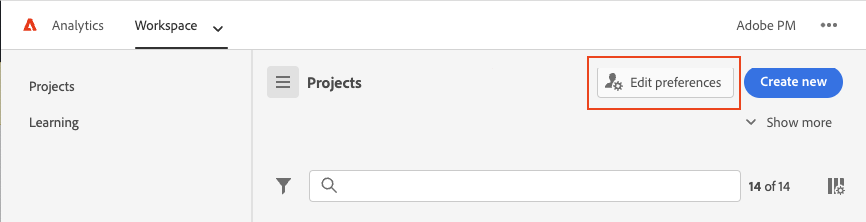

# User preferences

The [!UICONTROL Components] > [!UICONTROL User preferences] page lets you manage settings for Analysis Workspace and its related components at the user-level. User preferences apply to all *new* projects or panels.

Here is a short video on user preferences:

>[!VIDEO](https://video.tv.adobe.com/v/332600/?quality=12)

## General preferences

General preferences apply to your Adobe Analytics experience in the browser.

| Preference | Options |
| --- | --- |
| Landing page | <ul><li>Project list (default)</li><li>Blank project</li><li>Specific project selected from a list</li></ul> |
| Tips | <ul><li>Enabled (default)</li><li>Disabled</li></ul> |

## Project preferences

Project preferences apply to new projects and new panels created in Analysis Workspace. Certain preferences can also be managed on a per-project basis under [!UICONTROL Workspace] > [!UICONTROL Project] > [!UICONTROL Project info & settings].

| Section | Preference | Options |
| --- | --- | --- |
| **Display** | | |
|  | [View density](https://experienceleague.adobe.com/docs/analytics/analyze/analysis-workspace/build-workspace-project/view-density.html) | <ul><li>Compact</li><li>Comfortable</li><li>Expanded (default)</li></ul> |
| | [Color palette](https://experienceleague.adobe.com/docs/analytics/analyze/analysis-workspace/build-workspace-project/color-palettes.html) | <ul><li>Adobe-provided palettes (default)</li><li>Custom-defined palettes</li></ul> |
| **Data** | | |
|  | [Report suites](https://experienceleague.adobe.com/docs/analytics/analyze/analysis-workspace/panels/panels.html?#report-suite) | <ul><li>Most recent (default)</li><li>Specific report suite selected from a list</li></ul> |
|  | [Calendar](https://experienceleague.adobe.com/docs/analytics/analyze/analysis-workspace/panels/panels.html?#calendar) | Select from a list of: <ul><li>Adobe-provided ranges (default is This Month)</li><li>Custom-defined ranges</li></ul> |
|  | [Panel Type](https://experienceleague.adobe.com/docs/analytics/analyze/analysis-workspace/panels/panels.html) | <ul><li>Freeform (default)</li><li>Blank</li><li>Quick Insights</li></ul> |
|  | Number format | <ul><li>1,000.00 (default)</li><li>1.000,00</li><li>1 000,00</li></ul> |
|  | CSV separator character | <ul><li>Comma (default)</li><li>Semicolon</li><li>Colon</li><li>Pipe</li><li>Period</li><li>Space</li><li>Tab</li></ul> |
|  | Freeform table | <ul><li>Show anomalies </li><li>Show sparklines</li><li>Show annotations</li></ul> |

## [!UICONTROL Dark theme]

If you prefer to have a dark background for your Adobe Analytics user interface, you can toggle to [!UICONTROL Dark theme].

1. Click the Experience Cloud user icon at the top right.

   

1. Move the **[!UICONTROL Dark theme]** toggle to the right.
