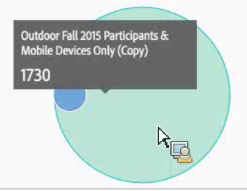
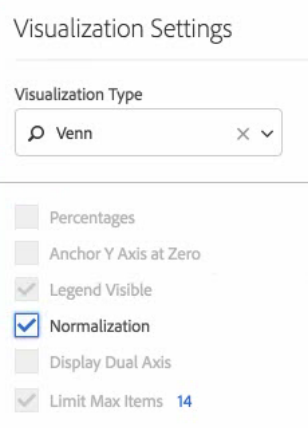

# Venn

The Venn visualization lets you drag in up to 3 segments (from Components) and one metric to build a Venn diagram.

 

You can then hover over the segments to gain more insight into percentages, etc.

To turn the Venn diagram into a Freeform table, click the colored dot next to the **[!UICONTROL Venn]** header and select **[!UICONTROL Manage Data Sources]** > **[!UICONTROL Available Data Sources]** > **[!UICONTROL Freeform Table]**.

To normalize the Venn diagram (take the size out of it), go to its Visualization Settings icon and select **[!UICONTROL Normalization]**.

