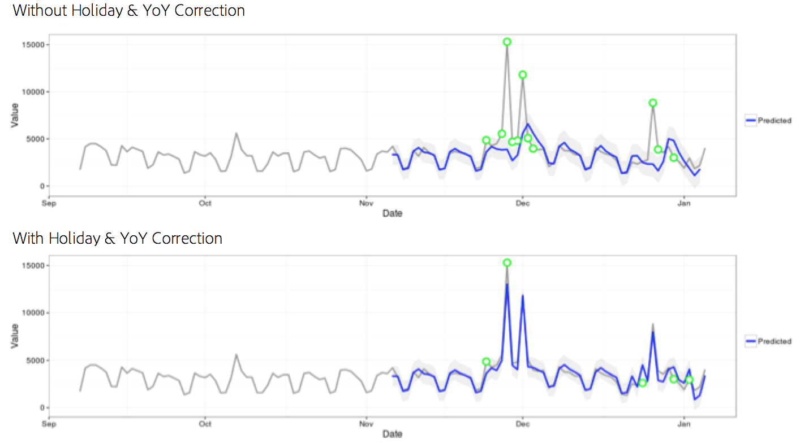

# Statistical techniques used in anomaly detection

Anomaly detection in Analysis Workspace uses a series of advanced statistical techniques to determine whether an observation should be considered anomalous or not.

Depending on the date granularity used in the report, 3 different statistical techniques are used - specifically for hourly, daily, weekly/monthly anomaly detection. Each statistical technique is outlined below.

## Anomaly detection for daily granularity {#section_758ACA3C0A6B4D399563ECABFB8316FA}

For daily granularity reports, the algorithm considers several important factors to deliver the most accurate results possible. First, the algorithm determines which type of model to apply based on available data of which we select between one of two classes - a time-series-based model or an outlier-detection model (called functional filtering).

The time series model selection is based on the following combinations for type of error, trend, and seasonality (ETS) as described by [Hyndman et al. (2008)](https://www.springer.com/us/book/9783540719168). Specifically, the algorithm tries the following combinations:

1. ANA (additive error, no trend, additive seasonality) 
1. AAA (additive error, additive trend, additive seasonality) 
1. MNM (multiplicative error, no trend, multiplicative seasonality) 
1. MNA (multiplicative error, no trend, additive seasonality) 
1. AAN (additive error, additive trend, no seasonality)

The algorithm tests the suitability of each of these by selecting the one with the best mean absolute percentage error (MAPE). If the MAPE of the best time series model is greater than 15% however, functional filtering is applied. Typically, data with a high degree of repetition (e.g. week over week or month over month) is the best fit with a time series model.

After model selection, the algorithm then adjusts the results based on holidays, and year-over-year seasonality. For holidays, the algorithm checks to see if any of the following holidays are present in the reporting date range:

* Memorial Day 
* July 4 
* Thanksgiving 
* Black Friday 
* Cyber Monday 
* December 24-26 
* January 1 
* December 31

These holidays were selected based on extensive statistical analysis across many customer data points to identify holidays that mattered the most to the highest number of customers' trends. While the list is certainly not exhaustive for all customers or business cycles, we found that applying these holidays significantly improved the performance of the algorithm overall for nearly all customers' datasets.

Once the model has been selected and holidays have been identified in the reporting date range, the algorithm proceeds in the following manner:

1. Construct the anomaly reference period - this includes up to 35 days prior to the reporting date range, and a matching date range 1 year prior (accounting for leap days when required and inclusive of any applicable holidays that may have occurred on a differing calendar day the previous year).
1. Test whether holidays in the current period (excluding the prior year) are anomalous based on most recent data.
1. If the holiday in the current date range is anomalous, adjust the expected value and confidence interval of the current holiday given the previous year's holiday (considering 2 days before and after). The correction for the current holiday is based on the lowest mean absolute percentage error of:

    1. Additive effects 
    1. Multiplicative effects 
    1. YoY difference

Notice the dramatic improvement of performance on Christmas Day and New Year's Day in the following example:

## Anomaly detection for hourly granularity {#section_014C9E9209AF43F8A03D5D46E3B3AEE7}

Hourly data relies on the same time series algorithm approach that the daily granularity algorithm does. However, it relies heavily on two trend patterns: the 24-hour cycle as well as the weekend/weekday cycle. To capture these two seasonal effects, the hourly algorithm constructs two separate models for a weekend and a weekday using the same approach outlined above.

The training windows for hourly trends relies on a 336-hour lookback window.

## Anomaly detection for weekly and monthly granularities {#section_5D421576BFBC4B24A58DFCC0A6407545}

Weekly and monthly trends do not exhibit the same weekly or daily trends found at daily or hourly granularities, so as such a separate algorithm is used. For weekly and monthly, a two-step outlier detection approach is used known as the Generalized Extreme Studentized Deviate (GESD) test. This test considers the maximum number of expected anomalies combined with the adjusted box-plot approach (a non-parametric method for outlier discovery) to determine the maximum number of outliers. The two steps are:

1. Adjusted box-plot function: This function determines the maximum number of anomalies given the input data.
1. GESD function: Applied to the input data with the output from step 1.

The holiday and YoY seasonality anomaly detection step then subtracts last year's data from this year's data and then iterates on the data again using the two-step process above to verify that anomalies are seasonally appropriate. Each of these date granularities uses a 15-period lookback inclusive of the selected reporting date range (either 15 months or 15 weeks) and a corresponding date range 1 year ago for training.
