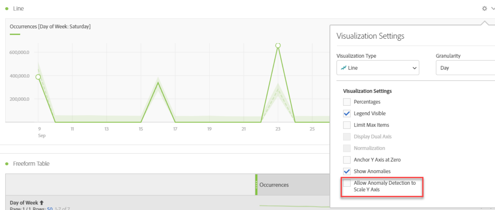

# View anomalies in Analysis Workspace

You can view anomalies in a table or in a line chart.

## View anomalies in a table {#section_869A87B92B574A38B017A980ED8A29C5}

In a time-series Freeform Table, each row now automatically gets flagged with a dark grey exclamation mark if a data anomaly has been detected.

The vertical grey line in each row indicates the expected value. When you hover over the exclamation mark, the extent to which the anomaly diverges from the expected value is indicated (in + or - %).

## View anomalies in a line chart {#section_7C1192AFDB4345A8A2CCFB3AE0C47D82}

The line chart shows the light green confidence band with the anomalous values (white dots).

If you click a white dot, it will turn green and it will show you:

* The date when the anomaly occurred 
* The raw value of the anomaly 
* The percentage value above or below the expected value, which is represented by the solid green line.
* The Analyze link to start [Contribution Analysis](/help/analyze/analysis-workspace/virtual-analyst/contribution-analysis/ca-tokens.md).

If you have multiple metrics in the line chart, we show only the anomalies and you have to hover over each anomaly to see the confidence band for that metric.

The Anomaly Detection confidence interval does not automatically scale the y-axis of a visualization to potentially make the chart more legible.

You have the option to allow the confidence interval to scale the chart. Just click the Settings (gear) icon and check **[!UICONTROL Allow Anomaly Detection to Scale Y Axis]**.

