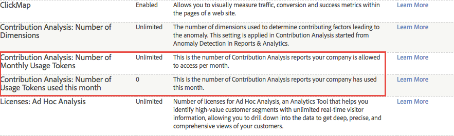

# Contribution Analysis overview

Contribution Analysis discovers hidden patterns within your data to explain statistical anomalies and identify correlations behind unexpected customer actions, out-of-bound values, and sudden spikes or dips for selected metrics across convergent audience segments.

Something happened. Why? Your Anomaly Detection report shows an unusual spike in orders and you want to know why. What happened out of the ordinary? Who is responding to what campaign or referral? Did something go viral? What are the specific factors that contributed to this anomaly? And perhaps most importantly: How can I capture important information about my customer and repeat this performance? (Or, if a dip in a metric or rise in a negative metric occurred, how can I avoid it in the future?)

Contribution Analysis helps you evaluate your data immediately to answer why an anomaly happened. It breaks down the contributions to an anomaly in seconds in what used to take weeks, providing patterns for audience segments and helping you develop a narrative for customer interactions. You can employ Contribution Analysis strategically to identify and capture meaningful associations to develop new audience segments, or use it tactically to identify out-of-bound or fraudulent activity that triggers an alert.

[Anomaly Detection](/help/analyze/analysis-workspace/virtual-analyst/c-anomaly-detection/anomaly-detection.md) identifies data spikes and extreme statistical dips based on selected metrics and selected audience segments. It sets an historical norm based on a training period and then plots extreme offsets that correlate to specific events. It can report a precipitous rise in a positive Orders metric or a rise in a negative Bounces metric, or dips in both, capturing statistically relevant data points to be evaluated by Contribution Analysis. Once a statistical anomaly is identified, Contribution Analysis lets you drill down and evaluate relevant marketing and campaign variables across all anomalous data points. It runs advanced algorithms and machine-learning processes to evaluate associations that contributed to a significant spike or dip. These calculations are then displayed in interactive visualizations designed to give you varying perspectives to help answer why something happened, and what to do about it.

Contribution Analysis helps you develop a narrative to describe why an anomaly occurred and how to respond to it, capturing relevant metrics and identifying hidden points that give you an overall reason for audience interactions and trending customer interests. Sometimes an anomaly is easy to see and correct, such as an errant order for 2,000 kayaks. Sometimes it's complex, like identifying an emerging trend across a time period in a region reacting only to a specific targeted campaign. Piecing together contributing items across metrics for various dimensions and their associations gives you an overall idea of your audience interactions and helps provide context for anomalous data points.

Here are a few use cases:

* Identify re-marketing potential by monitoring changes in product demand.
* Enhance customer experience by reacting to specific audience interests.
* Identify fraudulent orders early as an out-of-bounds report.
* Protect yourself from corporate espionage by identifying high usage and downloads.
* Monitor operations such as reporting missing javascript tags.

After a comprehensive analysis of an anomaly, a Contribution Summary is generated for Top Items ordered by total occurrences and the item's percentage of the contributing values. A normalized Contribution Score lets you easily compare, contrast, and associate with other significant dimension items.

## Contribution Analysis Tokens - overview {#section_3EF8D2BBCE6E4C309D753BCF04A453D0}

>[!IMPORTANT]
>
>Contribution Analysis has been removed from the Reports & Analytics feature set and is now available only via Analysis Workspace.

All customers with a Contribution Analysis entitlement can run full Contribution Analysis a limited number of times per month in Analysis Workspace. This **excludes** point product (SiteCatalyst 15) customers, Analytics Foundation customers, and Analytics Select customers, who do not get Contribution Analysis at all.

The number of runs per company is limited by monthly tokens that are granted based on the Adobe Analytics product your company purchased. This includes the ability to restrict Contribution Analysis access to avoid token misuse.

## Frequently asked questions {#section_11D0431AD2014B96AB9561CA66A367CE}

<table id="table_357775E5058644099E26B15A6790E8AF"> 
 <thead> 
  <tr> 
   <th colname="col1" class="entry"> Question </th> 
   <th colname="col2" class="entry"> Answer </th> 
  </tr>
 </thead>
 <tbody> 
  <tr> 
   <td colname="col1"> 
<b>Why did Adobe introduce tokens? </b> 
 </td> 
   <td colname="col2"> 
Contribution Analysis has been one of the most resonant capabilities in Adobe Analytics. Giving you a small number of "full" runs per month (rather than just 3 dimensions for some Analytics products) allows you to better see what unlimited full Contribution Analysis can do for you. 
 </td> 
  </tr> 
  <tr> 
   <td colname="col1"> 
<b>How does tokening in Contribution Analysis work? Does it cost a token to load a project with an existing Contribution Analysis, or only when running a brand new one?</b> 
 </td> 
   <td colname="col2"> 
Each login company (not each user) gets a certain number of tokens per month, which allow you to run "complete" Contribution Analysis in Analysis Workspace. 
 
Each time you generate a new Contribution Analysis, you pay one token. Loading projects with pre-run Contribution Analyses does not cost a token. 
 </td> 
  </tr> 
  <tr> 
   <td colname="col1"> 
<b>Do tokens apply to Contribution Analysis in Reports &amp; Analytics?</b> 
 </td> 
   <td colname="col2"> 
No. Contribution Analysis is no longer offered in Reports &amp; Analytics as of the April 2018 release. 
 </td> 
  </tr> 
  <tr> 
   <td colname="col1"> 
<b>If my company is out of tokens and wants to run additional Contribution Analyses, what can we do?</b> 
 </td> 
   <td colname="col2"> 
You can upgrade to another Adobe Analytics product, for example from Standard (2 tokens/month) to Ultimate (20 tokens/month). You cannot buy just more tokens—you must upgrade within the existing packaging framework. 
 </td> 
  </tr> 
  <tr> 
   <td colname="col1"> 
<b>How do I restrict access to Contribution Analysis?</b> 
 </td> 
   <td colname="col2"> 
By default, only admins have access to run Contribution Analyses, but admins can grant access to other users by creating a permission group in the <a href="https://docs.adobe.com/content/help/en/core-services/interface/manage-users-and-products/admin-getting-started.html"  > Admin Console </a>. You should give permission to use Contribution Analysis only to users who have a legitimate reason to use it and are trusted to not abuse their access. 
 
The permission is called "Contribution Analysis" under  Analytics &gt;  Admin &gt;  User Management &gt;  Edit Groups &gt;  Edit All Report Access &gt;  Customize Report Suite Tools  &gt;  Tools And Reports. 
 </td> 
  </tr> 
  <tr> 
   <td colname="col1"> 
<b>How do I know how many tokens my company is entitled to per month, and how many we have used in the current month?</b> 
 </td> 
   <td colname="col2"> 
Go to  Admin &gt;  Company Settings &gt;  View Feature Access Levels. There are 2 new items on this page: 
 
 
 </td> 
  </tr> 
 </tbody> 
</table>

## Anomaly Detection and Contribution Analysis entitlements {#section_9278D58F21A840AA9B1ED1BD07A1EF0A}

Below is a list of the detailed entitlements for Anomaly Detection and Contribution Analysis in Analysis Workspace.

>[!IMPORTANT]
>
>Anomaly Detection and Contribution Analysis have been removed from the Reports & Analytics feature set and are now available only via Analysis Workspace. Note that Adobe Analytics Select and Adobe Analytics Foundation customers have access only to "daily-granularity" Anomaly Detection in Workspace.

<table id="table_5C9B7E4AE82640B5A913519E576889B5"> 
 <thead> 
  <tr> 
   <th colname="col1" class="entry"> Adobe Analytics Entitlement </th> 
   <th colname="col2" class="entry"> Anomaly Detection </th> 
   <th colname="col3" class="entry"> Contribution Analysis </th> 
  </tr>
 </thead>
 <tbody> 
  <tr> 
   <td colname="col1"> 
Foundation 
 </td> 
   <td colname="col2"> 
Daily granularity only 
 </td> 
   <td colname="col3" colsep="1"> 
No tokens 
 </td> 
  </tr> 
  <tr> 
   <td colname="col1"> 
<a href="https://www.adobe.com/data-analytics-cloud/analytics/select.html?promoid=B4XQ3X7G&amp;mv=other"  > Select </a> 
 </td> 
   <td colname="col2"> 
Daily granularity only 
 </td> 
   <td colname="col3"> 
No tokens 
 </td> 
  </tr> 
  <tr> 
   <td colname="col1"> 
<a href="https://www.adobe.com/data-analytics-cloud/analytics/prime.html?promoid=91BF51TR&amp;mv=other"  > Prime </a> 
 </td> 
   <td colname="col2"> 
Yes 
 </td> 
   <td colname="col3"> 
10 tokens per month 
 </td> 
  </tr> 
  <tr> 
   <td colname="col1"> 
<a href="https://www.adobe.com/data-analytics-cloud/analytics/ultimate.html?promoid=8N4B5F1V&amp;mv=other"  > Ultimate</a> 
 </td> 
   <td colname="col2"> 
Yes 
 </td> 
   <td colname="col3"> 
20 tokens per month 
 </td> 
  </tr> 
  <tr> 
   <td colname="col1"> 
+Predictive Workbench 
 </td> 
   <td colname="col2"> 
Yes 
 </td> 
   <td colname="col3"> 
Unlimited tokens 
 </td> 
  </tr> 
  <tr> 
   <td colname="col1"> 
Standard 
 
    <ul id="ul_73D52020793B44868C9CE0F90893075D"> 
     <li id="li_21EE0871C87E43C8B781219B2BA0FA74">Adobe Analytics Core </li> 
     <li id="li_AB3593200F33439BAEE8FEB13CAE57F4">Adobe Analytics OD </li> 
     <li id="li_2B7D625519BC4A4CB598C95F15D3029B">Adobe Analytics MA </li> 
    </ul> </td> 
   <td colname="col2"> 
Yes 
 </td> 
   <td colname="col3"> 
2 tokens per month 
 </td> 
  </tr> 
  <tr> 
   <td colname="col1"> 
Premium (360, Attribution) 
 </td> 
   <td colname="col2"> 
Yes 
 </td> 
   <td colname="col3"> 
2 tokens per month 
 </td> 
  </tr> 
  <tr> 
   <td colname="col1"> 
Premium (Complete, <a href="https://www.adobe.com/data-analytics-cloud/analytics/predictive-intelligence.html"  > Predictive Intelligence</a>) 
 </td> 
   <td colname="col2"> 
Yes 
 </td> 
   <td colname="col3"> 
Unlimited tokens 
 </td> 
  </tr> 
 </tbody> 
</table>
