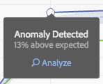

# Run Contribution Analysis

Contribution Analysis is an intensive machine learning process designed to uncover contributors to an observed anomaly in Adobe Analytics. The intent is to assist the user in finding areas of focus or opportunities for additional analysis much more quickly than would otherwise be possible.

## Run Contribution Analysis {#section_7D2C5E48A5664727941DF4C90976D9DC}

There are two ways to invoke contribution analysis in a project:

* In a freeform table with daily granularity, right-click any row and select **[!UICONTROL Run Contribution Analysis]**. You can even run it on rows that do not display any anomaly.

  >[!NOTE]
  >
  >We currently support contribution analysis only with daily granularity.

  

* In a line chart, hover over an anomaly data point in a line chart. Click the **[!UICONTROL Analyze]** link that appears.

  

1. (Optional) After you have clicked **[!UICONTROL Run Contribution Analysis]** in either the line chart or a table, you can narrow the scope of (and thus speed up) the analysis by [excluding dimensions](#section_F6932F4BF74544B5872164E7B1E0C6FC).

1. Wait while your contribution analysis loads. This could take a considerable amount of time, depending on the size of your report suite and the number of dimensions. Contribution analysis performs analysis on the top 50,000 items per dimension.
1. Analysis Workspace then loads a new Contribution Analysis panel directly within this project. You will notice a lot of familiar panels if you have used Contribution Analysis in Reports & Analytics before:

    * A visualization that shows the number of **Visits** on that day.
    * A monthly **Visits Trend line** for context.
    * **Top Items** that contributed to this anomaly, sorted by the [contribution score](https://experienceleague.adobe.com/docs/analytics/analyze/analysis-workspace/virtual-analyst/contribution-analysis/ca-tokens.html), plus the metric in question, and a Unique Visitors metric to put the metric in context from a sizing perspective.
    
    * The [Generated Segments](https://experienceleague.adobe.com/docs/analytics/components/segmentation/segmentation-workflow/seg-build.html) (Top Item Clusters) table identifies associations of top items based on the Contribution Score, anomaly occurrences, and overall percentage contributing to the anomalous metric. This is then captured as an audience segment (Contribution Segment 1, Contribution Segment 2, etc.). Clicking the "i" (info) button will give you a view of each auto segment's definition, including which top items it is made up of:

      

1. Since contribution analysis is now part of Analysis Workspace, you can take advantage of a number of its features from a table's right-click menu to make your analysis even more meaningful, such as:

    * [Breaking each dimension item down by another dimension.](/help/analyze/analysis-workspace/components/dimensions/t-breakdown-fa.md) 
    * [Trending one or more rows.](/help/analyze/analysis-workspace/home.md#section_34930C967C104C2B9092BA8DCF2BF81A) 
    * [Adding new visualizations.](/help/analyze/analysis-workspace/visualizations/freeform-analysis-visualizations.md) 
    * [Creating alerts.](/help/components/c-alerts/intellligent-alerts.md) 
    * [Creating or comparing segments.](/help/analyze/analysis-workspace/c-panels/c-segment-comparison/segment-comparison.md)

>[!NOTE]
>
>We highlight the anomaly being analyzed with a blue dot within Contribution Analysis and the Intelligent Alert projects linked to it. This provides a clearer indication of the anomaly being analyzed.

## Exclude dimensions from Contribution Analysis {#section_F6932F4BF74544B5872164E7B1E0C6FC}

There may be times when you want to exclude some dimensions from Contribution Analysis. For example, you may not care about any browser- or hardware-related dimensions at all, and you want to speed up analysis by removing them.

1. After you have clicked **[!UICONTROL Run Contribution Analysis]** (or **[!UICONTROL Analyze]** in a line chart), the **[!UICONTROL Excluded Dimensions]** panel displays.

1. Just drag any unwanted dimensions into the **[!UICONTROL Excluded Dimensions]** panel, then save the list by clicking **[!UICONTROL Set as Default]**. Or, click **[!UICONTROL Clear All]** to start over with selecting dimensions to exclude.

   

1. After you have added dimensions to exclude (or chosen not to), click **[!UICONTROL Run Contribution Analysis]** again.
1. If you ever need to revise the list of excluded dimensions, just double click Dimensions, and the list of excluded dimensions displays:

   

1. Just delete any unwanted dimensions by clicking the x next to them, then save the list by clicking **[!UICONTROL Set as Default]**.
