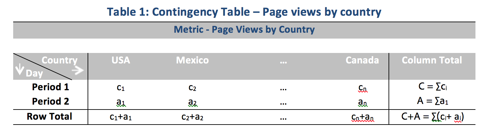
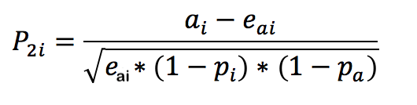
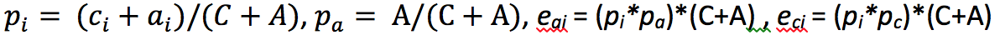

# Statistical techniques used in Contribution Analysis

Contribution Analysis is an intensive machine learning process designed to uncover contributors to an observed anomaly in Adobe Analytics. The intent is to assist the user in finding areas of focus or opportunities for additional analysis much more quickly than would otherwise be possible.

Contribution Analysis accomplishes this by performing a two-part algorithm to every single dimension item available to the user's Contribution Analysis report. The algorithm operates in this order:

1. For each dimension, it computes the Cramer's V test statistic. In the following example, consider a contingency table with page views by countries over two time periods:

   

   In Table 1, Cramer's V can be used to measure the association between the page views by countries for period 1 (e.g. historical) and period 2 (e.g. the day the anomaly occurred). A low value for Cramer's V implies a low level of association. Cramer's V ranges from 0 (no association) to 1 (complete association). The Cramer's V statistic can be computed:

   

1. For each dimension item, Person's Residual (PR) is used to measure the association between the anomalous metric and each dimension item. PR follows a standard normal distribution, which allows the algorithm to compare the PRs of two random variables even if the deviations are not comparable. In practice, the error is not known and is estimated using finite sample correction.

   In the previous example Table 1, the PR, with finite sample correction for country i and time period 2 is given by

   

   Here,

   

   (A similar formula can be obtained for time period 1.)

   For final results, the score for each dimension item is then weighted by the Cramer's V measure and rescaled to a number between 0 and 1 to provide its contribution score.
