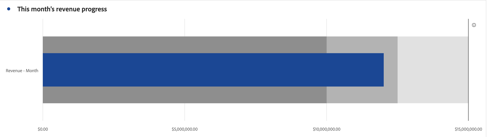

# Bullet graph {#bullet-graph}

<!-- markdownlint-disable MD034 -->

>[!CONTEXTUALHELP]
>id="workspace_bullet_goalvalue"
>title="Goal value"
>abstract="**[!UICONTROL High goal]** is the is the main goal you are aiming for. **[!UICONTROL Low goal]** and **[!UICONTROL Mid goal]** create ranges below the [!UICONTROL High goal]. Note: when the **[!UICONTROL Percentages]** option is checked, enter goals as whole numbers. For example: `20` if your goal is twenty percent."

<!-- markdownlint-enable MD034 -->

<!-- markdownlint-disable MD034 -->

>[!CONTEXTUALHELP]
>id="workspace_bullet_button"
>title="Bullet"
>abstract="Create a bullet graph visualization to show how a metric compares to, or measures against, performance ranges (goals)."

<!-- markdownlint-enable MD034 -->

>[!BEGINSHADEBOX]

_This article documents the Bullet visualization in_  _**Adobe Analytics**._ _See [Bullet](https://experienceleague.adobe.com/en/docs/analytics-platform/using/cja-workspace/visualizations/bullet-graph)  for the_  _**Customer Journey Analytics** version of this article._

>[!ENDSHADEBOX]

The  **[!UICONTROL Bullet]** visualization shows how a metric compares to, or measures against, performance ranges (goals). 

 

The bullet graph features a single, primary measure (for example, current year-to-date revenue) and allows you to enter qualitative ranges performance ranges (for example, compared to a target revenue). You can specify high, medium, and low goal ranges. You can specify goal ranges in  **[!UICONTROL Settings]**.

>[!BEGINSHADEBOX]

See  [Bullet graph visualization](https://video.tv.adobe.com/v/23989/?quality=12/?quality=12){target=&#34;_blank&#34;} for a demo video.

>[!ENDSHADEBOX]

## Settings

You can define specific settings for a [!UICONTROL Bullet] visualization. 

| Setting | Description |
|---|---|
| **[!UICONTROL Bullet options]** | Specify values for **[!UICONTROL High goal]**, **[!UICONTROL Mid goal]** and **[!UICONTROL Low goal]** in the [!UICONTROL Bullet] visualization.  **[!UICONTROL High goal]** is the is the main goal you are aiming for. **[!UICONTROL Low goal]** and **[!UICONTROL Mid goal]** create ranges below the High goal. Note: when the **[!UICONTROL Percentages]** option is checked, enter goals as whole numbers. For example: `20` if your goal is twenty percent. |

>[!MORELIKETHIS]
>
>[Add a visualization to a panel](/help/analyze/analysis-workspace/visualizations/freeform-analysis-visualizations.md#add-visualizations-to-a-panel)
>[Visualization settings](/help/analyze/analysis-workspace/visualizations/freeform-analysis-visualizations.md#settings)
>[Visualization context menu](/help/analyze/analysis-workspace/visualizations/freeform-analysis-visualizations.md#context-menu)
>

