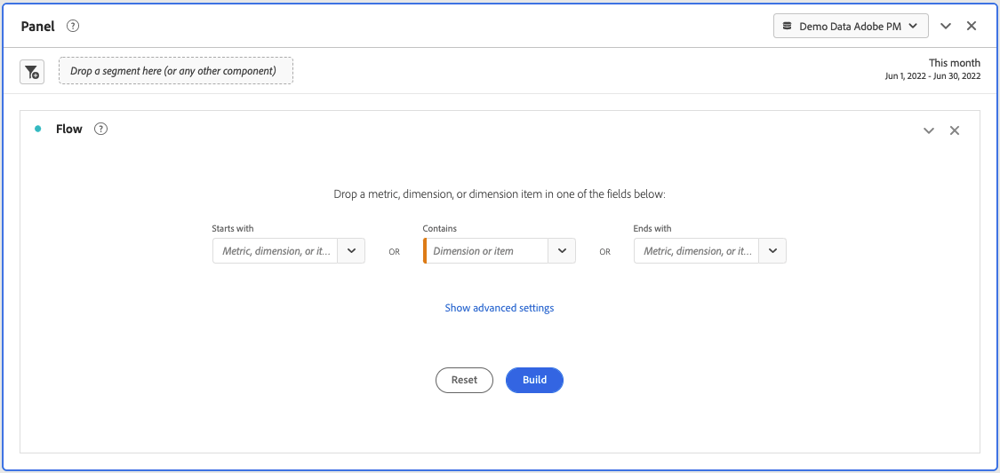
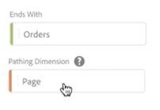
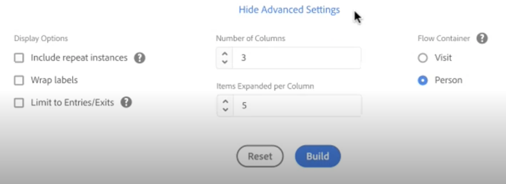
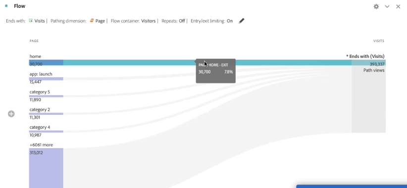
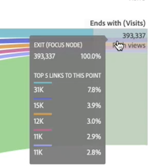

# Configure a flow visualization

>[!NOTE]
>
>This new version of the [!UICONTROL Flow] visualization is currently in private beta.

Flow lets you track the exact journeys your customers are taking through your website or your app. It traces a path through your dimensions (and dimension items) or metrics. Every flow has a starting point and an endpoint, and a metric or dimension (or item) that you are tracking. 

The new [!UICONTROL flow] experience enhances your workflow in several ways:

* It allows for metrics to be tracked, in addition to dimensions and dimension items.
* It contains [!UICONTROL Advanced Settings] to let you further customize the [!UICONTROL flow].
* It lets you configure the [!UICONTROL flow] before building it.

## Configuration steps {#configure}

1. To start creating a flow diagram, add a blank panel to your project and click the visualizations icon in the left rail. Then drag the Flow visualization into the panel. Or drag the [!UICONTROL Flow] visualization into an existing project.

1. Anchor your Flow visualization using one of three options:

   * [!UICONTROL Starts with] (metrics, dimensions, or items), or
   * [!UICONTROL Contains] (dimensions, or items), or
   * [!UICONTROL Ends with] (metrics, dimensions, or items)

   Each of these categories is shown onscreen as a "drop zone." Drag items from the dimensions or metrics list and drop them into the desired drop zone.

   For example, let's assume that you want to trace everything that leads up to a checkout event. You would drag a checkout-related dimension or metric (such as [!UICONTROL Order exists]) into the **[!UICONTROL Ends with]** drop zone. 

1. If you choose a metric, you also need to provide a [!UICONTROL Pathing Dimension], as shown here, that you will use to build the path. The default is [!UICONTROL Page].

   

1. (Optional) Click **[!UICONTROL Show Advanced Settings]** to configure Advanced Settings:

   

   | Setting | Description |
   | --- | --- |
   | **[!UICONTROL Include repeat instances]** | Flow visualizations are based on instances of a dimension. This setting gives you the option to include or exclude repeated instances, e.g. Page reloads. However, repeats cannot be removed from Flow visualizations that include multi-valued dimensions, such as listVars, listProps, s.product, merchandising eVars, etc. Default = unchecked. |
   | **[!UICONTROL Wrap labels]** | Normally, the labels on the Flow elements are truncated to save screen real estate, but you can make the entire label visible by checking this box.  Default = unchecked. |
   | **[!UICONTROL Limit to Entries/Exits]** | Results limited to paths when the first/last touchpoint is and entry/exit. |
   | **[!UICONTROL Number of Columns]** | Determines how many columns you want in your Flow diagram. |
   | **[!UICONTROL Items expanded per Column]** | How many items you want in each column. |
   | **[!UICONTROL Flow Container]** | <ul><li>Visit</li><li>Visitor</li></ul> Lets you switch between Visit and Visitor to analyze visitor pathing. These settings help you understand visitor engagement at the visitor level (across visits), or constrain the analysis to a single visit.  |

1. Click **[!UICONTROL Build]**.

## View and change the Flow output {#output}

A summary of the Flow configuration appears at the top of the diagram. The paths in the diagram are proportional. Paths with more activity appear thicker. 

To drill down further into the data, you have several options:

* The flow diagram is interactive. Mouse over the diagram to change the details that are shown.

* When you click on a node in the diagram, the details for that node appear. Click on the node again to collapse it.

   

* You can filter a column to display only certain results, such as including and excluding, specifying criteria, etc.

* Click the plus sign (+) on the left to expand a column.

* Use the right-click options detailed below to further customize the output.

* Click the pencil icon next to the configuration summary to further edit the flow or rebuild it with different options.

* You can also export and further analyze your Flow diagram as part of a project's .CSV file by going to **[!UICONTROL Project]** > **[!UICONTROL Download CSV]**.

## Right-click options {#right-click}

| Option | Description |
|--- |--- |
| [!UICONTROL Focus on this node] | Change the focus to the selected node. The focus node appears at the center of the Flow diagram. |
| [!UICONTROL Start Over] | Returns you to the Freeform diagram builder, where you can build a new Flow diagram. |
| [!UICONTROL Create Segment from this point in flow] | Create a segment. This takes you into the Segment Builder, where you can configure the new segment. |
| [!UICONTROL Breakdown] | Break the node down by available Dimensions, Metrics, or Time. |
| [!UICONTROL Trend] | Create a trended diagram for the node. |
| [!UICONTROL Expand entire column] | Expand a column to show all nodes. By default, only the top five nodes display. |
| [!UICONTROL Collapse entire column] | Hide all nodes in a column. |