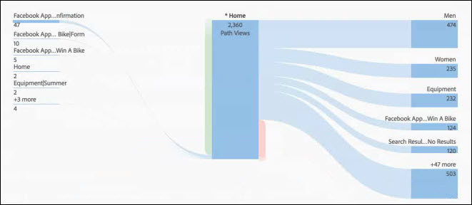

# Configure a flow visualization

Flow lets you track a path through your pages or dimensions, such as eVars:

* Entry (dimensions only) 
* Dimensions or items 
* Exit (dimensions only)

Each of these categories is shown onscreen as a "drop zone." Drag items from the list and drop them into the desired drop zone. Pages and other items that are not dimensions can only be placed in the middle drop zone. If you drop a dimension into the middle zone, a report is automatically run that inserts the top items for that dimension.

When you drop an item into a drop zone, the Flow diagram opens. The contents of the flow diagram depend on the drop zone where you drop a dimension or item. Exit and Entry show all items for the dimension (such as pages) you drop into the Entry or Exit drop zone. For example, if you drop a dimension into the central drop zone, the flow diagram for that dimension opens.

Hover over the Focus Node in the middle of the diagram to view information about that node.

The flow diagram is interactive. Mouse over the diagram to change the details that are shown.

The paths in the diagram are proportional. Paths with more activity appear thicker.

When you click on a node in the diagram, the details for that node appear. For example, if you click **[!UICONTROL Search Results]** at the top right in the top diagram above, the diagram expands to show more details about the search results node. Click on a node again to collapse it.

By default, the diagram shows the top five flows. If you click on the **[!UICONTROL More]** node at the bottom of the diagram, the diagram expands down to show five more flows. Continue clicking **[!UICONTROL More]** to expand until there are no additional flows to show.

There are no limits on how much you can explore within the Flow diagram.

You can also export and further analyze your Flow diagram as part of a project's .CSV file by going to **[!UICONTROL Project]** > **[!UICONTROL Download CSV]**.
