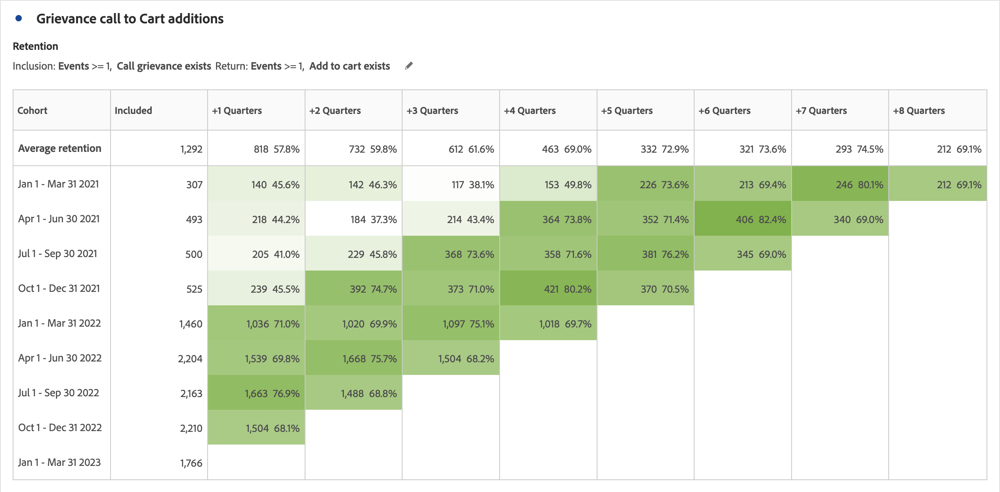
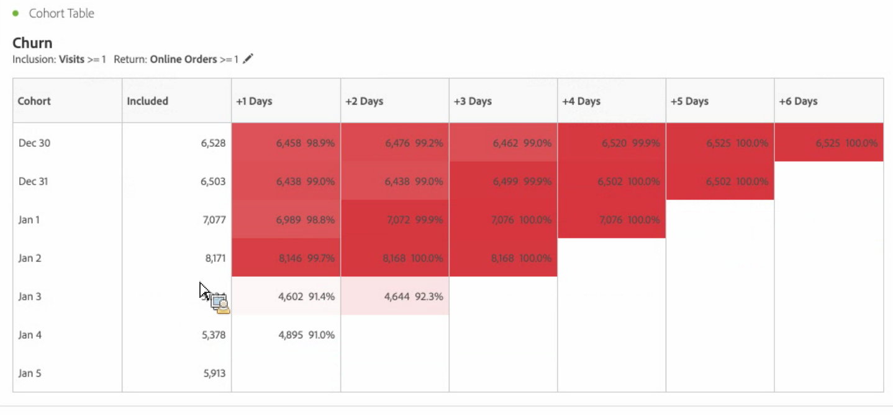
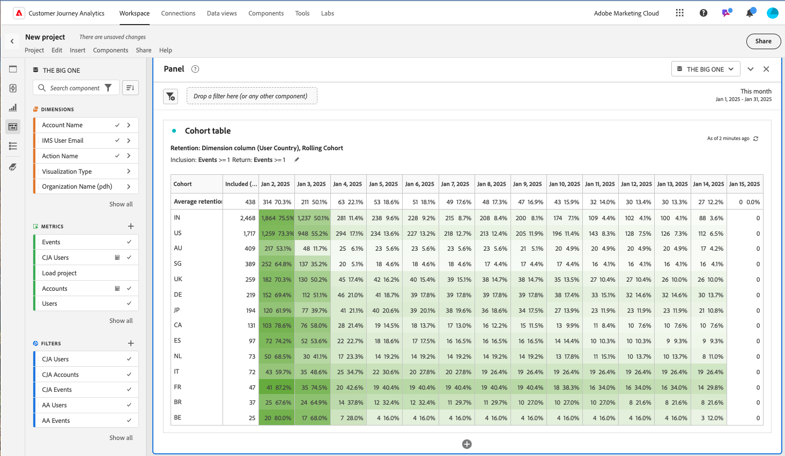
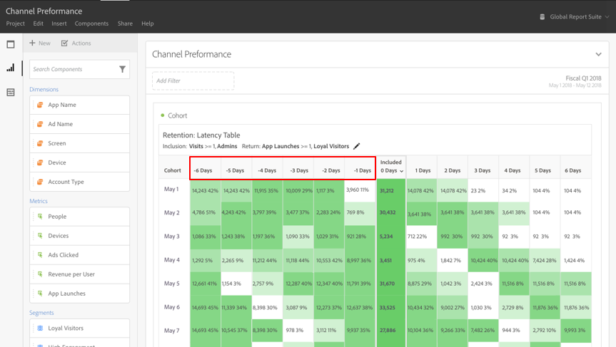
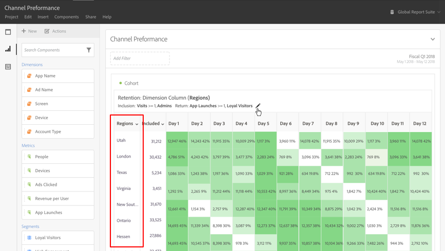

# Learn about [!UICONTROL Cohort Analysis] in Adobe Analytics

A *`cohort`* is a group of people sharing common characteristics over a specified period. [!UICONTROL Cohort Analysis] is useful, for example, when you want to learn how a cohort engages with a brand. You can easily spot changes in trends, then respond accordingly. (Explanations of [!UICONTROL Cohort Analysis] are available on the web, such as at [Cohort Analysis 101](https://en.wikipedia.org/wiki/Cohort_analysis).)

After creating a cohort report, you can curate its components (specific dimensions, metrics, and segments), then share the cohort report with anyone. See [Curate and Share](/help/analyze/analysis-workspace/curate-share/curate.md).

Examples of what you can do with [!UICONTROL Cohort Analysis]:

* Launch campaigns designed to spur a desired action.
* Shift marketing budget at exactly the right time in the customer lifecycle.
* Recognize when to end a trial or an offer, in order to maximize value.
* Gain ideas for A/B testing in areas such as pricing, upgrade path, and so on.
* View a [!UICONTROL Cohort Analysis] report within a Guided Analysis report.

[!UICONTROL Cohort Analysis] is available for all Adobe Analytics customers with access rights to [!UICONTROL Analysis Workspace].

[Cohort Analysis video tutorial](https://experienceleague.adobe.com/docs/analytics-learn/tutorials/analysis-workspace/cohort-analysis/cohort-analysis-workspace.html) (4:36)

>[!IMPORTANT]
>
>[!UICONTROL Cohort Analysis]
>
>does not support non-segmentable metrics (including calculated metrics), non-integer metrics (such as Revenue), or Occurrences. Only metrics that can be used in segments can be used in
>[!UICONTROL Cohort Analysis], and they can only be incremented by 1 at a time. 

## Cohort Analysis capabilities

The following capabilities allow for fine-tuned control over the cohorts you are building:

### [!UICONTROL Retention] Table

A [!UICONTROL Retention] cohort report returns visitors: each data cell shows the raw number and percentage of visitors in the cohort who did the action during that time period. You can include up to 3 metrics and up to 10 segments.

Here is a video on calculating rolling retention:

>[!VIDEO](https://video.tv.adobe.com/v/25962/?quality=12)

### [!UICONTROL Churn] Table

A [!UICONTROL Churn] cohort is the inverse of a retention table and shows the visitors who fell out or never met the return criteria for your cohort over time. You can include up to 3 metrics and up to 10 segments.

### [!UICONTROL Rolling Calculation]

Lets you calculate retention or churn based on the previous column, not the included column.

### [!UICONTROL Latency] Table

Measures the time that has elapsed before and after the inclusion event occurred. This is an excellent tool for pre/post analysis. The **[!UICONTROL Included]** column is in the center of the table and time periods before and after the inclusion event are shown on both sides.

### [!UICONTROL Custom Dimension] Cohort

Create cohorts based on a selected dimension, and not time-based cohorts, which are the default. Use dimensions such as [!UICONTROL marketing channel], [!UICONTROL campaign], [!UICONTROL product], [!UICONTROL page], [!UICONTROL region], or any other dimension in Adobe Analytics to show how retention changes based on the different values of these dimensions.

For instructions on how to set up and run a cohort report, go to [Configure a Cohort Analysis report](/help/analyze/analysis-workspace/visualizations/cohort-table/t-cohort.md).
