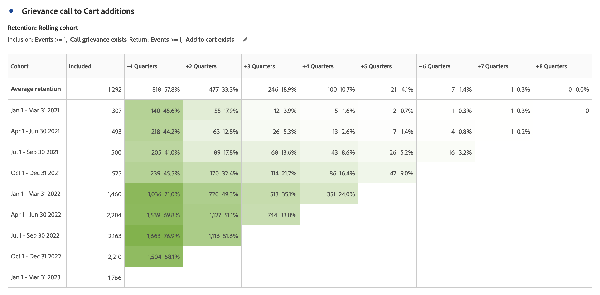
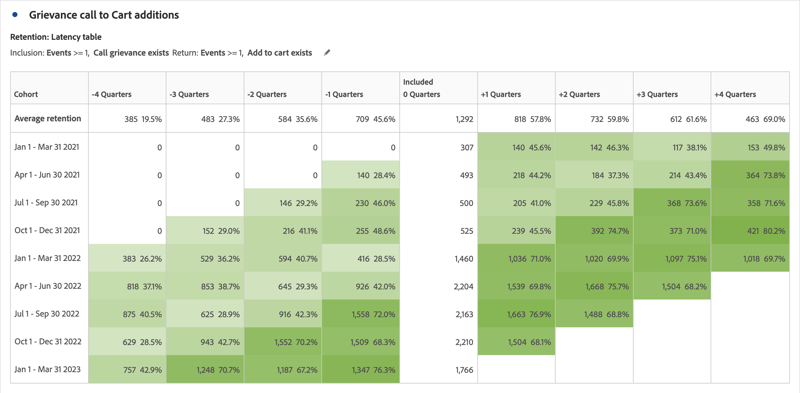
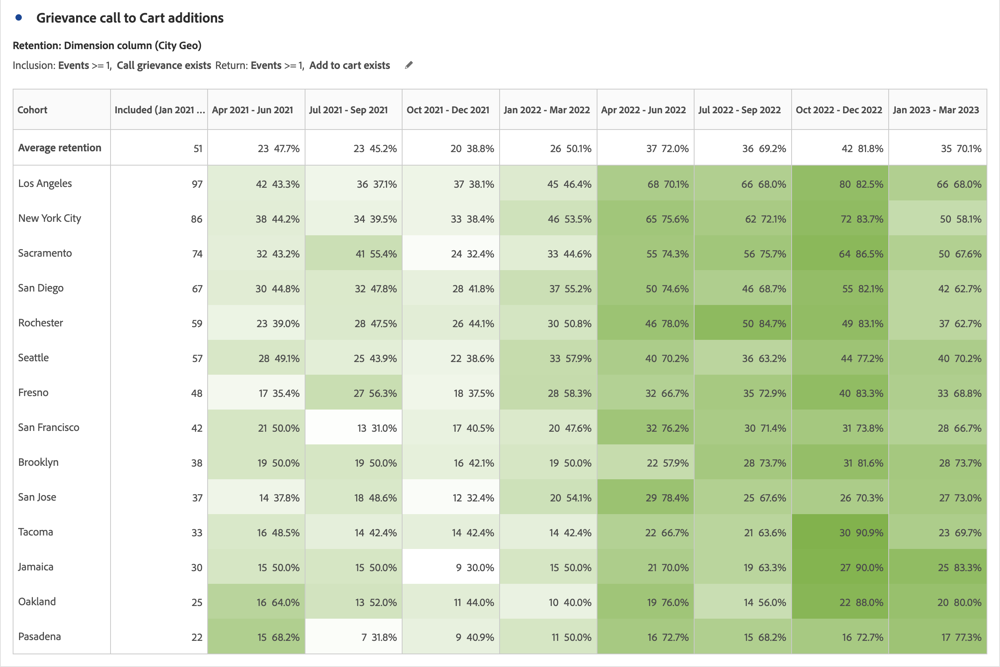

# Cohort table overview {#cohort-table-overview}

<!-- markdownlint-disable MD034 -->

>[!CONTEXTUALHELP]
>id="workspace_cohorttable_button"
>title="Cohort table"
>abstract="Create a cohort visualization to group users based on completion of an event and analyze ongoing engagement and churn over time."

<!-- markdownlint-enable MD034 -->

<!-- markdownlint-disable MD034 -->

>[!CONTEXTUALHELP]
>id="workspace_cohorttable_panel"
>title="Cohort table"
>abstract="Group users based on completion of an event, then analyze their ongoing engagement and churn over time.  **Parameters** **Inclusion criteria**: The components used to define your initial visitor cohorts. **Return criteria**: The components used to determine if a visitor has returned."

<!-- markdownlint-enable MD034 -->

>[!BEGINSHADEBOX]

_This article documents the Cohort table in_  _**Adobe Analytics**._ _See [Cohort table](https://experienceleague.adobe.com/en/docs/analytics-platform/using/cja-workspace/visualizations/cohort-table/cohort-analysis)  for the_  _**Customer Journey Analytics** version of this article._

>[!ENDSHADEBOX]

A *cohort* is a group of people sharing common characteristics over a specified period. A  **[!UICONTROL Cohort table]** visualization is useful, for example, when you want to learn how a cohort engages with a brand. You can easily spot changes in trends, then respond accordingly. (Explanations of [!UICONTROL Cohort Analysis] are available on the web, such as at [Cohort Analysis 101](https://en.wikipedia.org/wiki/Cohort_analysis).)

After creating a cohort report, you can curate its components (specific dimensions, metrics, and filters), then share the cohort report with anyone. See [Curate and Share](/help/analyze/analysis-workspace/curate-share/curate.md).

Examples of what you can do with a [!UICONTROL Cohort table]:

* Launch campaigns designed to spur a desired action.
* Shift marketing budget at exactly the right time in the customer lifecycle.
* Recognize when to end a trial or an offer to maximize value.
* Gain ideas for A/B testing in areas such as pricing, upgrade path, and so on.

[!UICONTROL Cohort table] is available for all Customer Journey Analytics customers with access rights to [!UICONTROL Analysis Workspace].

>[!BEGINSHADEBOX]

See  [Cohort analysis in Analysis Workspace](https://video.tv.adobe.com/v/23990/?quality=12&learn=on){target="_blank"} for a demo video.

>[!ENDSHADEBOX]

>[!IMPORTANT]
>
>[!UICONTROL Cohort Analysis] does not support non-filterable metrics (including calculated metrics), non-integer metrics (such as Revenue), or Occurrences. Only metrics that can be used in filters can be used in [!UICONTROL Cohort Analysis], and they can only be incremented 1 at a time. 

Cohort tables in Customer Journey Analytics support double-based (or any numeric-based) metric. For example, Purchase.Value (a double) can be used as an  Inclusion/Return Metric. In addition, all metrics that are passed into Adobe Experience Platform via the Analytics Source Connector are also doubles.

## Cohort table capabilities

The following sections describe Cohort Analysis features that allow for fine-tuned control over the cohorts you are building.

For more detailed information about creating a cohort and running a [!UICONTROL Cohort Analysis] report, see [Configure a Cohort table](/help/analyze/analysis-workspace/visualizations/cohort-table/t-cohort.md).

### [!UICONTROL Retention] table

A [!UICONTROL Retention] cohort table returns persons: each data cell shows the raw number and percentage of persons in the cohort who did the action during that time period. You can include up to 3 metrics and up to 10 filters.

### [!UICONTROL Churn] table

A [!UICONTROL Churn] cohort table is the inverse of a retention table and shows the persons who fell out or never met the return criteria for your cohort over time. You can include up to 3 metrics and up to 10 filters.

### [!UICONTROL Rolling Calculation]

You can calculate retention or churn based on the previous column, not the included column, which is referred to as rolling calculation.

### [!UICONTROL Latency] table

A latency table measures the time that has elapsed before and after the inclusion event occurred. Measuring latency is an excellent tool for pre- and post analysis. The **[!UICONTROL Included]** column is in the center of the table and time periods before and after the inclusion event are shown on both sides.

### [!UICONTROL Custom dimension] cohort

You can create cohorts based on a selected dimension, and not time-based cohorts (which are the default). Use dimensions such as [!UICONTROL City geo], [!UICONTROL Marketing channel], [!UICONTROL campaign], [!UICONTROL product], [!UICONTROL page], [!UICONTROL region], or any other dimension to show how retention changes. Based on the different values of these dimensions.

>[!MORELIKETHIS]
>
>[Configure a Cohort table](/help/analyze/analysis-workspace/visualizations/cohort-table/t-cohort.md).
>

<!--
A *`cohort`* is a group of people sharing common characteristics over a specified period. [!UICONTROL Cohort Analysis] is useful, for example, when you want to learn how a cohort engages with a brand. You can easily spot changes in trends, then respond accordingly. (Explanations of [!UICONTROL Cohort Analysis] are available on the web, such as at [Cohort Analysis 101](https://en.wikipedia.org/wiki/Cohort_analysis).)

After creating a cohort report, you can curate its components (specific dimensions, metrics, and segments), then share the cohort report with anyone. See [Curate and Share](/help/analyze/analysis-workspace/curate-share/curate.md).

Examples of what you can do with [!UICONTROL Cohort Analysis]:

* Launch campaigns designed to spur a desired action.
* Shift marketing budget at exactly the right time in the customer lifecycle.
* Recognize when to end a trial or an offer, in order to maximize value.
* Gain ideas for A/B testing in areas such as pricing, upgrade path, and so on.

[!UICONTROL Cohort Analysis] is available for all Adobe Analytics customers with access rights to [!UICONTROL Analysis Workspace].

>[!BEGINSHADEBOX]

See  [Cohort analysis in Analysis Workspace](https://video.tv.adobe.com/v/25965?quality=12&learn=on){target="_blank"} for a demo video.

>[!ENDSHADEBOX]

>[!IMPORTANT]
>
>[!UICONTROL Cohort Analysis] does not support non-segmentable metrics (including calculated metrics), non-integer metrics (such as Revenue), or Occurrences. 
>
>Only metrics that can be used in segments can be used in [!UICONTROL Cohort Analysis], and they can only be incremented by >1 at a time. 

## Cohort Analysis capabilities

The following sections describe Cohort Analysis features that allow for fine-tuned control over the cohorts you are building.

For more detailed information about creating a cohort and running a [!UICONTROL Cohort Analysis] report, see [Configure a Cohort Analysis report](/help/analyze/analysis-workspace/visualizations/cohort-table/t-cohort.md).

### [!UICONTROL Retention] Table

A [!UICONTROL Retention] cohort report returns visitors: each data cell shows the raw number and percentage of visitors in the cohort who did the action during that time period. You can include up to 3 metrics and up to 10 segments.

>[!BEGINSHADEBOX]

See  [Calculate rolling retention](https://video.tv.adobe.com/v/25962?quality=12&learn=on){target="_blank"} for a demo video.

>[!ENDSHADEBOX]

### [!UICONTROL Churn] Table

A [!UICONTROL Churn] cohort is the inverse of a retention table and shows the visitors who fell out or never met the return criteria for your cohort over time. You can include up to 3 metrics and up to 10 segments.

>[!BEGINSHADEBOX]

See  [Churn analysis](https://video.tv.adobe.com/v/25966?quality=12&learn=on){target="_blank"} for a demo video.

>[!ENDSHADEBOX]

### [!UICONTROL Rolling Calculation]

Lets you calculate retention or churn based on the previous column, not the included column.

### [!UICONTROL Latency] Table

Measures the time that has elapsed before and after the inclusion event occurred. This is an excellent tool for pre/post analysis. The **[!UICONTROL Included]** column is in the center of the table and time periods before and after the inclusion event are shown on both sides.

### [!UICONTROL Custom Dimension] Cohort

Create cohorts based on a selected dimension, and not time-based cohorts, which are the default. Use dimensions such as [!UICONTROL marketing channel], [!UICONTROL campaign], [!UICONTROL product], [!UICONTROL page], [!UICONTROL region], or any other dimension in Adobe Analytics to show how retention changes based on the different values of these dimensions.

-->
