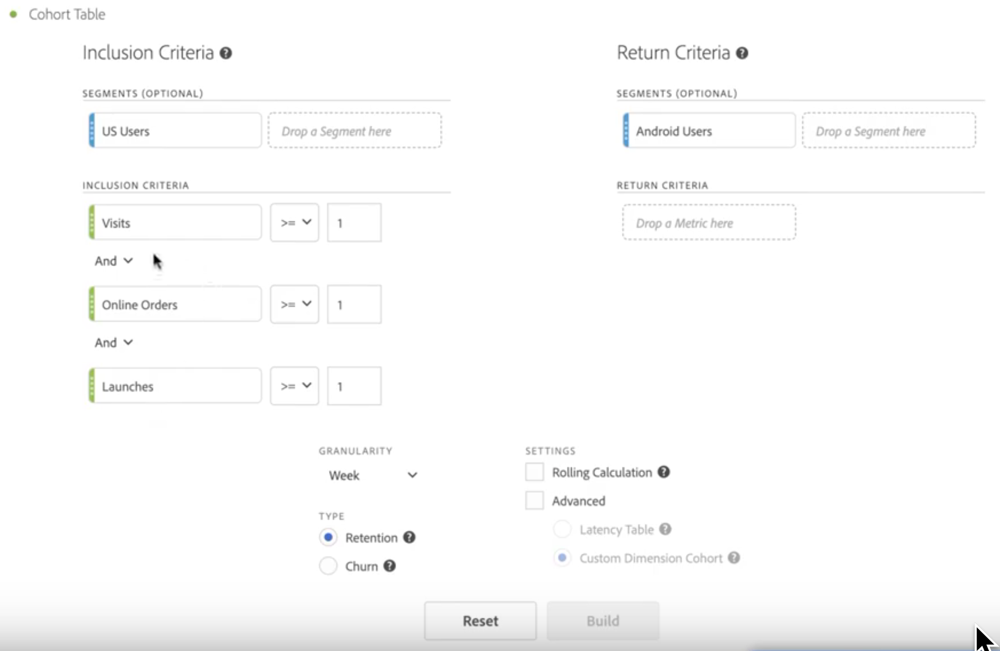
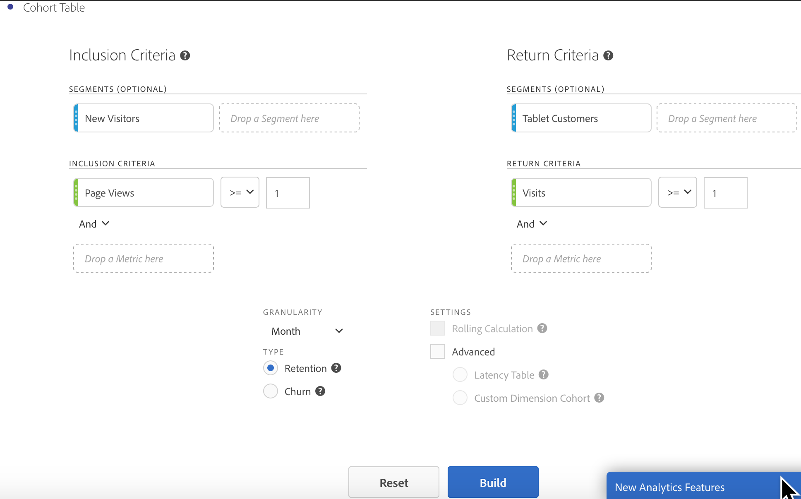

# Configure a [!UICONTROL Cohort Analysis] report

Create a cohort and run a [!UICONTROL Cohort Analysis] report in Analysis Workspace.

1. In Analysis Workspace, click the **[!UICONTROL Visualizations]** icon in the left rail and drag a **[!UICONTROL Cohort Table]** to the canvas.

   

1. Define the **[!UICONTROL Inclusion Criteria]**, **[!UICONTROL Return Criteria]**, **[!UICONTROL Cohort Type]**, and **[!UICONTROL Settings]** as defined in the table below.

| Element | Description |
|--- |--- |
|**[!UICONTROL Inclusion Criteria]**|You can apply up to 10 inclusion segments and up to 3 inclusion metrics. The metric specifies what places a user in a cohort. For example, if the inclusion metric is Orders, only users who placed an order during the time range of the cohort analysis will be included in the initial cohort. The default operator between metrics is AND, but you can change it to OR. In addition, you can add numeric filtering to these metrics. For example: "Visits >= 1". |
|**[!UICONTROL Return Criteria]**|You can apply up to 10 return segments and up to 3 return metrics. The metric indicates whether the user has been retained (retention) or not (churn). For example, if the return metric is Video Views, only users who viewed videos during subsequent time periods (after the period in which they were added to a cohort) will be represented as retained. Another metric that quantifies retention is Visits.|
|**[!UICONTROL Granularity]**|The time granularity of Day, Week, Month, Quarter, or Year.|
|**[!UICONTROL Type]**|**[!UICONTROL Retention]**(default): A retention cohort measures how well your visitor cohorts return to your property over time. This is the standard cohort that we have always had and indicates return and repeat user behavior. A [!UICONTROL Retention] Cohort is indicated by the color green in the table. **[!UICONTROL Churn]**: A churn (also known as "attrition" or "fallout") cohort measures how your visitor cohorts fall out of your property over time. Churn = 1 - Retention. [!UICONTROL Churn] is a good measure of stickiness as well as opportunity by showing you how frequently customers do not come back. You can use churn to analyze and identify areas of focus: which cohort segments could use some attention. A [!UICONTROL Churn] Cohort is indicated by the color red in the table (similar to fallout in our **[!UICONTROL Flow]** visualization). |
|**[!UICONTROL Settings]**|**[!UICONTROL Rolling Calculation]**: Calculate retention or churn based on the previous column, rather than the Included column (default). [!UICONTROL Rolling Calculation] changes the calculation method for your "return" periods. The normal calculation independently finds users who meet "return" criteria and were part of the inclusion period, regardless of whether or not they were in the cohort for the previous period. Instead, [!UICONTROL Rolling Calculation] finds users who meet "return" criteria and were part of the previous period. Therefore, [!UICONTROL Rolling Calculation] filters and funnels the users who continually meet the "return" criteria period over period. [!UICONTROL Return] criteria are  applied to each of the periods leading up to the selected period.   **[!UICONTROL Latency Table]**: A [!UICONTROL Latency] table measures the time that has elapsed before and after the inclusion event occurred. [!UICONTROL Latency] is great to use for pre/post analysis. For example, if you have an upcoming product or campaign launch and you want to track behavior before as well as see how it performs after, the [!UICONTROL Latency] table will display the pre and post behavior side by side to see the direct impact. The pre-inclusion cells in the [!UICONTROL Latency] Table are calculated by users who meet the [!UICONTROL Inclusion] criteria on the inclusion period and then meet the [!UICONTROL Return] criteria in the periods before the inclusion period. Note that [!UICONTROL Latency] tables and [!UICONTROL Custom Dimension] Cohort cannot be used together.  **[!UICONTROL Custom Dimension Cohort]**: Create cohorts based on the selected dimension, rather than time-based cohorts (default). Many customers want to analyze their cohorts by something other than time and the new Custom Dimension Cohort feature provides you with the flexibility to build cohorts based on dimensions of their choosing. Use dimensions such as marketing channel, campaign, product, page, region, or any other dimension in Adobe Analytics to show how retention changes based on the different values of these dimensions. The [!UICONTROL Custom Dimension] Cohort segment definition applies the dimension item only as part of the inclusion period, not as part of the return definition.  After choosing the [!UICONTROL Custom Dimension] Cohort option, you can drag and drop whichever dimension you want into the drop zone. This allows you to compare similar dimension items across the same time period. For example, you can compare performance of cities side by side, products, campaigns, etc. It will return your top 14 dimension items. However, you can use a filter (access it by hovering on the right of the dimension that was dragged on) to display only desired dimension items. A [!UICONTROL Custom Dimension] Cohort cannot be used with the [!UICONTROL Latency] Table feature. |

1. Adjust the **[!UICONTROL Cohort Table Settings]** by clicking the gear icon.

| Setting | Description |
| Only show percent | Removes the number value and only shows the percentage. |
| Round percent to nearest whole | Rounds the percent value to the nearest whole instead of showing the decimal value. |
| Show Average Percent Row | Inserts a new row at the top of the table and then adds the average for the values within each column. |

## Build the [!UICONTROL Cohort Analysis] report

1. Click **[!UICONTROL Build]**.

   

   The report shows visitors who placed an order ( *`Included`* column), and who returned to your site in subsequent visits. The reduction in visits over time enables you to spot problems and take action.
1. (Optional) Create a segment from a selection.

   Select cells (contiguous or noncontiguous), then right-click > **[!UICONTROL Create Segment From Selection]**.

1. In the [Segment Builder](/help/components/segmentation/segmentation-workflow/seg-build.md), further edit the segment, then click **[!UICONTROL Save]**.

   The saved segment is available for use in the [!UICONTROL Segment] panel in [!UICONTROL Analysis Workspace].
1. Name and save your cohort project.
1. (Optional) [Curate and share](/help/analyze/analysis-workspace/curate-share/curate.md) the project components.

   >[!NOTE]
   >
   >You must save your project before curation is available.
