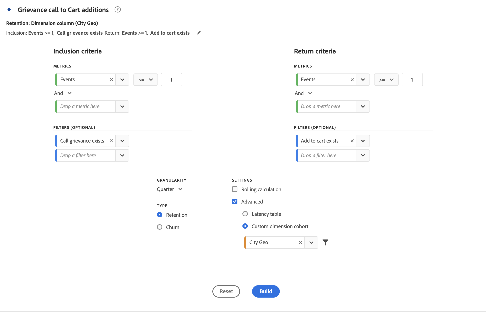

# Configure a Cohort table

To create and configure a [!UICONTROL Cohort table]:

1. Add a  **[!UICONTROL Cohort table]** visualization. See [Add a visualization to a panel](../freeform-analysis-visualizations.md#add-visualizations-to-a-panel).

1. Define the **[!UICONTROL Inclusion Criteria]**, **[!UICONTROL Return Criteria]**, **[!UICONTROL Cohort Type]**, and **[!UICONTROL Settings]** as defined in the table below.

   

   | Element | Description |
   |--- |--- |
   |**[!UICONTROL Inclusion criteria]**|You can apply up to 10 inclusion filters and up to 3 inclusion metrics. The metric specifies what to which cohort a user belongs. For example, if the inclusion metric is Orders, only users who placed an order during the time range of the cohort analysis are included in the initial cohort. The default operator between metrics is AND, but you can change it to OR. In addition, you can add numeric filtering to these metrics. For example: `Sessions >= 1`. |
   |**[!UICONTROL Return criteria]**|You can apply up to 10 return filters and up to 3 return metrics. The metric indicates whether the user has been retained (retention) or not (churn). For example, if the return metric is Video Views, only users who viewed videos during subsequent time periods (after the period in which they were added to a cohort) are represented as retained. Another metric that quantifies retention is Sessions. |
   |**[!UICONTROL Granularity]**|The time granularity of Day, Week, Month, Quarter, or Year.|
   |**[!UICONTROL Type]**|**[!UICONTROL Retention]** (default): A **[!UICONTROL Retention]** cohort measures how well your person cohorts return to your property over time. A retention cohort is the standard cohort and indicates return and repeat user behavior. A green color indicates a [!UICONTROL Retention] cohort in the table. **[!UICONTROL Churn]**: A **[!UICONTROL Churn]** (also known as attrition or fallout) cohort measures how your person cohorts fall out of your property over time. Churn is the opposite of retention: `Churn = 1 - Retention`. [!UICONTROL Churn] is a good measure of stickiness as well as opportunity by showing you how frequently customers do not come back. You can use churn to analyze and identify areas of focus: which cohort filters could use some attention? A red color indicates a [!UICONTROL Churn] cohort in the table (similar to fallout in the **[!UICONTROL Flow]** visualization). |
   |**[!UICONTROL Settings]**|**[!UICONTROL Rolling calculation]**: Calculate retention or churn based on the previous column, rather than the Included column (default). [!UICONTROL Rolling Calculation] changes the calculation method for your "return" periods. The normal calculation finds users who meet return criteria and were part of the inclusion period. Regardless of whether or not they were in the cohort for the previous period. Instead, [!UICONTROL Rolling Calculation] finds users who meet "return" criteria and were part of the previous period. Therefore, [!UICONTROL Rolling Calculation] filters and funnels the users who continually meet the "return" criteria period over period. [!UICONTROL Return] criteria are applied to each of the periods leading up to the selected period.   **[!UICONTROL Latency Table]**: A [!UICONTROL Latency table] measures the time that has elapsed before and after the inclusion event occurred. [!UICONTROL Latency table] is great to use for pre/post analysis. For example, you have an upcoming product or campaign launch and you want to track behavior before and after the launch. The [!UICONTROL Latency table] displays the pre- and post behavior side by side to see the direct impact. The pre-inclusion cells in the [!UICONTROL Latency table] calculate users who meet the [!UICONTROL Inclusion] criteria on the inclusion period and then meet the [!UICONTROL Return] criteria in the periods before the inclusion period. Note that [!UICONTROL Latency table] and [!UICONTROL Custom dimension cohort] cannot be used together.  **[!UICONTROL Custom dimension cohort]**: Create cohorts based on the selected dimension, rather than time-based cohorts (default). Many customers want to analyze their cohorts by something other than time and the new Custom Dimension Cohort feature provides you with the flexibility to build cohorts based on dimensions of their choosing. Use dimensions, such as marketing channel, campaign, product, page, region, or any other dimension to show how retention changes based on the different values of these dimensions. The [!UICONTROL Custom Dimension] Cohort filter definition applies the dimension item only as part of the inclusion period, not as part of the return definition.  After choosing the [!UICONTROL Custom dimension cohort] option, you can drag and drop whichever dimension you want into the drop zone. Adding dimensions allows you to compare similar dimension items across the same time period. For example, you can compare the performance of cities side by side, products, campaigns, etc. The Cohort table returns your top 14 dimension items. However, you can use a  filter to display only desired dimension items. A [!UICONTROL Custom dimension cohort] cannot be used with the [!UICONTROL Latency table] feature. |

1. Click **[!UICONTROL Build]**.
1. To reconfigure the [!UICONTROL Cohort table], select .

1. (Optional) Create a segment from a selection.

   Select one or more cells (contiguous or noncontiguous), then right-click > **[!UICONTROL Create Segment From Selection]**.

1. In the [Segment builder](/help/components/segmentation/segmentation-workflow/seg-build.md), further edit the segment, then click **[!UICONTROL Save]**.

   The saved segment is available for use in the [!UICONTROL Segment] panel in [!UICONTROL Analysis Workspace].

## Settings

You can define specific settings for a [!UICONTROL Cohort table].

1. Select  to adjust the [!UICONTROL Cohort table] settings.

   | Setting | Description |
   |---|---|
   | **Only show percent** | Removes the number value and only shows the percentage. |
   | **Round percent to nearest whole** | Rounds the percent value to the nearest whole instead of showing the decimal value. |
   | **Show Average Percent Row** | Inserts a new row at the top of the table and then adds the average for the values within each column. |

>[!MORELIKETHIS]
>
>[Add a visualization to a panel](/help/analyze/analysis-workspace/visualizations/freeform-analysis-visualizations.md#add-visualizations-to-a-panel)
>[Visualization settings](/help/analyze/analysis-workspace/visualizations/freeform-analysis-visualizations.md#settings)
>[Visualization context menu](/help/analyze/analysis-workspace/visualizations/freeform-analysis-visualizations.md#context-menu)
>

