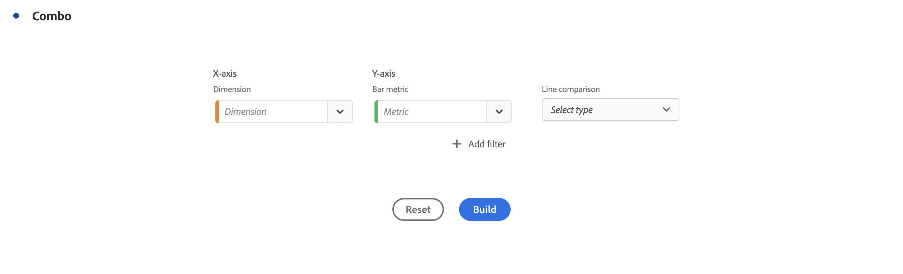

# Combo chart

>[!NOTE]
>
>This functionality is currently in [limited testing](/help/release-notes/releases.md).

The [!UICONTROL Combo chart] visualization makes it easy to quickly build a comparison visualization without having to build a table first. You can easily view trends in your data in a line/bar combination. 

Use a [!UICONTROL Combo chart] to 

* Compare this week's orders to orders at the same time last month (and last year) - all within a few clicks. 

* Quickly analyze and compare multiple metrics (like [!UICONTROL Unique Visitors] and [!UICONTROL Revenue]) against one another on the same chart. 

* Analyze a metric against a function (such as [!UICONTROL Cumulative Average]) over a time horizon.

Keep in mind that you can

* Add multiple comparisons in a single [!UICONTROL Combo chart]. 
* If you add one or more comparisons, they have to be of the same type, such as [!UICONTROL Time comparison].
* You can add up to 5 comparisons.
* You can apply up to 3 filters (segments) to a metric.

## Build a Combo chart

1. From the Visualizations drop-down list in the left rail, drag the [!UICONTROL Combo chart] visualization into a blank panel.

   

1. From the drop-down lists, select a dimension for the X-axis and a metric for the Y-axis.

1. Select the type of [!UICONTROL Line comparison] you want to use.

   | Line comparison type | Definition |
   | --- | --- |
   | **[!UICONTROL Time comparison]** | The most common type of comparison - comparing this time period to 4 weeks ago, for example. If you selected [!UICONTROL Time comparison], make a secondary selection as to which time period you want to compare.
 |
    | **[!UICONTROL Function]** | You could introduce a function like [!UICONTROL Average] into the comparison. See a list of supported functions below.
 |
   | **[!UICONTROL Secondary metric]** | You could, for example, compare [!UICONTROL Revenue] to another metric.
 |

   {style="table-layout:auto"}

1. Click **[!UICONTROL Build]**.

   The output will look similar to this:

   

   The current period is shown in the bar chart, and the comparison period is represented by the line chart. The dots on the line chart are known as "bar bells". 

## Supported functions

If you choose **[!UICONTROL Function]** as the [!UICONTROL Line comparison type], a function of the metric you have chosen will be returned.

| Function | Definition |
| --- | --- |
| **[!UICONTROL Column Sum]** | Adds all of the numeric values for a metric within a column (across the elements of a dimension) |
| **[!UICONTROL Cumulative Average]** | Returns the average of the last N rows. |
| **[!UICONTROL Median]** | Returns the median for a metric in a column. The median is the number in the middle of a set of numbers—that is, half the numbers have values that are greater than or equal to the median, and half are less than or equal to the median. |
| **[!UICONTROL Cumulative]** | The cumulative sum of N rows.  |
| **[!UICONTROL Column Maximum]** | Returns the largest value in a set of dimension elements for a metric column. |
| **[!UICONTROL Mean]** | Returns the arithmetic mean, or average, for a metric. |
| **[!UICONTROL Column Minimum]** | Returns the smallest value in a set of dimension elements for a metric column. |

{style="table-layout:auto"}

Here is an example of the cumulative average of the Revenue metric:

Here is an example of a combo chart with both Cumulative average and Mean functions:

## Combo chart settings

Click the gear icon on the top right of a combo chart to change its settings.

| Setting | Definition |
| --- | --- |
| **[!UICONTROL Visualization type]** | Lets you switch to another visualization type. |
| **[!UICONTROL Granularity]** | For trended visualizations, you can change the time granularity (day, week, month, etc.) from this dropdown. |
| **[!UICONTROL General]** |  |
| **[!UICONTROL Percentages]** | Displays values in percentages. |
| **[!UICONTROL Legend visible]** | Lets you hide the detailed legend text for the Combo charts visualization. |
| **[!UICONTROL Limit max items]** | Reduces the number of items on the X-axis. If you have a big data set, you may only show the first 10 items (or whatever value you pick). |
| **[!UICONTROL Overlays]** | Show or hide barbells on lines. |
| **[!UICONTROL Axis]** | |
| **[!UICONTROL Display dual axis]** | Only applies if you have two metrics - you can have a y-axis on the left (for one metric) and on the right (for the other metric). This is helpful when plotted metrics are of very different magnitudes. The dual axis color matches the color of the table, unless there are multiple comparisons. In that case, the color for all the comparisons is gray. |
| **[!UICONTROL Normalization]** | Forces metrics to equal proportions. This is helpful when plotted metrics are of very different magnitudes. |
| **[!UICONTROL Show x-axis]** | Display the x-axis or hide it. |
| **[!UICONTROL Show y-axis]** | Display the y-axis or hide it.  |
| **[!UICONTROL Anchor y-axis at zero]** | If all the values plotted on the chart are considerably above zero, the chart default will make the bottom of the y-axis NON-ZERO. If you check this box, the y-axis will be forced to zero (and it will re-draw the chart). |

{style="table-layout:auto"}
