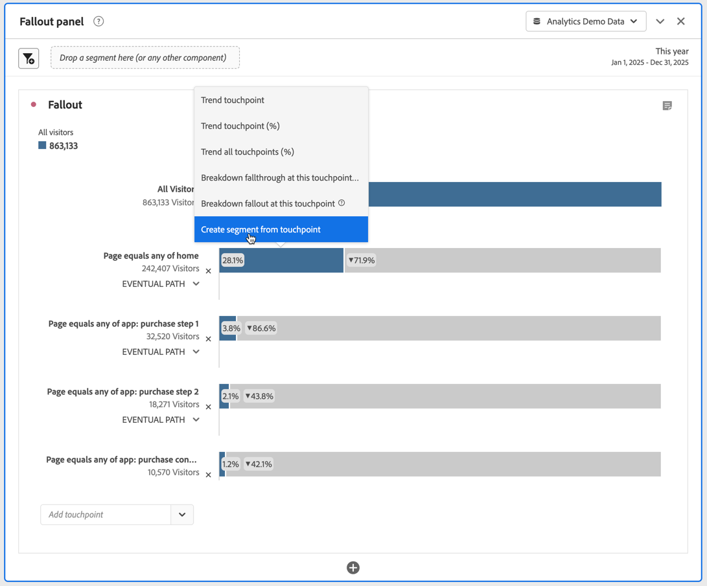
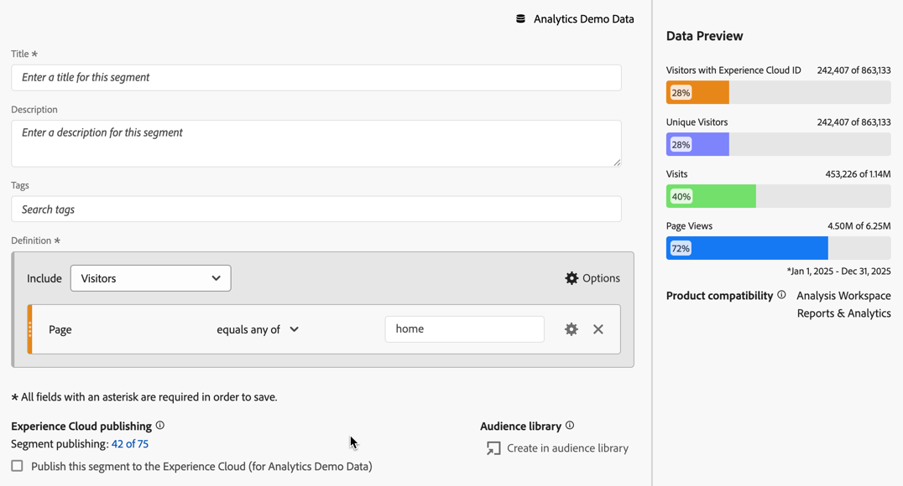
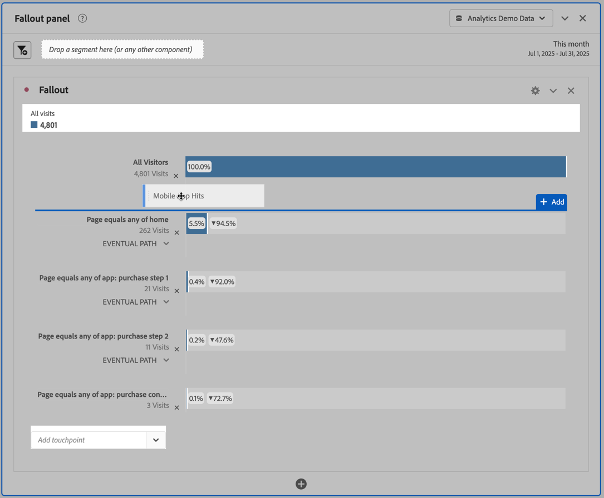
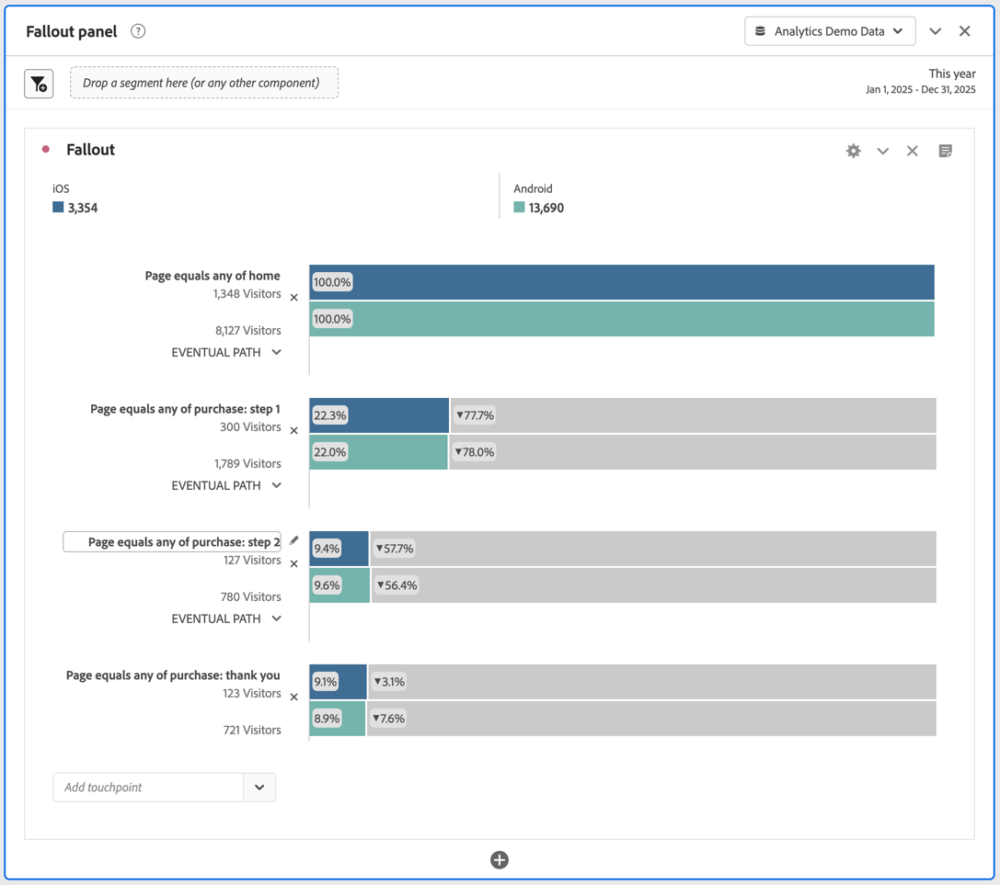

# Apply segments in fallout analysis

You can create segments from a touchpoint, add segments as touchpoint, and compare key workflows across various segments in Analysis Workspace.

>[!IMPORTANT]
>
>Segments used as checkpoints in Fallout must use a container that is at a lower level than the overall context of the Fallout visualization. With a visitor-context Fallout, segments used as checkpoints must be visit or hit-based segments. With a visit-context Fallout, segments used as checkpoint must be hit-based segments. If you use an invalid combination, the fallout will be 100%. You see a warning in the Fallout visualization when you add an incompatible segment as a touchpoint. Certain invalid segment container combinations will lead to invalid Fallout diagrams, such as:
>
>* Using a visitor-based segment as a touchpoint inside a visitor-context Fallout visualization.
>* Using a visitor-based segment as a touchpoint inside a visit-context Fallout visualization.
>* Using a visit-based segment as a touchpoint inside a visit-context Fallout visualization.
>

## Create a segment from a touchpoint

1. Create a segment from a specific touchpoint that you are especially interested in and that might be useful to apply to other reports. You do this by right-clicking the touchpoint and selecting **[!UICONTROL Create segment from touchpoint]**.

   

   The Segment Builder opens, pre-populated with the pre-built sequential segment that matches the touchpoint you selected:

   

1. Give the segment a title and description and save it.

   You can now use this segment in any project you wish.

## Add a segment as a touchpoint 

If you want to see, for example, how Mobile App Hits trend and affect the fallout, just drag the Mobile App Hits segment into the fallout:

Or you can create an AND touchpoint by dragging the Mobile App Hits segment onto another checkpoint.

## Compare segments in fallout 

You can compare an unlimited number of segments in the Fallout visualization. (Note that the video below states that you can compare up to 3 segments, which is wrong.)

>[!BEGINSHADEBOX]

See  [Compare segments in a fallout visualization](https://video.tv.adobe.com/v/24046?quality=12&learn=on){target="_blank"} for a demo video.

>[!ENDSHADEBOX]

1. Select the segments that you want to compare from the [!UICONTROL Segment] panel on the left. In the example In the example, two segments are selected: **[!UICONTROL iOS]** and **[!UICONTROL Android]**.
1. You drag the three segments onto the Segment drop zone at the top of the visualization.

   

1. Optional: You can keep *All Persons* as the default container or delete the container.

1. You can now compare the fallout across the three segments, such as where one segment is outperforming another, or other insights.
